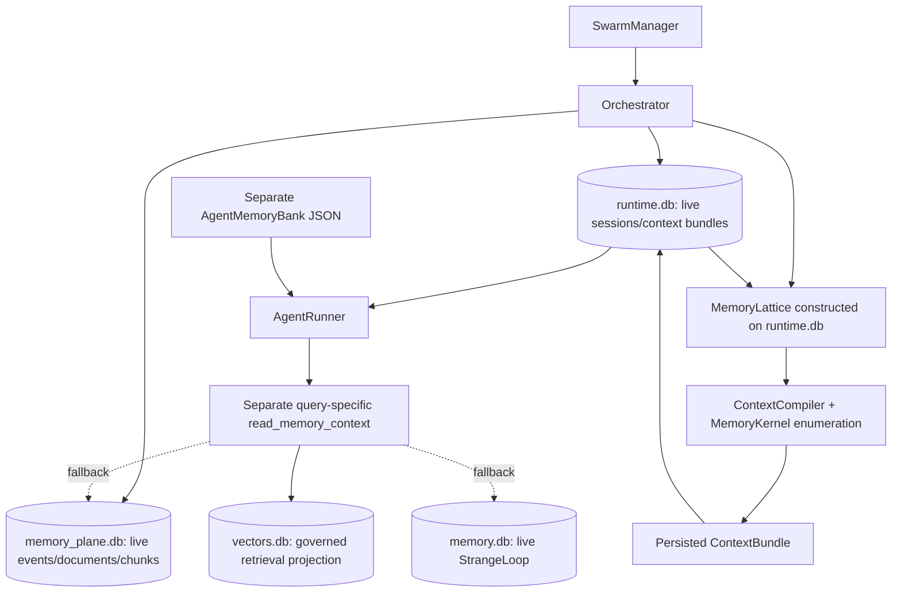
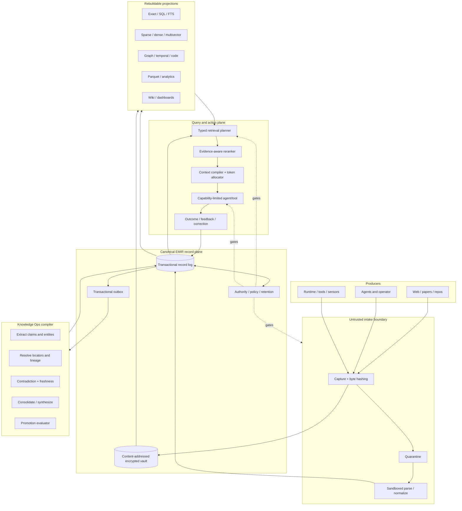
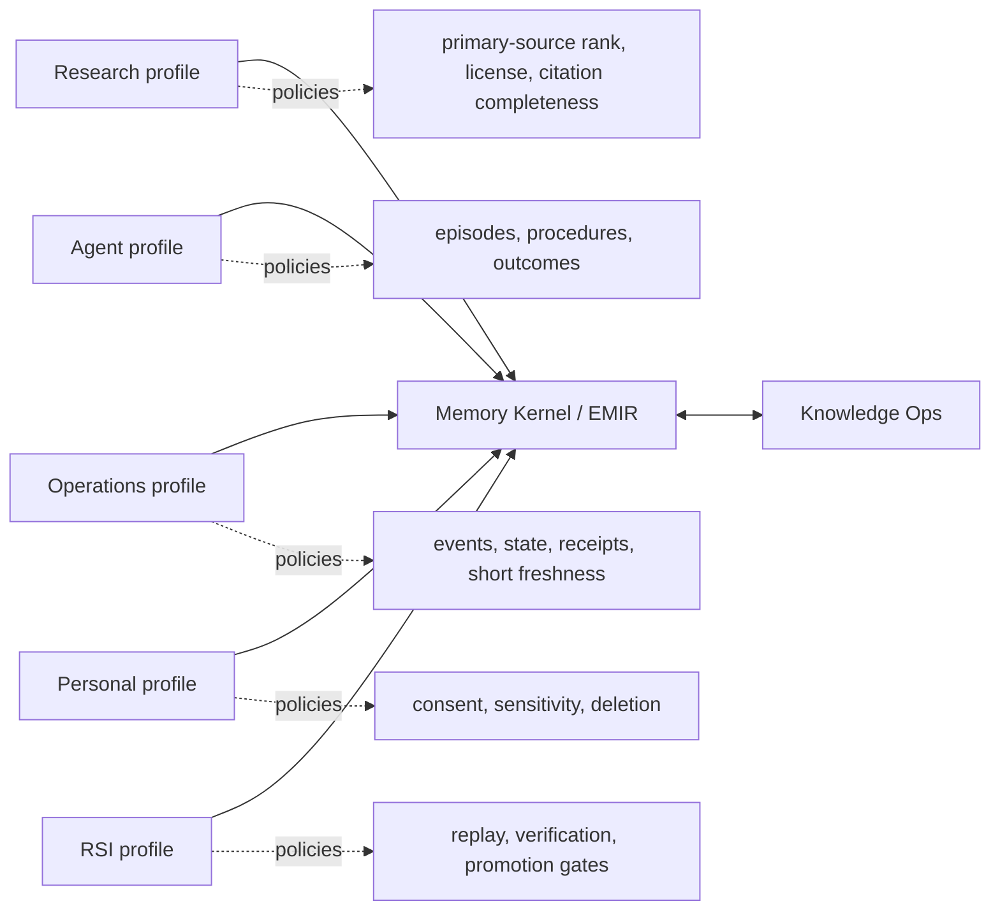
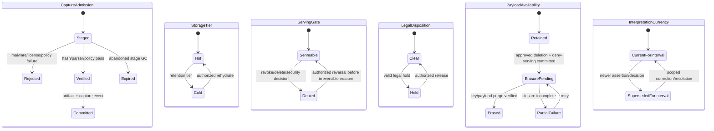
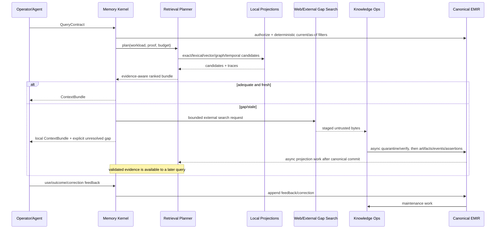
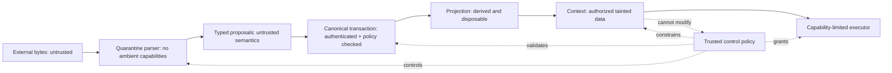

# Dharma Memory Kernel + Knowledge Operations Master Spec v0.2

Status: research-only architecture candidate; not merge, rollout, implementation, or production authorization  
Research cutoff: 2026-07-10 UTC; local closeout continued 2026-07-11 JST  
Scope: one operator on Apple Silicon plus one VPS, with a credible distributed path  
Authors: operator + Codex research synthesis  
Supersedes: no existing contract; this document proposes the convergence target

## v0.2 change record

v0.2 is the substantive remediation of the initial v0.1 council draft, not a
production milestone. It adds or corrects:

- support as policy/basis-specific append-only assessment rather than assertion
  state;
- normalized six-root placement, constructor emissions, bootstrap/revocation,
  and separately composed authority/security semantics;
- protected identity, staged-vault crash ordering, authorized erasure, and an
  independently recoverable deletion/revocation/key-state watermark;
- serialized transaction/fencing semantics, gateway-only canonical DML, offline
  proposals, idempotency collision handling, and current-security/historical-
  knowledge separation;
- separate projection definition/build/validation/activation records, canonical
  semantic events versus operational outbox state, and recovery budgets;
- storage-neutral `v0-reference` acceptance with PostgreSQL demoted to an
  experiment-13 benchmark candidate;
- a syntax-executed SQLite relational sketch, constructor algorithm, and full
  World Radar evidence trace;
- corrected repo citations/live-state receipt, expanded source counterevidence,
  chronological evaluation discipline, Phase 0 tripwires, owner/lifecycle
  inventory, and explicit falsification gates.

Known current-code defects are inputs to this architecture and Phase 0 exit
criteria; they are not claimed fixed by a no-code research document.

## How to read this report

Evidence labels are used throughout:

- **[R] Repo evidence** — observed in the current checkout, with exact file and line references.
- **[E] Established source class** — a mature standard, official production
  document, or peer-reviewed study supports the stated mechanism/result. It does
  **not** mean the conclusion is universal doctrine or independently replicated.
- **[N] Emerging** — recent primary research or a young implementation; useful but not yet durable doctrine.
- **[I] Inference** — an engineering conclusion drawn from evidence.
- **[D] Decision** — the recommended Dharma choice.
- **[Q] Open** — an operator decision or a falsification result is still required.
- **[S] Speculation** — a scenario, never a present-tense capability claim.

Research tables state source maturity as `standard/official production
documentation`, `peer-reviewed study`, `workshop/demo`, or
`preprint/emerging`; `[E]`/`[N]` remain evidence-posture labels only. The dated
[evidence receipt](evidence/MEMORY_KERNEL_KNOWLEDGE_OPS_EVIDENCE_20260710.md)
pins the rapidly changing 2026 sources verified during this pass. It is **not** a
complete captured-source manifest: Phase 0 must capture/pin every dependency by
version, retrieval date, license/copy policy, and digest before an implementation
may claim reproducible research provenance.

Repository-state observations and identity/version metadata for the decisive
recent sources were checked against the evidence available in the dated receipt
on 2026-07-10 UTC. Experimental results were summarized from the cited primary
sources, not independently reproduced; sources outside the receipt's seven-item
recent-source manifest still require capture/pinning before implementation.
This report separates architectural authority from source authority: a source
may accurately document its own mechanism without proving that mechanism is best
for Dharma.

---

## 1. Executive thesis

### 1.1 The breakthrough

**[D] Do not build a separate research-memory database or wiki authority.**
Research memory, agent memory, operational memory, RSI memory, and personal
memory are domain profiles over one shared substrate. They differ in record
types, admission policies, retention, sensitivity, retrieval plans, and proof
obligations—not in what counts as canonical truth.

The proposed substrate is the **Dharma Epistemic Memory Intermediate
Representation (EMIR)**:

> A small, typed, append-only, bitemporal record language in which evidence,
> epistemic modality, support, decision authority, access authority, freshness,
> and retention are evaluator semantics rather than prose fields or receipts.

Memory Kernel is the EMIR facade, policy evaluator, and canonical front door.
Knowledge Ops is the transformation and maintenance compiler. The transactional
record log and content-addressed vault persist EMIR. Lexical, vector, graph,
temporal, analytical, wiki, and context structures are replaceable compiled
projections.

This gives a precise answer to the original question—why should a provenance-
first research memory differ from Dharma's memory and vector search as a whole?

> It should not be a separate system. It should be the first demanding profile
> that forces the shared memory system to represent source evidence correctly.
> Vector search is one access path over that system, never the system itself.

### 1.2 Five architectural bets

1. **Typed epistemics, not one `truth_state`.** **[D]** `Observed<P>`,
   `SourceAsserted<P>`, `Inferred<P>`, `Hypothesis<P>`, and
   `AuthorizedDecision<P, Scope>` remain distinct types. A new assessment may
   find stronger or weaker support; an authorization-for-use decision may not
   cast one modality into another.
2. **Stable identity, append-only versions, protected content digests.** **[D]**
   A logical object has a stable UUIDv7; every interpretation has an immutable
   version identity and byte-stable payload while retained; exact bytes have an
   algorithm-tagged protected digest. These identities are not interchangeable,
   and authorized erasure remains possible.
3. **Canonical records, disposable projections.** **[D]** The system must be
   correct after every vector, graph, full-text, wiki, summary, cache, and
   analytical table is deleted and rebuilt.
4. **Retrieval is compilation, not nearest-neighbor lookup.** **[D]** A typed
   query planner selects exact, SQL, lexical, sparse, dense, multivector, graph,
   temporal, code, iterative, or long-context paths by workload and proof
   obligation. No memory mechanism wins universally; current frontier evidence
   directly supports adaptive routing ([EvoMemBench](https://arxiv.org/abs/2605.18421)).
5. **Retained evidence is byte-stable; interpretations evolve append-only.**
   **[D]** Corrections, contradictions, syntheses, consolidations, and assessments
   create new records. They never silently rewrite retained historical evidence;
   authorized erasure may remove protected payloads while leaving only the
   minimum non-secret accountability state.

### 1.3 The small type-system contribution

The standing Dharma language question asks how epistemic modality and authority
can become typechecker/evaluator semantics. EMIR's first challengeable rule is:

```text
Assertion<P, M, A>                         // immutable proposition, modality, asserter

assess : AssertionRef<P, M, A>
       × EvidenceBundle
       × EvaluationPolicy
       × TransactionBasis
       -> SupportAssessment<P, M>

invariant: assess() cannot change M or A
```

Support is not a total monotonic state on the assertion. A later assessment may
strengthen, weaken, contest, or refute support; two policies may legitimately
disagree. `provisional → supported → corroborated` is at most a policy-specific
positive partial order. Every reassessment is a new immutable evaluation.

Consequences:

```text
assess(Inferred<P>, new_evidence) -> SupportAssessment<corroborated> // allowed
SourceAsserted<P>                 -> Observed<P>                      // type error
Decision<P, project_scope>        -> EmpiricalFact<P>                 // type error
Summary<P>                        -> IndependentEvidence<P>            // type error
```

An operator can authoritatively decide a policy, preference, priority, or
accepted risk inside a granted scope. The same authority cannot make an
empirical proposition true. A signed source can prove origin and byte integrity
without proving factuality. Model consensus is correlated testimony, not
independent evidence.

### 1.4 Success criterion

The system succeeds when each unit of operator attention leaves behind a
portable, source-resolving, policy-governed record that makes a later task
better—and when a later correction improves current behavior without destroying
what was previously observed or believed.

It fails if it merely accumulates more text, embeddings, summaries, or agent
self-narratives.

---

## 2. Repository reality: what Dharma has today

### 2.1 Current census and verification

At `2026-07-10T15:42:15Z`, the read-only census reported **81 registered surfaces, 70
existing, and 11 missing**. The adapter readiness report returned `ready`, with
all 81 surfaces accounted for and all 7 required surfaces ready. A focused suite
covering Memory Kernel adapters/readiness/context evaluation, ContextCompiler
integration, and governed retrieval passed **56 tests**.

The exact command, Git basis, live-store snapshot caveats, and test output are
preserved in the dated
[evidence receipt](evidence/MEMORY_KERNEL_KNOWLEDGE_OPS_EVIDENCE_20260710.md).

A broader legacy/agent-memory group is not green: it produced **104 passes and
one failure**. The failing backward-compatibility test calls
`ContextCompiler._build_sections()` without the newly required
`memory_kernel_section` keyword (`tests/test_memory_integration.py:397`). This
report records the regression and does not fix it because the task is
architecture research, not runtime implementation.

Current defects are explicit **P0 blockers to live EMIR integration**, with
owners and deadlines defined by the Phase 0 exit—not blockers to reviewing this
research contract:

| Blocker | Accountable owner | Phase 0 exit evidence |
|---|---|---|
| `_build_sections` backward-compatibility failure | ContextCompiler/runtime integration owner | failing node plus broader memory group pass; compatibility path or migration is explicit |
| Lattice constructed over wrong/empty duplicate stores | Orchestrator + MemoryLattice owners | end-to-end write to each real store and query-specific recall through the production dispatch path |
| default kernel pack ignores query and permits weak defaults | Memory Kernel retrieval owner | relevance fixture, explicit admissibility, and stale preview wording removed |
| 57 GiB vector projection has non-idempotent writer/schema drift | Vector projection owner | controlled retry yields one row/amplification `1.000`; source-owned unique key/migration and shadow parity receipt |
| World Radar drops source bytes and lacks Go archive flags | World Radar + vault-capture owners | real Go-to-vault integration test with copy policy, digest, rehydrate, locator, and restricted-copy mode |
| structured `knowledge.db` registry/ownership does not match its CLI-only read seam or main compiler wiring | structured-knowledge + registry owners | census path/owner corrected; `dgc intent-plan` retained/tested; main-runtime consumer explicitly wired or the extraction path explicitly scoped/disabled |
| principal SQLite stores lack one complete migration/high-watermark ledger | storage/migration owner | schema/user-version migrations plus the §9.4 surface ledger exist and rollback/parity fixtures pass |

No `v0-reference`, merge, or rollout claim is permitted until these exit
receipts exist. Phase 2 separately owns the absent canonical Knowledge Ops write
executor.

Commands:

```text
uv run python scripts/memory_surface_census.py --repo-root . --home /Users/dhyana --dry-run
uv run python scripts/memory_kernel_readiness.py --repo-root . --home /Users/dhyana --summary-only --dry-run
uv run pytest -q tests/test_memory_kernel_adapters.py \
  tests/test_memory_kernel_generic_adapters.py \
  tests/test_memory_kernel_readiness.py \
  tests/test_memory_context_eval.py \
  tests/test_context_compiler_memory_kernel.py \
  tests/test_memory_retrieval.py
```

**[I] Readiness proves bounded adapter coverage; it does not prove semantic
convergence, query relevance, a canonical writer, or cross-surface consistency.**
Only seven adapter factories are content-aware; other eligible surfaces fall
back to `GenericSurfaceMetadataAdapter`
(`dharma_swarm/memory_kernel/facade.py:357-388`). The `ready` label is accurate
for its narrow read-adapter contract, but must not be read as “unified memory is
production-ready.”

### 2.2 Component and authority map

| Surface | Runtime reality | Authority | Status | Evidence |
|---|---|---|---|---|
| `MemoryKernel` facade | Registers/censuses surfaces, normalizes atoms, applies bounded read policy, and exposes a separate governed query engine | Intended canonical front door; not a canonical database | Implemented, partially integrated | `dharma_swarm/memory_kernel/facade.py:54-75,96-133,207-275` |
| Memory atoms | Broad envelope: 11 atom types, 7 lanes, 7 scopes, 8 truth states, provenance/risk/freshness fields | Evidence envelope, not sufficient canonical assertion model | Implemented; ontology conflates axes | `dharma_swarm/memory_kernel/atoms.py:117-222,338-470` |
| Context admission | Applies allow/omit policy and budgets to a bounded atom iterable | Read admission policy | Implemented; not relevance-aware | `dharma_swarm/memory_kernel/context_admission.py:51-128,144-225,291-346` |
| Default Memory Kernel context | Receives a recall query, but does not use it to select or rank atoms | Runtime context input | Live, defective | `dharma_swarm/memory_kernel/default_context.py:22-83,107-144` |
| `ContextCompiler` | Independently assembles Memory Kernel, always-on memory, lattice recall, palace, graph, knowledge store, artifacts, facts, and semantic context | Runtime bundle author; not the only prompt contributor | Live; AgentRunner adds query recall/latent gold/AgentMemory separately | `dharma_swarm/context_compiler.py:101-123,242-406,533-653,695-733`; `dharma_swarm/agent_runner.py:1222-1272,2393-2397` |
| Orchestrator dispatch | Constructs `MemoryLattice`, `ContextCompiler`, and `MemoryKernel`; persists and attaches context bundles | Production dispatch path | Live | `dharma_swarm/orchestrator.py:1260-1345,2376-2395` |
| `MemoryLattice` | Uses one supplied DB path for RuntimeState, EventMemory, UnifiedIndex, and StrangeLoop; HybridRetriever wraps that index; EventLog uses a separate directory | Runtime/evidence facade | Live and parallel to Memory Kernel | `dharma_swarm/memory_lattice.py:31-98,119-236` |
| Event memory | SQLite tables for events, source documents/chunks, retrieval logs, conversation turns, idea shards, links, and uptake | Raw operational evidence | Live | `dharma_swarm/engine/event_memory.py:15-152,266-300` |
| Unified index | Replaces document chunks by a source-derived document ID and scans all records in Python for search | Projection | Live; loses historical document versions | `dharma_swarm/engine/unified_index.py:153-284,333-403` |
| Engine hybrid retriever | Full-scans all indexed records through exact, lexical, overlap, orientation, and hash-embedding lanes | Projection/query engine | Live; not scalable ANN/FTS | `dharma_swarm/engine/hybrid_retriever.py:120-269` |
| Governed retrieval engine | Separate FTS/vector pipeline against `~/.dharma/vectors.db`; attaches a Memory Kernel admission summary | Projection/query engine | Live; not actually fused in common case | `dharma_swarm/memory_retrieval.py:82-94,171-245,535-777` |
| Vector store | SQLite/TF-IDF by default, optional `sqlite-vec`, FTS and O(n) fallbacks; calls itself bitemporal | Projection | Live; only event/ingestion instants, not bitemporal version history | `dharma_swarm/vector_store.py:447-488,540-691` |
| Memory Palace | Default-on post-task writer to VectorStore/LanceDB; main ContextCompiler construction receives no palace instance | Projection | Write-live, direct compiler read partly unwired | `dharma_swarm/orchestrator.py:58-68,1297-1301,3232-3253`; `dharma_swarm/memory_palace.py:509-542` |
| StrangeLoop memory | Stores free text and layers; uses word heuristics for quality and repeated-word extraction for consolidation | Legacy agent memory | Live; low epistemic rigor | `dharma_swarm/memory.py:19-60,122-156,199-246` |
| AgentMemoryBank | Per-agent JSON write and separate system-prompt injection | Agent-scoped raw memory | Live, outside compiled bundle | `dharma_swarm/swarm.py:922-929,3099-3109`; `dharma_swarm/agent_runner.py:2393-2397,3039-3060` |
| AgentMemoryManager | SQLite store also receives successful tasks; richer context/tools have no production caller | Duplicate agent memory | Write-live, read-dormant | `dharma_swarm/agent_runner.py:3065-3079,3439-3455`; `dharma_swarm/agent_memory_manager.py:490-689` |
| Runtime facts | `memory_facts` include truth state, confidence, validity and provenance JSON | Runtime state, not knowledge authority | Live; mutable promotion | `dharma_swarm/runtime_state.py:121-165`; `dharma_swarm/memory_lattice.py:119-195` |
| `contracts.intelligence.MemoryPlane` | Protocol plus `SovereignMemoryPlaneAdapter` writes/updates `runtime.db` facts while describing a canonical memory interface | Competing operational memory-write interface | Implemented internal/production-facing contract seam; no main-runtime caller found | `dharma_swarm/contracts/intelligence.py:10-38`; `dharma_swarm/contracts/intelligence_adapters.py:233-324`; `dharma_swarm/contracts/intelligence_stack.py:110-145` |
| Graph store | Four SQLite property graphs plus bridges, with JSON payloads and overwrite upserts | Projection | Implemented | `dharma_swarm/graph_store.py:141-330` |
| Graph ecosystem | GraphNexus federates semantic, catalytic, temporal, lineage, telos, and bridge graphs; separate claim and legacy-organism graph stores also exist | Projections/evidence graphs | Multiple, partly live/partly legacy | `dharma_swarm/graph_nexus.py:117-190`; `dharma_swarm/claim_graph.py:1-169`; `dharma_swarm/organism.py:111-207,1035-1077` |
| `knowledge_units.KnowledgeStore` | Default post-task LLM extraction writes propositions/prescriptions to `~/.dharma/state/knowledge.db`; the main compiler receives no instance, while `dgc intent-plan` reads prescriptions from that store | Provisional structured knowledge | Write-live; read by a CLI path but absent from the main compiler | `dharma_swarm/orchestrator.py:1297-1301,2937-2954`; `dharma_swarm/sleep_time_agent.py:532-604`; `dharma_swarm/knowledge_units.py:667-674`; `dharma_swarm/terminal_commands/intent.py:15-20`; `dharma_swarm/operator_core/intent_payloads.py:51-56,125-141`; `dharma_swarm/dgc_cli.py:1935-1936` |
| `engine.knowledge_store` | Separate in-memory/Qdrant interface with deterministic hash embeddings; backend failure can fall back to memory | Projection/cache | Incompatible duplicate; silently non-durable by default | `dharma_swarm/engine/knowledge_store.py:1-6,43-65,85-220,235-275`; `dharma_swarm/swarm.py:547-555` |
| CitationIndex | JSONL passage/source-location model; tests and a seed script, but no production-runtime caller found; access/delete rewrite file | Dormant projection | Implemented, unwired | `dharma_swarm/citation_index.py:75-97,156-203,243-250,286-291`; `scripts/seed_agentic_autonomy_citations.py:17,184-201`; `tests/test_citation_index.py:49-342` |
| Semantic Commons | YAML ontology/alias/orientation router loaded by HybridRetriever | Routing metadata, not semantic knowledge authority | Active | `dharma_swarm/semantic_commons.py:18-20,96-223`; `dharma_swarm/engine/hybrid_retriever.py:120-153` |
| Semantic filesystem / OKF | Referenced by a plan, but no `fs_substrate`, `semantic_fs`, or OKF implementation/tests exist in this HEAD | Intended projection/interface | Missing | `docs/plans/2026-06-26-semantic-commons-livingdock-codex-composer-100-goal-spec.md:164-173,231-235` |
| Knowledge Ops intake | Converts atom metadata into `memory_atom`/`memory_surface` staging nodes plus `DERIVED_FROM` edges; intentionally omits raw content | Staging/metabolism, not runtime facts | Implemented, read-only | `dharma_swarm/knowledge_ops/memory_intake.py:165-216,280-309` |
| Conflict review | Finds structural conflicts such as shared `content_ref`; explicitly avoids semantic truth inference | Review artifact | Implemented, narrow | `dharma_swarm/knowledge_ops/memory_conflict_review.py:83-143` |
| Promotion bridge/gate | Produces proposals, decisions, and reviewed receipts while explicitly performing no canonical mutation | Governance artifact | Implemented dry-run; canonical writer missing | `dharma_swarm/memory_kernel/promotion_gate.py:1-5,169-234`; `dharma_swarm/knowledge_ops/memory_kernel_promotion_bridge.py:1-7,115-174` |
| Write receipts | Allows append-only proposal/receipt/review/tombstone operations and blocks direct protected-store mutation | Governance artifact | Implemented | `dharma_swarm/memory_kernel/write_receipts.py:1-5,21-57,135-236` |
| Surface census docs | Correctly distinguish raw memory, projections, staging, and authority | Governance intent | Useful but stale counts | `docs/architecture/memory_surfaces_census_v3.md:23-30,171-213,275-291` |
| Production bar | Declares Memory Kernel the canonical front door, with Lattice/Palace subordinate and Knowledge Ops promotion gated | Target contract | Not fully satisfied | `docs/architecture/MEMORY_KERNEL_PROD_BAR.md:8-44,62-104` |
| Standalone Holon kernel | A second `MemoryKernel` class in a standalone package | Separate packaging domain, not shared authority | Intentional isolation; name collision | `holon/memory_kernel/__init__.py:39-80`; `docs/governance/CONVERGENCE_MAP_2026-07-01.md:180-203` |

### 2.2.1 Current dispatch/read path



Evidence: boot/store construction at `dharma_swarm/swarm.py:662-709`; event
writes at `dharma_swarm/orchestrator.py:498-526,670-694`; compiler construction
at `dharma_swarm/orchestrator.py:1260-1301`; bundle plus a separate query recall at
`dharma_swarm/agent_runner.py:1222-1272`.

### 2.2.2 Successful-task write fan-out

One successful result can be independently persisted as:

| Destination | Evidence |
|---|---|
| runtime artifact/manifest/receipt | `dharma_swarm/orchestrator.py:3210-3230` |
| VectorStore and LanceDB through MemoryPalace | `dharma_swarm/orchestrator.py:3232-3251`; `dharma_swarm/memory_palace.py:509-542` |
| AgentMemoryBank JSON and AgentMemoryManager SQLite | `dharma_swarm/agent_runner.py:3039-3079` |
| structured propositions/prescriptions | `dharma_swarm/orchestrator.py:2937-2954` |
| catalytic graph JSON | `dharma_swarm/orchestrator.py:2958-2973` |
| conversation/event surfaces | AgentRunner/EventMemory paths described above |

There is no transaction or common immutable result/source identity across this
fan-out. A common EMIR record/version ID and outbox is therefore a convergence
requirement, not merely an architectural preference.

### 2.3 Ten load-bearing findings

#### Finding R1 — runtime injection is live while warnings and documents say it is not

**[R]** The orchestrator constructs a Memory Kernel and ContextCompiler, compiles
a bundle, and attaches its metadata
(`dharma_swarm/orchestrator.py:1260-1345,2376-2395`). The compiled
sections include admitted Memory Kernel content
(`dharma_swarm/context_compiler.py:533-554`), and the integration test asserts that content is
present (`tests/test_context_compiler_memory_kernel.py:84-109`). Yet admission
still emits `preview_only_no_runtime_prompt_injection`
(`dharma_swarm/memory_kernel/context_admission.py:159-162`), and May documents
say no live prompt injection
(`docs/architecture/memory_kernel_current_intent.md:27-56`).

**[D]** Treat executable code and tests as current truth; mark the warnings and
old rollout documents as historical before any further rollout claim.

#### Finding R2 — the default Memory Kernel context ignores the task query

**[R]** `build_memory_kernel_default_context()` accepts `recall_query`, records
whether a query exists, but calls `preview_memory_pack()` without query text or a
relevance function (`dharma_swarm/memory_kernel/default_context.py:22-83`). Its default policy disables
`require_context_admissible` and permits `CLAIMED` material
(`dharma_swarm/memory_kernel/default_context.py:46-61`). Admission then consumes
the first bounded atoms in deterministic surface order
(`dharma_swarm/memory_kernel/facade.py:82-87,114-133`;
`dharma_swarm/memory_kernel/context_admission.py:144-225,291-346`).

**Consequence:** a pack can be policy-safe and completely irrelevant. The live
front door is an admission layer over enumeration, not a query-aware memory
system.

#### Finding R3 — two “hybrid” retrieval stacks disagree

**[R]** `MemoryLattice` uses
`dharma_swarm/engine/hybrid_retriever.py:120-269`, which full-scans a
UnifiedIndex through five local scoring lanes. `MemoryKernel.query()` delegates
to `dharma_swarm/memory_retrieval.py:82-94,171-245` over a separate vector
database. In the latter, any FTS
hit prevents vector search from running
(`dharma_swarm/memory_retrieval.py:207-228`), so the
normal case cannot fuse lexical and vector candidates. Memory Kernel atoms are
reduced to an admission summary rather than fused candidates
(`dharma_swarm/memory_retrieval.py:231-240,535-599`).

**[D]** Converge on one retrieval-plan interface. Engines may remain multiple;
the plan, candidate schema, evidence trace, and context contract may not.

#### Finding R4 — the executing context path crosses different physical databases

**[R]** the swarm initializes StrangeLoop memory at `memory.db` and event memory
at `memory_plane.db` (`dharma_swarm/swarm.py:673-675`). During dispatch, the
orchestrator builds `MemoryLattice(db_path=store.db_path)`, where `store` is the
runtime-state store (`dharma_swarm/orchestrator.py:1270,1293-1300`). `MemoryLattice` then
constructs its EventMemoryStore, UnifiedIndex, and StrangeLoopMemory on that
runtime DB (`dharma_swarm/memory_lattice.py:40-45`).

**Consequence:** the context compiler can read a lattice instantiated over
`runtime.db` while live events and legacy memories are written to
`memory_plane.db` and `memory.db`. Schema co-location is mistaken for data
convergence.

#### Finding R5 — “truth” is a scalar where separable, composed types are required

**[R]** Atoms expose a single sequence from raw through canonical, superseded,
and rejected (`dharma_swarm/memory_kernel/atoms.py:164-172`). Runtime facts can
be mutated from one truth state to another
(`dharma_swarm/memory_lattice.py:165-195`), including through the competing
`contracts.intelligence.MemoryPlane` writer
(`dharma_swarm/contracts/intelligence_adapters.py:233-324`). This collapses how
a statement was obtained, how well it is supported, whether it is current, and
who can decide it.

**[D]** Replace scalar promotion semantics with invariant modality plus separate
support, currency, and authority judgments. Preserve compatibility mappings only
at adapters.

#### Finding R6 — provenance has fields but lacks evidence-grade identity

**[R]** `MemoryAtom.build()` hashes content for `payload_digest` when present,
but its fallback `source_digest` hashes metadata such as surface/path/time rather
than source bytes (`dharma_swarm/memory_kernel/atoms.py:411-424`). It has no first-class proposition,
evidence locator, capture activity, independence group, or authority grant.

**Consequence:** a source can appear provenance-rich without a resolvable,
byte-stable citation.

#### Finding R7 — consolidation mutates or summarizes without a durable derivation model

**[R]** UnifiedIndex deletes/replaces chunks for a document
(`dharma_swarm/engine/unified_index.py:333-403`); StrangeLoop consolidation turns
recurring words into new pattern memories (`dharma_swarm/memory.py:199-221`);
runtime fact promotion mutates truth state. None forms an append-only derivation
graph with source locators and versioned algorithms.

#### Finding R8 — Knowledge Ops has governance scaffolding but no canonical knowledge writer

**[R]** Intake, conflict review, proposal, decision, and promotion receipts exist.
The promotion module deliberately sets `mutation_performed=False` and
`artifact_record_only=True`
(`dharma_swarm/memory_kernel/promotion_gate.py:194-233`). This is honest and
safe, but it means the intended metabolism loop does not close; the
`SovereignMemoryPlaneAdapter` is a separate mutable runtime-fact writer, not the
missing Knowledge Ops executor.

#### Finding R9 — the wiki and graph are not the missing authority

**[R]** Current doctrine correctly calls vectors, graphs, retrieval feedback,
logs, and generated summaries projections or evidence, not canon
(`docs/architecture/MEMORY_KERNEL_PROD_BAR.md:32-44,85-94`).

**[D]** Preserve this doctrine. The missing component is a canonical typed
record/write model—not promotion of an existing projection.

#### Finding R10 — routing metadata can accidentally launder “canon”

**[R]** Semantic Commons is an active YAML alias/orientation router, not a
semantic filesystem or knowledge authority. Its projection classifier returns
`canon` unless a small set of projection markers matches
(`dharma_swarm/semantic_commons.py:314-333`). Its labels also call custom lexical
overlap `lexical_bm25_fts` and hash-vector scoring `vector_search`, which can
overstate the mechanism actually executed.

**[D]** Unknown classification defaults to `unknown` or `projection`, never
`canon`. Canonical authority must be produced only by an EMIR constructor and
evaluation/decision path, not inferred from missing metadata.

### 2.4 Live-state snapshot: the fragmentation has material cost

Read-only checks at `2026-07-10T15:41:47Z` add operational weight to the
code-path audit. They are dated observations, not immutable current counts:

| Live store | Size | Non-content evidence | Interpretation |
|---|---:|---|---|
| `~/.dharma/db/memory_plane.db` | 4.6 GiB | maximum rowids: `event_log=40,347`, `source_documents=14,735`, `source_chunks=74,609`, `retrieval_log=27,172` | The event/source/retrieval plane contains substantial live evidence. |
| `~/.dharma/db/memory.db` | 3.7 MiB | `memories` maximum rowid `11,026`; mtime `2026-07-10T15:06:34Z` (`2026-07-11T00:06:34+0900`) | Legacy StrangeLoop memory is separately live. |
| `~/.dharma/state/runtime.db` | 419 MiB | `session_events` maximum rowid `101,327`; `context_bundles` maximum rowid `8,010`; duplicated `event_log`, `source_documents`, `source_chunks`, and `retrieval_log` tables all contain zero rows | Dispatch constructs its lattice over a database whose duplicated retrieval/event plane is empty. |
| `~/.dharma/vectors.db` | 57 GiB | committed AUTOINCREMENT high-water `24,796,967`; live snapshot also found 24,735,271 current rows but only one populated `content_hash` | The projection is already too large to treat casually as memory authority or cheap-to-rebuild state. |

The vector growth is explainable in code: current `_init_db()` defines neither a
`content_hash` column nor a dedup index
(`dharma_swarm/vector_store.py:540-601`), and `upsert()` always executes an
`INSERT` (`dharma_swarm/vector_store.py:697-745`). The live database has drifted:
it contains an untracked `content_hash` column and non-unique
`idx_vec_documents_dedup`, but the writer does not populate it. Thus “upsert” is
provably non-idempotent. `sqlite_sequence` is the maximum committed
AUTOINCREMENT high-water mark, not a current row count.

Exact paths, size/mtime, read-only query shapes, outputs, Git basis, WAL caveat,
and World Radar health basis are preserved in the dated
[evidence receipt](evidence/MEMORY_KERNEL_KNOWLEDGE_OPS_EVIDENCE_20260710.md).

**[D] Immediate architecture implication:** measure and control write
amplification before adding embeddings, graph extraction, or recursive
synthesis. Projection manifests require idempotency keys, high-watermarks,
retention, incremental rebuild, and explicit recovery-time budgets.

### 2.5 The source-vault gap is visible in a live ingestion path

The Python World Radar bridge exposes and passes a complete family of archive
flags (`dharma_swarm/world_radar/go_bridge.py:75-103,515-559`). The Go scout's
actual CLI defines only state/output/health/fetch/cascade/query flags before
`flag.Parse()` (`tools/world_scout_go/main.go:19-27`). It fetches HTTP response
bodies, parses them into observations, and discards the raw bodies
(`tools/world_scout_go/scout.go:42-61,144-160`). The live health artifact on
`2026-07-10T15:41:58Z` reported `archive_enabled=false`, `archive_count=0`, and zero archived
bytes; the exact file timestamp and fields are in the
[evidence receipt](evidence/MEMORY_KERNEL_KNOWLEDGE_OPS_EVIDENCE_20260710.md).

Tests prove Python flag plumbing and simulate archive output, but do not exercise
an implemented Go archive writer (`tests/test_world_radar_go_bridge.py:131-224,
233-289`).

**[R/Q] This runtime defect is unresolved. It blocks any v0.2 merge, rollout,
source-vault, or production-integration claim until the Phase 0 Go-to-vault exit
fixture passes; the worked trace is a target contract, not evidence that capture
is live.**

**[I]** This is a precise example of why a canonical source-capture contract is
needed: the system can retain derived observations while the source bytes needed
for future verification disappear. The fix is not a World Radar-specific wiki;
it is the shared `capture()` → `SourceArtifact` → `Event<SourceCaptured>`
boundary.

### 2.6 Duplication and gap summary

| Category | Implemented | Duplicated/contradictory | Missing |
|---|---|---|---|
| Discovery/read adapters | Broad census, bounded adapters, readiness gates | Counts and phase docs drift from live runtime | Semantic source capability and owner contracts |
| Canonical record model | Rich atom envelope, runtime facts, events | Atom/fact/event/knowledge-node schemas overlap | Stable logical/version identity; proposition/evidence/authority types; append-only writer |
| Retrieval | FTS, TF-IDF/vector, exact/lexical/hash-semantic, graph, palace, context sections | Two hybrid stacks; independent compiler sections; query ignored in default kernel path | One typed query plan and common candidate/evidence contract |
| Provenance | Source refs, digests, receipts, event checksums | Metadata digest can masquerade as source digest | Byte-addressed artifacts, robust selectors, derivation activities, provenance closure |
| Temporal | Event/ingestion/valid timestamps scattered | “Bitemporal” label without system-version history | Valid-time + transaction-basis query semantics |
| Knowledge Ops | Intake, structural review, proposals, decisions, receipts | Review artifacts can look like progress while mutation is intentionally absent | Canonical write executor; semantic contradiction assessments; correction lifecycle |
| Context | Persistent bundles, budget, omission reasons, runtime wiring | Stale preview warnings; many parallel sources; static weights | Proof-aware token allocator, taint/capability boundary, retrieval trace |
| Durability | SQLite stores, JSONL logs, some checksums | Three physical DB paths can hold overlapping schemas/data | One logical authority, tested backup/restore, projection rebuild manifest |

### 2.7 What must be preserved

The next architecture should evolve, not discard, the strongest existing work:

- the surface census and adapter registry;
- bounded reads and explicit omission reasons;
- the production bar's projection-versus-authority distinction;
- append-only proposal and review receipts;
- runtime context-bundle persistence;
- EventMemory's event/source/retrieval substrate;
- graceful vector/FTS fallbacks;
- the deliberate absence of silent canon mutation.

The migration target is a semantic convergence layer, not a rewrite of every
memory engine.

---

## 3. First-principles model

### 3.1 Definitions

| Term | Durable operational definition | Not equivalent to |
|---|---|---|
| **Source** | A publisher, repository, sensor, principal, service, or system from which material or testimony was obtained | A URL or copied file |
| **Artifact** | A byte-stable-while-retained byte sequence or structured value with media type, protected digest, size, capture context, and copy/license policy | An entity, assertion, or mutable document |
| **Locator** | A version-bound selector that resolves evidence inside an artifact: page/line, JSON Pointer, symbol/range, timestamp, text quote + position | A free-text citation |
| **Observation** | A record that a principal or instrument encountered a value/event under stated conditions | Proof that the value is globally true |
| **Event** | A temporally situated occurrence asserted by a producer and recorded append-only | Current state |
| **Proposition** | A normalized, addressable statement whose polarity and scope can be compared | Its support status |
| **Assertion** | A proposition asserted with invariant epistemic modality, asserter, provenance, and validity; support is a separate policy/basis-specific assessment | A scalar “fact” or its current support judgment |
| **Evidence** | A typed relation from an assertion or assessment to an artifact/observation/assertion, with role, locator, derivation, and independence group | A high similarity score |
| **Entity** | A stable logical referent with versioned descriptions and explicit identity-resolution assertions | A content hash or graph node label |
| **Relationship** | A claim whose proposition relates entities, with the same evidence/time/modality rules as any claim | A property-graph edge that is true by insertion |
| **Episode** | A bounded view over temporally related observations, actions, context, and outcomes | An abstractive narrative |
| **Procedure** | Versioned know-how with preconditions, environment assumptions, executable artifact or steps, verifier, and measured outcomes | A remembered suggestion |
| **Decision** | A scoped normative commitment made by an authorized principal | Empirical evidence |
| **Synthesis** | A versioned derived artifact whose atomic assertions resolve to source assertions/evidence | Canonical source material |
| **State** | A deterministic as-of fold over events/versions under a named policy | The event history |
| **Memory** | A governed durable record, intentionally retained, that can change a future query, policy, decision, or action | Every stored byte |
| **Working memory** | A bounded context bundle compiled for one task and principal | Durable canon |
| **Cache** | A disposable performance representation whose loss cannot change canonical meaning | Memory authority |
| **Feedback** | A record of retrieval use, task outcome, correction, or evaluator judgment | Automatic promotion evidence |

### 3.2 Memory classes are views and contracts

**[E]** Cognitive architectures distinguish working, episodic, semantic, and
procedural memory ([Soar architecture](https://soar.eecs.umich.edu/soar_manual/02_TheSoarArchitecture/),
[episodic](https://soar.eecs.umich.edu/soar_manual/07_EpisodicMemory/),
[semantic](https://soar.eecs.umich.edu/soar_manual/06_SemanticMemory/)). Agent
systems add external archival paging ([MemGPT](https://arxiv.org/abs/2310.08560)),
reflection ([Generative Agents](https://arxiv.org/abs/2304.03442)), and executable
skills ([Voyager](https://arxiv.org/abs/2305.16291)).

**[I]** These are operational contracts, not separate authorities:

| View | Selection contract | Mutation contract | Retention default |
|---|---|---|---|
| Working | task/principal/budget scoped | disposable compile | minutes/session |
| Episodic | temporal observations/actions/outcomes | append-only | policy-dependent |
| Semantic | context-independent assertions | new assertion versions/evidence links | until superseded/retention |
| Procedural | applicable, replayable know-how | candidate → verified version | retain outcome history |
| Autobiographical | self-scoped reconstruction over episodes and claims | derived synthesis only | rebuildable |
| Shared | records visible under namespace and authority policy | no copying required | source policy |

An autobiographical summary is not identity authority. A shared memory is not a
common vector bucket. A procedure is not semantically promoted because it was
recalled often.

### 3.3 Identity law

```text
logical_id      = UUIDv7                       // stable referent
version_id      = UUIDv7                       // immutable interpretation/version
integrity_digest = "sha256:" + digest(raw)     // protected exact-byte check
storage_key     = HMAC(domain_key, integrity_digest) | random opaque ID
event_id        = UUIDv7                       // trace/order-independent identity
retry_key       = (origin_principal, origin_node, caller_idempotency_key)
```

**[E]** Content-addressed names bind an algorithm and digest to bytes
([RFC 6920](https://datatracker.ietf.org/doc/html/rfc6920)); they do not supply a
mutable logical identity or prove truth. **[D]** Hash raw bytes before parsing or
normalization. Canonicalize structured data only under an explicit algorithm and
version (for example [RFC 8785 JCS](https://www.rfc-editor.org/rfc/rfc8785.html)).

Rules:

1. A URL is a locator, not artifact identity.
2. The same bytes may have multiple source observations because provenance
   contexts differ.
3. A mutable entity or claim keeps its logical ID across versions.
4. A new interpretation gets a new version ID even if its prose is identical.
5. Digests are algorithm-tagged, protected metadata; a raw plaintext digest is
   not a public object path or cross-domain equality oracle.
6. Storage addressing and deduplication are scoped to an explicit protection and
   erasure domain. Sensitive namespaces expose opaque aliases/storage keys.
7. Repositories retain upstream commit identity plus an independently hashed
   archive/manifest.
8. UUIDv7 exposes approximate creation time. External sensitive references use
   opaque aliases even when the internal logical/version ID is UUIDv7.
9. A regenerated UUID is never an idempotency key; retry identity is supplied by
   the authenticated origin and enforced uniquely.

### 3.4 Canonical record envelope

All canonical records use one administrative envelope; kind-specific bodies own
their semantic fields. A field has one authoritative location.

```text
RecordEnvelope<K, Body> {
  logical_id: UUIDv7
  version_id: UUIDv7
  kind: K
  schema: SchemaRef
  namespace: NamespaceRef
  owner: PrincipalRef

  body: Body | ErasedPayloadRef
  protected_body_digest: ProtectedMetadataRef<Digest>?
  recorded_at: Instant             // descriptive DB-assigned wall time
  transaction_basis: TransactionBasis

  sensitivity: SensitivityLabel
  retention: RetentionPolicyRef
  producer: PrincipalOrToolRef
  signature: AttestationRef?
  trace_id: UUIDv7?
}
```

`modality`, proposition validity, asserted evidence, decision authority basis,
and derivation inputs live only in their bodies. Canonical rows are append-only
and byte-stable while retained. A `current_head`, active-grant fold, full-text
index, graph, wiki, or active-evaluation view may update because it is a
projection. Authorized erasure replaces serving availability with a separately
recorded terminal state; it does not rewrite a retained payload.

### 3.4.1 Keep the initial algebra deliberately small

**[D]** The conceptual ontology is broad; the first durable schema should have
only six constructor roots:

```text
SourceArtifact   // bytes/value + capture context
Event            // append-only occurrence/observation
Assertion        // proposition + invariant modality + asserter
Decision         // scoped normative commitment
Procedure        // applicable, testable know-how
Derivation       // versioned transform and lineage
```

Entities, relationships, episodes, syntheses, context bundles, and feedback can
begin as validated payload subtypes or projections. Promote one into a distinct
canonical root only when it has a different owner, constructor rights, legal
state transitions, retrieval behavior, retention/deletion behavior, and at
least one falsification fixture. This prevents ontology ambition from becoming
write friction and migration debt.

Normative placement:

| Object | Root/subtype | Owner/constructor | Notes |
|---|---|---|---|
| artifact version | `SourceArtifact` | capture/vault constructor | exact protected integrity and copy policy |
| source observation | `Event<SourceCaptured>` | capture adapter | refers to artifact; never asserts extracted prose itself |
| sensor/action/outcome | `Event<Observed|Action|Outcome>` | registered adapter/executor | carries occurrence/observation time |
| empirical/source/inferred claim | `Assertion<M>` | modality-specific constructor | support is not stored here |
| evidence locator | embedded `EvidenceRef` value | inherits host assertion/evaluation ownership | version-bound selector |
| support judgment | `Derivation<SupportAssessment>` | authorized evaluator | policy/basis-specific and append-only |
| contradiction | `Derivation<ContradictionAssessment>` | verifier/evaluator | relations among assertions; no mutable set state |
| synthesis/context compile | `Derivation<Synthesis|ContextCompilation>` | named compiler | inputs, outputs, omissions and activity pinned |
| grant/policy/schema/principal registration | `Decision<Grant|Policy|Registration>` | root/authorized issuer | active state is a fold |
| correction | new assertion plus `Decision<CorrectionResolution>` when needed | actual modality constructor + scoped decider | never recasts old assertion |
| revocation/deletion/tombstone | `Decision<Revoke|Delete>` plus `Event<Revoked|ErasureProgress>` | authorized issuer + erasure worker | payload may become unavailable |
| procedure definition | `Procedure` | procedure owner | outcomes are separate `Event<Outcome>` records |
| projection builder | `Procedure<ProjectionBuilder>` | projection owner | builds are derivations; activation is a decision |
| projection build/validation | `Derivation<ProjectionBuild|Validation>` | builder/verifier | no mutable manifest state |

Worked counterexample: an `Episode` stays a validated view over event versions
because it has no unique constructor, authority, or deletion semantics beyond
its inputs. Making it a seventh root would create duplicate history. A synthesis
also remains `Derivation<Synthesis>` because its defining property is a pinned
transform from inputs to outputs. If future episode objects acquire independent
consent/retention or causal semantics, that fixture—not taste—justifies a root.

### 3.4.2 Constructors, not labels, enforce epistemics

An ordinary agent must not be able to write `modality="observed"` or grant
itself authority. EMIR uses capability-scoped constructors:

| Constructor | May emit | Required capability/evidence | Forbidden cast |
|---|---|---|---|
| `capture_source` | `SourceArtifact`, `Event<SourceCaptured>` | approved capture adapter; byte digest; source identity; locator | cannot emit an assertion or assessment |
| `extract_source_assertion` | `Assertion<SourceAsserted>` + `Derivation<Extraction>` proposal | artifact version + verified locator + extractor activity; governed gateway commits both atomically | cannot emit `Observed` or supported status |
| `record_sensor_observation` | `Event<SensorObserved>` and, when a declared mapping exists, `Assertion<Observed>` proposal | registered instrument/adapter, calibration, mapping, and activity | model prose cannot call it |
| `infer` | `Assertion<Inferred>` + `Derivation<InferenceActivity>` | premise version IDs + immutable rule/model/config | cannot relabel as source or observation |
| `hypothesize` | `Assertion<Hypothesis>` | actor identity + scope | cannot satisfy action proof gates |
| `decide` | `Decision<AuthorizedDecision>` | principal grant for exact action/scope | cannot decide empirical truth |
| `verify_execution` | `Event<ProcedureOutcome>` + `Derivation<ExecutionVerification>` | sandbox receipt + named verifier | cannot rewrite procedure history |
| `evaluate_support` | `Derivation<SupportAssessment>` | authorized evaluator + policy + proof bundle | modality invariant |
| `assess_contradiction` | `Derivation<ContradictionAssessment>` | comparator/policy + both verified locators + verifier | cannot mutate members or emit generic `incompatible` |
| `synthesize` | `Derivation<Synthesis>` | authorized compiler + atomic output/source map + omission log | cannot become independent source evidence |
| `compile_context` | `Derivation<ContextCompilation>` when retained | authenticated effective query contract + selected authorized candidates | cannot grant tool/action authority |
| `record_feedback` | `Event<Feedback>` | declared durable-use purpose + source task/outcome | raw telemetry cannot self-promote |
| `correct` | `Decision<CorrectionResolution>`; any replacement assertion uses its own modality constructor | correction grant; target version | retained source bytes/history remain byte-stable; no modality recast |
| `grant` / `delegate` | `Decision<AuthorityGrant>` | valid issuer chain, scoped delegation limit, acyclic grant graph | cannot exceed issuer authority |
| `revoke` | `Decision<AuthorityRevocation>` | current revocation capability + target grant | appends; never edits grant body |
| `delete` | `Decision<DeletionApproval>` | deletion capability + purpose/legal-hold check | authorizes workflow, not empirical truth |
| `record_erasure_progress` | `Event<ErasureProgress>` | erasure-worker capability + approved deletion/closure member | cannot authorize deletion or empirical truth |
| `define_projection` | `Procedure<ProjectionBuilder>` | projection-admin capability + builder/fallback contract | cannot originate assertions |
| `record_projection_build` / `validate_projection` | `Derivation<ProjectionBuild|ProjectionValidation>` | projection-gateway capability + watermarks/inventory/fixtures | cannot activate itself |
| `activate_projection` | `Decision<ProjectionActivation>` | projection-admin grant + passing validation/current security watermark | cannot change canonical meaning |

Every constructor reauthorizes at commit. External side effects recheck the
current security basis at execution time. Bootstrap root principals and recovery
issuers are explicit sealed configuration/registration decisions; delegation
cycles and scope escalation fail closed. `promote` means “authorize an assessment
for a named use,” never “make an assertion globally true.”

Bootstrap is concrete and deliberately narrow:

1. Setup generates an operator-root signing key offline; only its public-key
   digest and an initial random authority epoch/fence are pinned in a
   read-only, operator-owned bootstrap file and independent encrypted recovery
   package. Private root/recovery keys never enter agent environments.
2. Revision 1 commits `Decision<PrincipalRegistration>` and the initial
   `Decision<Policy>`/constructor registry, signed by that pinned root. The root
   can grant administrative actions; it cannot construct `Observed` or upgrade
   empirical support by identity.
3. Delegation commits only when the issuer's current chain covers the exact
   action/resource/depth and the new graph is acyclic. Constructor-registry
   changes require a dedicated `administer_schema` grant, never an ordinary
   `grant` capability.
4. The recovery issuer is a distinct offline key whose capability is limited to
   fence/epoch rotation, root-key recovery, and restore activation. It cannot
   read protected payloads or emit empirical assertions. Normal root rotation
   requires old-root authorization plus recovery-package verification.
5. If the root is lost/compromised, break-glass recovery starts a new epoch,
   fences every prior primary, appends an externally checkable recovery
   decision/checkpoint, replays the current denial/key state first, and requires
   operator confirmation before writes reopen. It never rewrites old grants.

The bootstrap file is not a hidden truth database: it establishes the initial
administrative verifier and epoch only. Its byte digest, custody check, recovery
drill, and replacement decision are v0 fixtures.

### 3.5 Kind-specific canonical bodies

```text
SourceArtifactBody {
  opaque_object_id, protected_integrity_digest,
  byte_length, media_type, encryption_domain,
  ciphertext_digest?, license, copy_policy
}

SourceCapturedEventBody {
  source_id, artifact_version_id?, locator,
  occurred_at?, observed_at, retrieved_at, published_at?,
  etag?, redirect_chain[], capture_tool, transport_assurance
}

EventBody<T> {
  event_type: T, occurred_at?, observed_at?,
  actor_or_instrument, subject_refs[], payload,
  time_kind, time_precision, time_confidence
}

Proposition {
  subject, predicate, object, polarity,
  qualifiers, domain_scope, normalization_version
}

AssertionBody<M> {
  proposition_id, modality: M, asserter,
  valid_during?, asserted_evidence_refs[], premise_refs[]
}

EvidenceRef {
  target_record_version,
  selector: TextQuote + (TextPosition | Page | Line | JsonPointer | TimeRange | SymbolRange),
  role: supports | refutes | qualifies | defines | demonstrates,
  locator_verified,
  extraction_activity,
  root_source_groups[]?, independence_uncertainty?
}

SupportAssessmentBody {
  assertion_version_id, evaluation_policy_version,
  evidence_bundle_id, evaluator,
  as_of_valid?, knowledge_basis, security_basis,
  outcome, confidence_estimate?, confidence_method?, calibration_ref?
}

ProcedureBody {
  goal_pattern, preconditions[], assumptions[], environment_fingerprint,
  executable_artifact?, declarative_steps?, verifier_requirements[], safety_class
}

DecisionBody<T> {
  decision_type: T, decision, scope, effective_during?,
  authority_basis[], rationale, alternatives[], review_due?
}

DerivationBody<T> {
  derivation_type: T, input_version_refs[], output_refs[],
  transform_artifact_or_rule, model_prompt_config_refs[],
  evidence_selectors[], omission_log[]
}

ContextBundle {
  effective_query_contract, selected_candidate_units[], evidence_locators[],
  selected_assessment_refs[], scores_by_lane, contradiction_assessments[],
  freshness[], omissions[], token_allocation, compiler_version, policy_version
}
```

`Derivation<T>` is one root with a closed, schema-versioned discriminator—not a
free-form subtype. v0 defines at least `Extraction`, `InferenceActivity`,
`SupportAssessment`, `ContradictionAssessment`, `Synthesis`,
`ContextCompilation`, `ProjectionBuild`, and `ProjectionValidation`. Each value
has a distinct registered constructor, capability, body schema, owner class, and
retention policy. A constructor authorized for `SupportAssessment` cannot emit
`ContradictionAssessment`; the composite emission constraint below rejects that
cast without inventing eight new roots.

Replica/storage locations, procedure outcome counts, revocations, contradiction
resolutions, build runs, validations, and activations are separate events,
decisions, or derivations. They are never mutable accumulators or reverse
references inside an immutable body. Current counts and states are folds.

### 3.5.1 Minimal SQLite `v0-reference` relational sketch

This is normative enough to falsify the algebra, but deliberately not a full
production migration. Semantic bodies, integrity digests, and storage keys may
contain erasable information, so records point to protected payload slots. The
slot's current availability is a security fold; deletion decisions and erasure
events remain canonical even when the protected payload is destroyed.

```sql
PRAGMA foreign_keys = ON;

CREATE TABLE authority_clock (
  singleton          INTEGER PRIMARY KEY CHECK (singleton = 1),
  authority_epoch    TEXT NOT NULL,
  next_revision      INTEGER NOT NULL CHECK (next_revision > 0),
  latest_security_revision INTEGER NOT NULL CHECK (latest_security_revision >= 0),
  current_fence_token TEXT NOT NULL
);

CREATE TABLE authority_commits (
  authority_epoch    TEXT NOT NULL,
  global_revision   INTEGER NOT NULL CHECK (global_revision > 0),
  principal_id      TEXT NOT NULL,
  security_revision_after INTEGER NOT NULL,
  previous_commit_digest TEXT,
  fence_token_digest TEXT NOT NULL,
  commit_digest     TEXT NOT NULL,
  signer_key_id     TEXT NOT NULL,
  signature_ref     TEXT NOT NULL,
  recorded_at_utc   TEXT NOT NULL,
  PRIMARY KEY (authority_epoch, global_revision)
);

CREATE TABLE protected_payload_slots (
  payload_slot_id     TEXT PRIMARY KEY,
  encryption_domain  TEXT NOT NULL,
  opaque_storage_key TEXT,
  protected_digest   TEXT,
  byte_length        INTEGER CHECK (byte_length IS NULL OR byte_length >= 0),
  availability       TEXT NOT NULL
    CHECK (availability IN ('staged','retained','denied','erased')),
  security_revision  INTEGER NOT NULL,
  authorizing_decision_version_id TEXT,
  CHECK (availability != 'erased' OR opaque_storage_key IS NULL)
);

-- Seeded only by the bootstrap/policy authority and versioned by a
-- Decision<Registration>. Ordinary proposals cannot add emission rules.
CREATE TABLE constructor_emission_rules (
  constructor_name    TEXT NOT NULL,
  root_kind           TEXT NOT NULL,
  subtype             TEXT NOT NULL,
  registration_decision_version_id TEXT NOT NULL,
  PRIMARY KEY (constructor_name, root_kind, subtype)
);

-- Illustrative genesis registry; the real migration binds the same rows to the
-- committed genesis registration decision and its digest.
INSERT INTO constructor_emission_rules VALUES
  ('capture_source','SourceArtifact','ArtifactVersion','genesis-v1'),
  ('capture_source','Event','SourceCaptured','genesis-v1'),
  ('extract_source_assertion','Assertion','SourceAsserted','genesis-v1'),
  ('extract_source_assertion','Derivation','Extraction','genesis-v1'),
  ('record_sensor_observation','Event','SensorObserved','genesis-v1'),
  ('record_sensor_observation','Assertion','Observed','genesis-v1'),
  ('infer','Assertion','Inferred','genesis-v1'),
  ('infer','Derivation','InferenceActivity','genesis-v1'),
  ('hypothesize','Assertion','Hypothesis','genesis-v1'),
  ('decide','Decision','AuthorizedDecision','genesis-v1'),
  ('verify_execution','Event','ProcedureOutcome','genesis-v1'),
  ('verify_execution','Derivation','ExecutionVerification','genesis-v1'),
  ('evaluate_support','Derivation','SupportAssessment','genesis-v1'),
  ('assess_contradiction','Derivation','ContradictionAssessment','genesis-v1'),
  ('synthesize','Derivation','Synthesis','genesis-v1'),
  ('compile_context','Derivation','ContextCompilation','genesis-v1'),
  ('record_feedback','Event','Feedback','genesis-v1'),
  ('correct','Decision','CorrectionResolution','genesis-v1'),
  ('grant','Decision','AuthorityGrant','genesis-v1'),
  ('delegate','Decision','AuthorityGrant','genesis-v1'),
  ('revoke','Decision','AuthorityRevocation','genesis-v1'),
  ('delete','Decision','DeletionApproval','genesis-v1'),
  ('record_erasure_progress','Event','ErasureProgress','genesis-v1'),
  ('define_projection','Procedure','ProjectionBuilder','genesis-v1'),
  ('record_projection_build','Derivation','ProjectionBuild','genesis-v1'),
  ('validate_projection','Derivation','ProjectionValidation','genesis-v1'),
  ('activate_projection','Decision','ProjectionActivation','genesis-v1');

CREATE TABLE emir_records (
  version_id          TEXT PRIMARY KEY,
  logical_id          TEXT NOT NULL,
  root_kind           TEXT NOT NULL
    CHECK (root_kind IN
      ('SourceArtifact','Event','Assertion','Decision','Procedure','Derivation')),
  subtype             TEXT NOT NULL,
  constructor_name    TEXT NOT NULL,
  schema_uri          TEXT NOT NULL,
  schema_version      TEXT NOT NULL,
  canonicalization_rule TEXT NOT NULL,
  protected_envelope_digest TEXT NOT NULL,
  namespace_id        TEXT NOT NULL,
  owner_principal_id  TEXT NOT NULL,
  payload_slot_id     TEXT NOT NULL REFERENCES protected_payload_slots,
  recorded_at_utc     TEXT NOT NULL,
  authority_epoch     TEXT NOT NULL,
  global_revision     INTEGER NOT NULL,
  revision_ordinal    INTEGER NOT NULL CHECK (revision_ordinal >= 0),
  sensitivity_policy_id TEXT NOT NULL,
  retention_policy_id TEXT NOT NULL,
  producer_id         TEXT NOT NULL,
  trace_id            TEXT,
  FOREIGN KEY (constructor_name, root_kind, subtype)
    REFERENCES constructor_emission_rules(constructor_name, root_kind, subtype),
  FOREIGN KEY (authority_epoch, global_revision)
    REFERENCES authority_commits(authority_epoch, global_revision),
  UNIQUE (authority_epoch, global_revision, revision_ordinal)
);

CREATE INDEX emir_records_logical_basis
  ON emir_records(logical_id, authority_epoch, global_revision);
CREATE INDEX emir_records_namespace_kind_basis
  ON emir_records(namespace_id, root_kind, authority_epoch, global_revision);

CREATE TABLE semantic_events (
  semantic_event_id   TEXT PRIMARY KEY,
  event_type          TEXT NOT NULL,
  subject_version_id  TEXT REFERENCES emir_records(version_id),
  payload_slot_id     TEXT REFERENCES protected_payload_slots,
  authority_epoch     TEXT NOT NULL,
  global_revision     INTEGER NOT NULL,
  event_ordinal       INTEGER NOT NULL CHECK (event_ordinal >= 0),
  recorded_at_utc     TEXT NOT NULL,
  FOREIGN KEY (authority_epoch, global_revision)
    REFERENCES authority_commits(authority_epoch, global_revision),
  UNIQUE (authority_epoch, global_revision, event_ordinal)
);

CREATE TABLE retry_keys (
  origin_principal_id TEXT NOT NULL,
  origin_node_id      TEXT NOT NULL,
  idempotency_key     TEXT NOT NULL,
  proposal_digest     TEXT NOT NULL,
  committed_epoch     TEXT NOT NULL,
  committed_revision  INTEGER NOT NULL,
  result_version_ids_json TEXT NOT NULL,
  PRIMARY KEY (origin_principal_id, origin_node_id, idempotency_key)
);

CREATE TABLE artifact_payload_bindings (
  source_artifact_version_id TEXT PRIMARY KEY
    REFERENCES emir_records(version_id),
  payload_slot_id     TEXT NOT NULL REFERENCES protected_payload_slots,
  capture_event_version_id TEXT NOT NULL REFERENCES emir_records(version_id)
);

-- Append-only security mutations are a typed subset/index of canonical
-- Decision records and semantic events. Current security tables below are
-- strict folds over this log, never independent authority.
CREATE TABLE security_events (
  security_event_id   TEXT PRIMARY KEY REFERENCES semantic_events,
  decision_version_id TEXT NOT NULL REFERENCES emir_records(version_id),
  security_kind       TEXT NOT NULL
    CHECK (security_kind IN
      ('grant','revoke','delete','legal_hold','policy','principal','key_state')),
  authority_epoch     TEXT NOT NULL,
  security_revision   INTEGER NOT NULL,
  security_event_ordinal INTEGER NOT NULL CHECK (security_event_ordinal >= 0),
  prior_fold_digest   TEXT NOT NULL,
  resulting_fold_digest TEXT NOT NULL,
  UNIQUE (authority_epoch, security_revision, security_event_ordinal)
);

-- Mutable, synchronously maintained security folds. Historical knowledge reads
-- never select an older version of these tables.
CREATE TABLE security_basis_current (
  singleton          INTEGER PRIMARY KEY CHECK (singleton = 1),
  authority_epoch    TEXT NOT NULL,
  security_revision  INTEGER NOT NULL,
  fold_digest        TEXT NOT NULL,
  deciding_security_event_id TEXT REFERENCES security_events,
  computed_at_utc    TEXT NOT NULL
);

CREATE TABLE security_state_current (
  state_key          TEXT PRIMARY KEY,
  state_kind         TEXT NOT NULL
    CHECK (state_kind IN
      ('grant','revocation','deletion','legal_hold','policy','principal','key_state')),
  subject_ref        TEXT NOT NULL,
  effect             TEXT NOT NULL CHECK (effect IN ('allow','deny')),
  decision_version_id TEXT NOT NULL REFERENCES emir_records(version_id),
  deciding_security_event_id TEXT NOT NULL REFERENCES security_events,
  security_revision  INTEGER NOT NULL,
  protected_scope_and_constraints_slot TEXT REFERENCES protected_payload_slots
);

-- Operational delivery state: durable, mutable, and regenerable from
-- semantic_events. It is not semantic authority.
CREATE TABLE projection_outbox (
  delivery_id         TEXT PRIMARY KEY,
  semantic_event_id   TEXT NOT NULL REFERENCES semantic_events,
  consumer_id         TEXT NOT NULL,
  work_class          TEXT NOT NULL,
  target_definition_id TEXT NOT NULL DEFAULT 'none',
  status              TEXT NOT NULL
    CHECK (status IN ('pending','leased','delivered','dead_letter')),
  attempts            INTEGER NOT NULL DEFAULT 0,
  lease_until_utc     TEXT,
  last_error          TEXT,
  UNIQUE (semantic_event_id, consumer_id, work_class, target_definition_id)
);

-- These four tables are typed, append-only indexes over canonical
-- Procedure/Derivation/Decision records; they do not create a seventh root.
CREATE TABLE projection_definitions (
  definition_version_id TEXT PRIMARY KEY REFERENCES emir_records(version_id),
  definition_digest   TEXT NOT NULL UNIQUE,
  fallback_kind       TEXT NOT NULL
);
CREATE TABLE projection_build_runs (
  build_version_id    TEXT PRIMARY KEY REFERENCES emir_records(version_id),
  definition_version_id TEXT NOT NULL REFERENCES projection_definitions,
  source_revision     INTEGER NOT NULL,
  security_watermark  INTEGER NOT NULL,
  output_inventory_digest TEXT NOT NULL
);
CREATE TABLE projection_validations (
  validation_version_id TEXT PRIMARY KEY REFERENCES emir_records(version_id),
  build_version_id    TEXT NOT NULL REFERENCES projection_build_runs,
  fixture_version     TEXT NOT NULL,
  verdict             TEXT NOT NULL CHECK (verdict IN ('pass','fail','inconclusive'))
);
CREATE TABLE projection_activations (
  activation_version_id TEXT PRIMARY KEY REFERENCES emir_records(version_id),
  build_version_id    TEXT NOT NULL REFERENCES projection_build_runs,
  validation_version_id TEXT NOT NULL REFERENCES projection_validations,
  action              TEXT NOT NULL CHECK (action IN ('activate','retire','rollback'))
);

-- Independently copied before a node may serve. The denial/key registries are
-- protected companion material addressed by these digests/watermarks.
CREATE TABLE security_checkpoints (
  checkpoint_id       TEXT PRIMARY KEY,
  authority_epoch     TEXT NOT NULL,
  security_revision   INTEGER NOT NULL,
  denial_set_digest   TEXT NOT NULL,
  key_registry_digest TEXT NOT NULL,
  last_security_event_id TEXT NOT NULL REFERENCES security_events,
  previous_checkpoint_digest TEXT,
  witness_ref         TEXT,
  recorded_at_utc     TEXT NOT NULL
);

CREATE TRIGGER authority_commits_no_update BEFORE UPDATE ON authority_commits
BEGIN SELECT RAISE(ABORT, 'authority commits are append-only'); END;
CREATE TRIGGER authority_commits_no_delete BEFORE DELETE ON authority_commits
BEGIN SELECT RAISE(ABORT, 'authority commits are append-only'); END;
CREATE TRIGGER emir_records_no_update BEFORE UPDATE ON emir_records
BEGIN SELECT RAISE(ABORT, 'EMIR records are append-only'); END;
CREATE TRIGGER emir_records_no_delete BEFORE DELETE ON emir_records
BEGIN SELECT RAISE(ABORT, 'EMIR records are append-only'); END;
CREATE TRIGGER semantic_events_no_update BEFORE UPDATE ON semantic_events
BEGIN SELECT RAISE(ABORT, 'semantic events are append-only'); END;
CREATE TRIGGER semantic_events_no_delete BEFORE DELETE ON semantic_events
BEGIN SELECT RAISE(ABORT, 'semantic events are append-only'); END;
CREATE TRIGGER security_events_no_update BEFORE UPDATE ON security_events
BEGIN SELECT RAISE(ABORT, 'security events are append-only'); END;
CREATE TRIGGER security_events_no_delete BEFORE DELETE ON security_events
BEGIN SELECT RAISE(ABORT, 'security events are append-only'); END;
```

Only the canonical write-gateway role may `INSERT` canonical
records/events/typed projection declarations, and it may do so only after the
registered constructor/evaluator passes. Agents, adapters, parsers, and
projection workers have no direct canonical DML; they submit typed proposals.
The gateway role cannot `UPDATE`/`DELETE` canonical history. Only the separately
authorized erasure path can destroy protected payload material; it first commits
the deny-serving decision/security watermark and never rewrites an assertion
into a tombstone. PostgreSQL RLS or SQLite connection discipline is defense in
depth; portable capability semantics live in the constructor/evaluator.

In the SQLite reference, the gateway process is the only OS principal/process
given a read-write handle to the canonical file; agent/adapter code receives the
proposal API, and projection builders receive bounded read snapshots/exports or
read-only connections. The conformance harness attempts direct DML from each
role and requires an authorization/read-only failure before SQL execution. If
PostgreSQL is selected, separate gateway, erasure, projection-read, and backup
roles enforce the same boundary; RLS is additional containment, never the
portable semantics.

The envelope digest is computed over RFC 8785 canonical JSON of the typed
administrative envelope plus protected payload digest reference, excluding the
digest/signature fields themselves and every mutable operational fold. For a
sensitive envelope it is a protected keyed digest, not a public equality oracle.
The signed `authority_commits.commit_digest` covers the ordered record/event
digests, previous committed basis, epoch, security revision, and fence identity.

Only `projection_outbox.status`, `attempts`, `lease_until_utc`, and `last_error`
may mutate, and only the projection-delivery worker role may mutate them.
`delivery_id`, source semantic event, consumer, work class, target projection
definition (or literal `none`), and uniqueness key never change. Distinct
active/shadow definitions therefore receive distinct deliveries. Outbox rows
contain no semantic payload authority, can be regenerated
from `semantic_events`, and cannot change a canonical query result.
`security_basis_current` and `security_state_current` similarly mutate only as a
synchronous deterministic fold whose deciding event, prior/resulting digest,
and revision exist in append-only `security_events`. Restore verifies the fold
against the independently copied `security_checkpoints` chain before serving.

`authority_clock(singleton=1)` deliberately serializes the v0 writer and will
eventually contend; it is not a scale claim. Instrument per-commit lock wait,
transaction service time, one-minute arrival/queue-depth buckets, abort reason,
and end-to-end latency. After 30 representative operating days, define observed
peak as the p99 of non-maintenance, nonzero one-minute commit-arrival rates. Run
three 30-minute replays at `2 ×` that rate with production-sized payload/index
mix. The provisional pass rule is: no fence/semantic abort, non-idempotency abort
rate below 0.1%, p99 lock wait below 25% of the operator-approved write-latency
SLO, and queue drained within two one-minute buckets after load stops. Thresholds
must be ratified from the baseline rather than silently inherited.

Partitioned authority becomes a design trigger only when this test misses a hard
write/recovery SLO in all three runs after batching/index/transaction tuning, or
independent principals require an availability domain one writer cannot
provide. Crossing that trigger starts a
new protocol ADR (namespace ownership, coordinated basis vector or explicit
non-atomic reads, quorum/election/fencing, cross-namespace transaction rules);
it never silently shards the singleton contract.

### 3.5.2 Canonical constructor commit algorithm

The seeded `constructor_emission_rules` relation is the exhaustive v0
**permitted** emission matrix, not an open-ended example. Each signed constructor
schema separately declares required/optional cardinality (for example the
`Assertion<Observed>` sensor mapping is optional, while capture's artifact/event
pair is atomic and required). Every prose constructor/emission and worked trace
must be represented. `C01_constructor_matrix` compares the normative registry,
body schemas/cardinalities, and seed rows in both directions: an absent
normative emission, unused extra rule, wrong constructor/subtype, or missing
required atomic member fails the release.

Genesis is the only commit that does not use an already-existing grant/registry:

```text
bootstrap_genesis(sealed_bootstrap_file, operator_presence):
  require database has no authority_clock, authority_commits, or records rows
  verify bootstrap-file byte digest, operator-root signature, recovery-key ID,
         initial epoch/fence, and one-time operator-presence challenge
  BEGIN EXCLUSIVE
    create authority_clock(epoch, next_revision=2, fence, security_revision=1)
    append authority_commit revision 1 with previous_commit_digest = GENESIS
    append PrincipalRegistration, Policy, ConstructorRegistry,
           initial root Grant, and RecoveryIssuerRegistration Decisions
    insert exhaustive constructor_emission_rules bound to the committed
           ConstructorRegistry decision version (`genesis-v1` in the sketch)
    append ordered semantic_events and security_events for every security member
    materialize security folds; append security checkpoint; mark genesis used
  COMMIT
  require isolated export/restore verifies the same genesis/registry digests
```

Any nonempty database, repeated attempt, digest/signature mismatch, or missing
member aborts. After revision 1, **all** changes—including registry/root
rotation—use the ordinary authorized commit path. Genesis cannot ingest user
knowledge or emit empirical assertions.

```text
commit(authenticated_origin, RecordProposal p):
  staged = vault.stage_hash_scan_encrypt_fsync_rename(p.protected_payload)

  BEGIN SERIALIZED TRANSACTION
    prior = retry_keys[p.origin_principal, p.origin_node, p.idempotency_key]
    if prior exists:
      require prior.proposal_digest == digest(p) else fail IdempotencyCollision
      ROLLBACK staged orphan; return prior result

    current_security = load_current_security_basis_and_lock_authority_clock()
    require authenticated_origin.fence_token == authority_clock.current_fence_token
    constructor = registry.resolve(p.intended_constructor, p.schema)
    effective_capability = policy.intersect(
      authenticated_origin.grants_at(current_security),
      constructor.required_capability,
      mandatory_policy_floor)
    require effective_capability permits p.namespace, subtype, purpose, scope
    require p.not_expired and expected_stream_revisions_match(p)
    require schema_valid(p) and constructor.proof_obligations_pass(p)
    require lineage_is_acyclic(p) and all current dependencies are authorized

    revision = allocate_global_revision(current_authority_epoch)
    insert authority_commits(..., revision, resulting_security_revision,
      previous_commit_digest, fence_token_digest, signer_key_id, signature_ref)
    insert protected_payload_slots(staged, availability='retained', revision)
    insert emir_records(..., revision, deterministic ordinals)
    insert semantic_events(..., revision, deterministic ordinals)
    if security-affecting:
      insert security_events(..., revision, deterministic member ordinals,
                             chained prior/resulting fold digests)
      apply synchronous current security/deny/key/hold folds from those exact
        security_events and advance security basis
    insert projection_outbox(...)
    insert retry_keys(..., digest(p), committed result)
  COMMIT

  on abort: preserve no canonical result; reconcile staged/renamed orphan
  on success: return version IDs + TransactionBasis(epoch, revision)
```

The gateway reauthorizes inside the serial transaction. A later tool execution
reauthorizes again against the current security basis. Wall time, UUID order,
model output, signatures, and reviewer consensus cannot substitute for the
constructor proof or authority check.

Only a row present in `authority_commits` can be returned as a
`TransactionBasis`. Append-only triggers/roles cover `authority_commits`,
`emir_records`, `semantic_events`, `retry_keys`, artifact bindings, and the four
typed projection declaration tables. Current security folds and outbox lease
state are intentionally mutable and exactly rebuildable from canonical
decisions/events. A stale primary whose fence token differs fails before
allocating a revision.

**[E]** W3C PROV's entity/activity/agent and derivation/attribution concepts are
a mature interoperability basis ([PROV-DM](https://www.w3.org/TR/prov-dm/)).
**[D]** EMIR should map to PROV for export, while retaining Dharma-specific
epistemic and authority semantics. Provenance informs trust; it is not a truth
calculator.

### 3.6 Separable, interacting trust axes

Every assertion evaluation appends a `Derivation<SupportAssessment>` containing a
structured judgment:

```text
Judgment<P> {
  integrity          // were referenced bytes/signatures verified?
  source_identity    // who or what produced them, at what assurance?
  modality           // observed/source-asserted/inferred/etc.; invariant
  relevance          // does the evidence bear on P?
  support             // policy-specific outcome; not stored on the assertion
  currency            // current/stale/unknown at requested valid/transaction time
  decision_authority // may this principal decide P within this scope?
  access_authority   // may this consumer retrieve/use the material?
  sensitivity
  retention_state
}
```

No one-dimensional confidence score may substitute for this judgment. If a
probability is stored, it must name the estimator, calibration population,
version, and evaluation date.

“Separable” does not mean statistically or operationally independent. The
evaluator composes axes with deny-dominant rules:

```text
may_expose(candidate, use) =
  access_authority_allows
  AND sensitivity_clearance_allows
  AND retention_serving_state_allows
  AND current_deletion/revocation_state_allows
  AND required_integrity/provenance_obligations_pass

may_decide(action) = may_expose(required inputs, action)
                     AND decision_authority_allows(action, scope)
```

A highly supported assertion remains invisible when access, sensitivity,
retention, or deletion denies. A grant cannot repair weak evidence; a retention
expiry cannot recast modality; decision authority does not establish empirical
support. Policies may depend on several axes, but no axis silently mutates
another.

### 3.7 Authority is typed and scoped

```text
AuthorityGrantBody {
  grant_id, principal, action,
  resource_or_claim_scope,
  valid_during, transaction_basis,
  issuer, delegation_basis,
  constraints, maximum_delegation_depth
}
```

`action` includes `read`, `annotate`, `propose`, `decide`, `assess_for_use`, `publish`,
`execute`, `delegate`, and `delete`. An authorization system such as Zanzibar
demonstrates that relationship tuples and consistency are distinct from content
truth ([Google Zanzibar](https://research.google/pubs/zanzibar-googles-consistent-global-authorization-system/)).

### 3.8 Promotion proof obligations

Promotion evaluates a claim for a named use policy; it does not turn it into
metaphysical truth.

```text
evaluate(assertion, policy, as_of_valid, knowledge_basis,
         authenticated_principal, current_security_basis) -> SupportAssessment
```

Required obligations:

1. Every non-hypothetical source assertion resolves to a byte-stable retained
   source version (or authorized erased terminal reference) or is explicitly
   `unverified_external_locator`.
2. Every cited locator resolves and matches its quote/hash.
3. Every inference names premise versions and an immutable rule/model/config.
4. Derivatives of one root source count as one independence group.
5. Material contradictions are present in the evaluation bundle.
6. Source-class freshness policy passes for the requested time or returns stale.
7. The evaluator, policy version, knowledge basis, and current security basis are
   recorded.
8. The authenticated principal holds the action-specific grant at commit/use.
9. Operator decisions influence only their declared normative scope.
10. Epistemic modality is invariant under promotion.

### 3.9 Temporal model

The system distinguishes:

- `occurred_at`: when an event happened;
- `published_at`: when a source published material;
- `observed_at`: when an observer encountered it;
- `retrieved_at`: when bytes were captured;
- `valid_during`: when a proposition applies in the world;
- `recorded_at`: descriptive database-assigned wall time near commit;
- `transaction_basis`: the deterministic fold/snapshot identity.

Valid time and transaction time are separate, foundational database concepts
([Jensen and Snodgrass](https://www.sciencedirect.com/science/article/pii/0306437994900132)).
Clock timestamps and UUIDv7 do not provide a safe total causal or commit order.
EMIR v0 uses one serialized global authority revision allocated under a locked
`authority_epoch` row in the same transaction. Only committed
`authority_commits` rows are issued as bases; an aborted transactional candidate
is invisible and may be reused, while a committed revision is never reused. A
future design that requires durable gap-preserving reservations must specify a
separate reservation protocol. A multi-namespace read uses one
`TransactionBasis`:

```text
TransactionBasis {
  authority_epoch, global_revision,
  database_snapshot_or_LSN?, namespace_revision_vector?
}
```

The initial single authority makes `global_revision` sufficient. A future
partitioned system must capture the namespace vector in one coordinated snapshot
or explicitly return a non-atomic basis; it may not pretend wall time is atomic.
Multi-namespace authority-sensitive writes either commit in one database
transaction or fail. Intervals are half-open `[start, end)`, timestamps are UTC
with declared precision, and `unknown`, `approximate`, `recurring`, and
`conditional` time remain explicit values rather than invented instants.

Do not forbid overlapping empirical claims: contradictory sources may assert
different values over the same time. Non-overlap constraints are appropriate
only where the domain guarantees one assignment, such as an authority grant or
configuration interval.

### 3.10 Deletion and forgetting semantics

Deletion is an independent but policy-composed workflow over a dependency closure, not
`DELETE FROM records`. Canonical payloads are byte-stable and append-only **while
retained**; erasable encrypted bodies are separate from minimum ledger metadata.

```text
requested
  -> denied | legal_hold | approved
  -> synchronous deny-serving decision + security watermark
  -> closure_calculating
  -> erasing (per-object DEK destruction and physical purge)
  -> propagating (projections, caches, replicas, queued work)
  -> verifying (including pre-deletion restore/rebuild probe)
  -> completed | partial_failure_retry | escalated_failure
```

Per-object or small erasure-set data-encryption keys avoid deleting a whole shared
domain to erase one object. The surviving tombstone contains only what the
declared accountability policy permits; even a digest/equality token may be
sensitive. `ErasedPayloadRef` is a valid terminal reference, so reference
integrity does not require erased bytes to remain. A separately protected
recovery-control ledger stores current denial/deletion watermarks and key state;
every backup records that watermark, and a restored node serves nothing until it
proves catch-up.

Historical evidence needed for accountability can be retained only under an
explicit lawful policy and protected namespace. “Immutable” is not permission
to keep personal data forever. NIST's current media-sanitization guidance is
[SP 800-88 Rev. 2](https://csrc.nist.gov/pubs/sp/800/88/r2/final).

---

## 4. Target architecture

### 4.1 Logical planes



### 4.2 One substrate, multiple profiles



There is no `research_memory.db`. The research profile owns source capture,
evidence extraction, citation completeness, and synthesis policies. It reads and
writes the same canonical types as the rest of Dharma.

### 4.3 Physical deployment, initial target

**[Q] Production benchmark candidate, with no selection preference before
experiment 13:** PostgreSQL 18 as a possible single writable transactional
authority, with a minimal content-addressed vault adapter and local disposable
caches. PostgreSQL supplies cross-host transactions, range and
temporal constraints, full-text search, JSONB, row-level security, WAL/PITR,
logical replication, and UUIDv7 without making a specialist vector/graph system
canonical. PostgreSQL 18 temporal constraints cover application time but not
native system-versioned tables; transaction-time history remains explicit in
EMIR ([PostgreSQL 18 release notes](https://www.postgresql.org/docs/18/release-18.html),
[range constraints](https://www.postgresql.org/docs/18/rangetypes.html)).

**[D] Migration constraint:** Phases 0–2 use the existing SQLite harness and one
serialized authority; PostgreSQL is not a day-one dependency. Do not begin by porting all current stores. First
implement the EMIR schema and evaluator in the existing SQLite test harness;
then run the same conformance fixtures against PostgreSQL. Promote PostgreSQL to
authority only after import/replay, restore, and projection-destruction tests
pass. During migration, old SQLite surfaces remain source adapters—not a second
authority.

**Why not SQLite as the final Mac+VPS authority?** SQLite is excellent for an
embedded single-host writer and should remain the offline/cache/test format.
WAL permits concurrent local readers and one writer, but not a network-
filesystem multi-host topology, and the WAL is part of persistent database
state that must travel with the file ([SQLite WAL](https://www.sqlite.org/wal.html)).
A serialized API over SQLite can safely accept remote-origin proposals; remote
origin alone does not require PostgreSQL. PostgreSQL earns selection only when
concurrent writers, database-enforced multi-principal isolation, replication/
PITR, or a measured recovery SLA outweigh its administration. If custody,
offline operation, and one local writer dominate, SQLite may remain authority.

Experiment 13 uses one frozen corpus/proposal trace and the same fault schedule
for every candidate. Its scorecard records:

- pass/fail of C01–C11 and identical authorized current/as-of results;
- p50/p95/p99 commit/read latency, lock wait, throughput, aborts, database/WAL
  growth, backup size, and CPU/RAM/disk at baseline and `2 ×` peak;
- crash points, corruption detection, achieved RPO/RTO, stale-primary fencing,
  pre-deletion restore behavior, and coordinated vault recovery;
- capability parity, defense-in-depth isolation, migration/export/import
  round-trip, and exact auditability;
- operator minutes for install, upgrade, key/certificate rotation, backup,
  restore, diagnosis, monthly maintenance, and one simulated incident;
- extra always-on services, credentials, network exposure, and annualized
  compute/storage cost.

Hard security/semantic/recovery failures disqualify an engine; averages cannot
hide them. Among passing engines, select the simplest/custody-compatible one
meeting operator-approved SLO/RPO/RTO. PostgreSQL wins only if SQLite misses a
declared concurrency/isolation/recovery requirement by more than measurement
uncertainty and the gain repays its measured operator boundary. XTDB wins only
if its temporal/recovery advantage survives the same rule. Otherwise SQLite
remains authority. The decision receipt publishes raw runs and the rejected
alternative, not a fashion-weighted total score.

**[Q] Operator deployment choice:** locate the primary on the always-on VPS if
continuous autonomous agents dominate; locate it on Apple Silicon if local
custody and offline operator work dominate. In either case there is exactly one
writer. The other site has an encrypted read cache and proposal queue. Failover
is manual until a separate HA design specifies replication durability, voters,
election, fencing, RPO/RTO, and split-brain tests.

### 4.4 Artifact vault

Build a small adapter, not an object-storage platform:

```text
stage(bytes, namespace, encryption_domain) -> StagedBlobRef
commit(staged_ref, capture_event) -> SourceArtifactRef
get(ref, principal, purpose) -> authorized byte stream
verify(ref) -> digest/integrity result
delete(ref, authorized_request) -> deletion event
export(refs, policy) -> BagIt/RO-Crate package
```

Initial storage can be a filesystem layout keyed by a protection-domain HMAC or
opaque object ID under encrypted volumes, with the raw SHA-256 retained as
protected integrity metadata and an independent encrypted backup. A BagIt package supplies simple
payload manifests and integrity verification
([RFC 8493](https://datatracker.ietf.org/doc/html/rfc8493)); RO-Crate supplies a
portable research-object metadata projection
([RO-Crate 1.3](https://www.researchobject.org/ro-crate/specification.html)).
Neither becomes the internal authority.

Filesystem bytes and SQL do not share a transaction. Intake follows:

```text
write unique staging file
  -> fsync file and staging directory
  -> hash/scan/encrypt
  -> atomic rename into domain-scoped object path
  -> fsync object directory
  -> SQL commit SourceArtifact + Event<SourceCaptured> + semantic event
  -> async delete unreferenced staged/renamed objects after grace period
```

A committed reference whose retained object is unavailable fails closed and
triggers replica recovery. Crash reconciliation distinguishes unreferenced staged
objects, committed missing objects, and intentionally erased terminal refs.

Copy policy is first-class:

```text
permitted_snapshot | metadata_and_hash_only | limited_excerpt |
remote_pointer_only | prohibited | operator_review
```

### 4.5 Canonical commit and distribution

Every canonical mutation is one transaction:

1. authenticate principal and idempotency key;
2. load policy/authority at a named commit basis;
3. validate the typed record and proof obligations;
4. allocate a global authority revision under the current epoch;
5. append record version and semantic mutation event;
6. append transactional outbox rows;
7. commit;
8. asynchronously build projections;
9. return committed record/version/revision and any deferred obligations.

No event bus is needed initially. The semantic mutation event is canonical; the
transactional outbox is durable operational delivery state that may be
acknowledged, compacted, or regenerated from canonical events. NATS
JetStream can distribute them after independent live consumers justify the
operational burden. JetStream remains transport, never the sole record.

### 4.6 Projection contract

```text
ProjectionDefinition {
  projection_definition_id, kind, schema_version,
  builder_code_digest, builder_config_digest,
  source_record_types[],
  tokenizer_or_chunker_version?,
  model_id_and_digest?, embedding_dimension?,
  engine_and_storage_format_versions,
  ACL_policy_version, deletion_policy_version, fallback
}

ProjectionBuildRun {
  build_id, definition_id, builder_identity,
  source_high_watermark, deletion_security_watermark,
  output_inventory_digest, row_count,
  started_at, completed_at, incremental_or_full,
  elapsed_time, money_compute_storage_cost
}

ProjectionValidation {
  validation_id, build_id, fixture_and_scorer_versions,
  equivalence_kind, retrieval_metrics, ACL_and_deletion_results,
  verdict
}

ProjectionActivation {
  activation_id, build_id, validation_id,
  namespace_scope, authority_basis, effective_revision,
  action: activate | retire | rollback
}
```

Invariants:

- projection workers have no permission to mutate canonical tables;
- writes are idempotent on definition/source-version/candidate-unit/derivative-kind;
- every result returns source version, locator, projection version, and policy
  basis;
- embedding, tokenizer, chunker, or graph-schema changes create new projection
  IDs;
- new projections build beside old ones, run shadow evaluation, and switch via
  an append-only activation decision/current pointer fold;
- every projection can be dropped without losing meaning;
- exact/lexical retrieval remains available when embeddings or network models
  fail.

### 4.7 Initial replaceable projections

| Need | Build now | Trigger to replace/add | Escape route |
|---|---|---|---|
| Exact/structured | authoritative SQL engine (SQLite Phase 0–2; Postgres candidate) | Never remove; specialize only after evidence | SQL/JSON export |
| Lexical | SQLite FTS5 initially; PostgreSQL FTS if selected | Add learned sparse/engine when native eval wins | Rebuild from artifact/assertion text |
| Vector | repaired local exact/vector baseline; pgvector only if Postgres selected | Qdrant when measured recall/latency/scale fails | Regenerate from definition/build records |
| Graph | relational node/edge/evidence tables + recursive SQL | Neo4j or another engine only for proven traversal/algorithm need | Rebuild edges from claims |
| Temporal | explicit valid/transaction time + range indexes | XTDB falsification spike if temporal query/recovery gain is decisive | Canonical event/version export |
| Analytics | prepare Parquet export; DuckDB when measured analytical work exists | Iceberg/DuckLake when corpus/concurrent analytical writes justify | Open file formats |
| Wiki | generated Markdown/static site | Collaborative UI later | Regenerate from synthesis records |
| Local cache | SQLite | Platform-specific cache if required | Delete and refill |

**[E]** pgvector defaults to exact search and offers HNSW/IVFFlat tradeoffs;
approximate recall must be monitored against exact results
([official pgvector repository](https://github.com/pgvector/pgvector)). SQLite
FTS5 remains an excellent local-cache fallback
([SQLite FTS5](https://www.sqlite.org/fts5.html)). Qdrant supports dense+sparse
fusion and multistage queries but is an optional projection, not an authority
([Qdrant hybrid queries](https://qdrant.tech/documentation/search/hybrid-queries/)).

### 4.8 Namespace and local-first model

Namespaces are policy boundaries, not database copies:

```text
operator/<id>
project/<id>
repo/<id>/worktree/<id>
session/<id>
agent/<id>
team/<id>
public/<id>
quarantine/<source-or-job>
```

Every record has one owning namespace and may be referenced across namespaces
only through explicit grants. Sensitive bytes and embeddings do not deduplicate
across protection domains.

Offline writes are noncanonical `RecordProposal` values containing origin
principal/node, signature, intended constructor, encrypted payload, creation and
expiry, base `TransactionBasis`, expected stream revisions, dependencies, and a
stable idempotency key. On reconnect, the authority authenticates the origin,
revalidates the **current** grant/security basis, checks expected revisions, and
commits, rejects, or opens an explicit conflict. Side effects execute only after
canonical acceptance and reauthorization.

Example: a Mac queues a publication proposal under grant G while the VPS commits
`revoke(G)`. On reconnect the proposal's historical knowledge basis still exists,
but current security basis denies publication; the proposal is rejected and
cannot resurrect G. A concurrent draft annotation may instead merge only if its
record subtype declares and passes a tested CRDT merge algebra.

CRDTs are permitted for record bodies with a declared safe merge algebra (for
example a draft annotation), never for ACLs, deletions, support assessments,
identity merges, operator decisions, or external side effects.

The required carve-out fixture starts two offline nodes from draft `D@r10`.
Node A inserts text span `a`; node B inserts disjoint span `b`; both signed
proposals merge to the same draft bytes/order under the pinned CRDT version and
create no canonical assertion. Repeat with concurrent edits to an ACL, support
assessment, operator decision, identity link, and side-effect request: schema
validation must reject them as CRDT payloads, leaving two explicit proposals or
a conflict for serialized resolution. Finally revoke A's grant at the authority
before reconnect; even the otherwise mergeable text proposal is rejected under
current security. The test compares merge order A→B/B→A, provenance of both
edits, retry idempotency, and absence of any merged authority field.

Offline caches cannot promise instantaneous physical deletion. Sensitive cache
keys use expiring leases and a maximum offline TTL; deletion SLAs explicitly
cover reachable controlled serving paths, and a rejoining node must catch up to
the security watermark before decrypting or serving cached data. Until a tested
replication/election/fencing design names voters, durability mode, RPO/RTO, and
split-brain behavior, the topology is **single writer with manual recovery and
failover**, not high availability.

### 4.9 Model-independent APIs

```text
capture(SourceRequest) -> SourceArtifact + Event<SourceCaptured>
append(RecordProposal, BasisToken) -> CommitResult
evaluate(AssertionRef, EvaluationPolicy, KnowledgeBasis,
         AuthenticatedGatewayContext{principal, current_security_basis,
                                     as_of_valid?}) -> SupportAssessment
query(QueryContract) -> RetrievalTrace + CandidateSet
compile(ContextRequest) -> ContextBundle
correct(CorrectionProposal) -> CommitResult
forget(DeletionRequest) -> DeletionWorkflowRef
rebuild(ProjectionDefinition) -> ProjectionBuild + ProjectionValidation
export(RecordSelection, ExportProfile) -> PortablePackage
```

Provider/model identifiers appear only in activity and projection manifests.
No canonical ID embeds a vendor, embedding dimension, tokenizer, or graph engine.

### 4.10 Worked trace: one World Radar source becomes answerable evidence

This trace is concrete enough to become the first integration fixture. IDs are
illustrative opaque aliases; source text is never permitted to choose a
constructor or authority.

1. **Fetch and stage.** World Scout fetches `https://publisher.example/item/42`
   at `2026-07-10T02:00:00Z`. The capture adapter streams the exact response to
   quarantine, records redirect/TLS/ETag/media-type metadata, computes protected
   integrity digest `sha256:…91af`, applies `permitted_snapshot`, encrypts under
   domain `research-public-v1`, fsyncs, and renames to opaque storage key
   `obj_rp_7K…`. No assertion exists yet.
2. **Commit capture.** `capture_source` commits `SourceArtifact sa_01` and
   `Event<SourceCaptured> ev_01` at `TransactionBasis(epoch_7, revision_1042)`.
   `ev_01` distinguishes `published_at`, `observed_at`, and `retrieved_at` and
   points to `sa_01`. The stable retry tuple prevents a network retry from
   creating a second observation. An abort leaves only a reconcilable orphan.
3. **Extract without laundering modality.** Sandboxed parser `parser@digest`
   proposes proposition `p_17` and dual locator `{TextQuote, TextPosition}`. The
   locator verifier rehydrates `sa_01` and matches the exact bytes. Governed
   `extract_source_assertion` then commits `Assertion<SourceAsserted> as_17` plus
   `Derivation<Extraction> dx_17`; it cannot emit `Observed` or `supported`.
4. **Assess for one use.** Evaluator `eval_v3` gathers `as_17`, its source root,
   freshness, contradictions, and policy `research_answer_v2`. It evaluates
   knowledge basis revision `1043` against current security watermark `sec_77`,
   then commits `Derivation<SupportAssessment> sup_17` at global revision
   `1044`. Outcome `supported_for_research_answer` does not mutate `as_17` and
   does not apply under another policy implicitly.
5. **Build disposable access paths.** The semantic log creates idempotent FTS
   and vector work keyed by `(definition, as_17, locator-span, derivative-kind)`.
   A build records source/security watermarks, output inventory, engine/model
   versions, row count, cost, and exact-search audit. Validation must pass
   locator, ACL, deletion, and retrieval fixtures before an authorized
   activation decision. Deleting both indexes leaves steps 1–4 intact.
6. **Compute the query contract.** A later agent requests the topic and a proof
   preference. The server authenticates it, intersects requested scope with
   mandatory policy, freezes `knowledge_basis=1044` (which can see `sup_17`),
   loads the **current** `security_basis`, and produces
   `EffectiveQueryContract eqc_9`; the caller
   cannot raise its sensitivity ceiling or weaken proof obligations.
7. **Retrieve and hydrate.** Exact/lexical/vector lanes return
   `CandidateUnit(as_17, locator-span-1, assessment=sup_17)`. Union preserves
   distinct spans, authorization filters precede exposure, and canonical
   hydration rejects a stale projection basis. Contradictory assessments, root
   groups, and uncertainty travel with the candidate.
8. **Compile, answer, and verify.** ContextCompiler allocates tokens to the
   primary-source span and locator, emits an immutable context receipt, and the
   model drafts an answer. A post-generation stage extracts each atomic answer
   claim, checks source resolution/entailment/contradiction/citation coverage,
   and repairs or abstains. The answer never acquires tool authority from the
   retrieved text.
9. **Correct or forget.** A later publisher revision creates a new artifact,
   event, assertion, and assessment; it does not rewrite `sa_01`/`as_17` while
   retained. A deletion commits deny-serving/security watermark first, destroys
   the protected payload key, propagates through projections/caches, and proves
   a pre-deletion restore cannot serve it.

If the same source is discovered during a live query, it may be quoted only in
the explicit tainted ephemeral lane for that answer. Durable projection and
support eligibility begin asynchronously at step 2, never by same-turn
similarity or model confidence.

---

## 5. Memory lifecycle and state machines

### 5.1 Independent, composable lifecycle folds



Support is not a lifecycle state. Each `SupportAssessment` is an immutable
policy/basis-specific result; later assessments may support, contest, refute, or
abstain without mutating the assertion or one another. An assertion can
simultaneously be supported under policy A, contested under policy B,
superseded for one valid interval, cold in storage, denied for serving, and under
legal hold. These state blocks are independent folds, not one product-state
enum. A legal hold blocks or pauses erasure approval; it is not a transition out
of `Denied`. Deletion may start from any storage tier and follows §3.10's
independent workflow. Epistemic modality never changes.

### 5.2 Complete operating loop



A same-turn external source may enter only an explicitly marked unverified,
tainted ephemeral answer lane. It cannot satisfy promotion, authority, execution,
or tool-control obligations and is excluded from durable projections until the
normal asynchronous intake path commits it. Knowledge Ops consumers filter work
classes, checkpoint idempotently, cap derivation depth, reject lineage cycles,
and never re-ingest a synthesis/assessment as new raw source evidence.

### 5.3 Procedure lifecycle

```text
experience/reflection
  -> ProcedureCandidate
  -> sandbox replay
  -> verifier + environment/precondition capture
  -> ApprovedProcedureVersion
  -> retrieval by applicability
  -> execution receipt + outcome
  -> confidence/calibration update as a new assessment
  -> revised/superseded procedure
```

Reflexion shows verbal feedback can improve some tasks
([paper](https://arxiv.org/abs/2303.11366)); intrinsic self-correction can also
degrade performance ([Huang et al.](https://arxiv.org/abs/2310.01798)). **[D]** A
reflection is a procedure candidate, never its own verifier.

---

## 6. Primary-source frontier research matrix

Maturity labels describe the source, not the universality of its conclusion.
Links without a versioned local capture remain research inputs rather than
reproducible EMIR evidence; the source-vault experiment must close that gap.

> **Preprint/emerging rule:** these rows are hypothesis-generating signals. They
> may justify a falsification experiment, never an implementation choice,
> promotion, or authority claim by themselves. Even peer-reviewed rows remain
> workload-bounded evidence rather than design authority.

### 6.1 Agent-memory mechanisms

| Source | Mechanism / measured result | Maturity and limitation | Dharma decision |
|---|---|---|---|
| [EvoMemBench](https://arxiv.org/abs/2605.18421) (2026) | Compares 15 memory methods across in/cross-episode and knowledge/execution work. No method wins universally; long context remains competitive; retrieval is strong for knowledge, procedural/long-term experience for matched execution. | **Preprint/emerging benchmark, v2 2026.** Results are model/workload dependent. | Typed records plus a workload-adaptive compiler, never a universal memory backend. |
| [LongMemEval-V2](https://arxiv.org/abs/2605.12493) (2026) | Histories reach 500 trajectories/115M tokens. A code-agent-over-files path scored 72.5% versus 48.5% for the strongest RAG path, at higher latency. | **Preprint/emerging benchmark, v1 2026.** Important scale evidence; one benchmark cannot select a global architecture. | File/code/tool retrieval is a first-class lane. “More vectors” is not the only scale path. |
| [MemoryArena](https://arxiv.org/abs/2602.16313) (2026) | Systems near saturation on conversational recall benchmarks fail interdependent, multi-session agent tasks. | **Preprint/emerging benchmark, v1 2026.** Not yet a settled deployment predictor. | Evaluate memory-to-action and transfer, not recall alone. |
| [GateMem](https://arxiv.org/abs/2606.18829) (2026) | Tests utility, contextual authorization, and active forgetting. No evaluated method achieved all three; unauthorized/deleted information still leaked. | **Preprint/emerging benchmark, v1 June 2026.** Unreplicated but directly relevant. | Authorization must precede exposure; deletion tests cover all projections/caches. |
| [Collaborative Memory v1](https://arxiv.org/abs/2505.18279v1) | Proposes private and selectively shared tiers with changing user–agent–resource permissions, provenance-bearing fragments, and policy-filtered views. | **Preprint/emerging, 2025.** Formal policy proposal, not production validation; copied shared fragments complicate revocation/deletion. | Reuse the dynamic-access threat model, but make “shared memory” authorized views over EMIR records, not copied pools. |
| [MemoryAgentBench](https://arxiv.org/abs/2507.05257) / [OpenReview](https://openreview.net/forum?id=DT7JyQC3MR) | Separates accurate retrieval, test-time learning, long-range understanding, and conflict resolution/selective forgetting. | **Peer-reviewed ICLR 2026 benchmark.** Still synthetic in parts. | Make these separate eval dimensions and components. |
| [LoCoMo](https://arxiv.org/abs/2402.17753) | Long conversational corpus, roughly 300 turns and 9K tokens on average across up to 35 sessions; RAG/long context remain below human performance. | **Peer-reviewed study/benchmark, 2024.** Widely used but small and conversation-specific; LLM-judge effects. | One regression suite only, never the certification gate. |
| [Generative Agents](https://arxiv.org/abs/2304.03442) | Event stream; retrieval by recency, relevance, importance; reflection creates abstractions; planning consumes recalls. Ablations improved perceived believability. | **Peer-reviewed UIST 2023 study.** Subjective simulation evaluation and no epistemic verifier. | Keep event→derived reflection→plan; reflection retains lineage and provisional status. |
| [MemGPT](https://arxiv.org/abs/2310.08560) | OS-like bounded context plus external archival memory, with model-directed paging and writes. | **Preprint/emerging research system, 2023.** Influential but weak authority/deletion semantics. | Expose memory tools, but schemas/capabilities outside model discretion. |
| [Reflexion](https://arxiv.org/abs/2303.11366) | Stores verbal feedback in episodic memory; reported 91% HumanEval pass@1 versus an 80% GPT-4 baseline. | **Peer-reviewed NeurIPS 2023 study.** Gains depend on actionable external feedback; intrinsic self-correction can degrade reasoning. | Reflection is candidate feedback, not a self-promoting fact or procedure. |
| [Voyager](https://arxiv.org/abs/2305.16291) | Executable skill library, curriculum, execution feedback; reported transfer and substantially faster Minecraft milestones. | **Preprint/emerging research system, 2023.** One environment; environment-specific accidents can become skills. | Procedures require preconditions, environment fingerprint, executable replay, verifier, success/failure history. |
| [Mem0](https://arxiv.org/abs/2504.19413) | Extracts/consolidates conversational facts; reports LoCoMo quality, latency and token improvements; graph variant adds modest aggregate gain. | **Preprint/emerging benchmark, 2025.** Author-reported and excluded an unanswerable category. | Reproduce locally. Do not adopt graph cost on self-reported aggregate gains. |
| [A-MEM](https://arxiv.org/abs/2502.12110) | LLM-authored Zettelkasten notes, attributes, links, and updates to older note representations. | **Preprint/emerging system, 2025.** Dynamic memory is useful but in-place representation revision risks provenance loss. | New interpretation versions and links only; never rewrite source evidence. |
| [MemoryOS](https://aclanthology.org/2025.emnlp-main.1318/) | Hierarchical short/mid/long-term conversational memory and persona updates. | **Peer-reviewed EMNLP 2025 study.** Domain-specific and personality summaries can self-reinforce. | Hierarchy is a view; persona/autobiography never identity authority. |
| [RecMem](https://aclanthology.org/2026.findings-acl.1619/) | Consolidates only information with sustained recurrence; reports up to 87% construction-token savings. | **Peer-reviewed Findings of ACL 2026 study.** Recurrence does not imply truth. | Recurrence can prioritize consolidation, never promote support. |
| [Useful Memories Become Faulty When Continuously Updated](https://arxiv.org/abs/2605.12978) | Continuous LLM consolidation can degrade below no-memory baselines; raw episodes are competitive. | **Preprint/emerging counterexample, 2026.** Crucial but not yet replicated broadly. | Gate consolidation; preserve raw episodes; require benefit against a no-consolidation baseline. |
| [Complementary Learning Systems](https://doi.org/10.1037/0033-295X.102.3.419) | Proposes complementary fast hippocampal storage and slower interleaved neocortical learning to avoid catastrophic disruption of accumulated structure. | **Peer-reviewed theoretical/modeling work, 1995.** Biological/cognitive inspiration, not validation of an LLM consolidation algorithm. | Preserve raw episodes; make slower synthesis a gated, replay-tested derivation rather than continuous rewrite. |
| [Nader, Schafe, and LeDoux](https://doi.org/10.1038/35021052) | A rat fear-conditioning experiment found retrieval made an established memory sensitive to post-retrieval protein-synthesis disruption, evidence for reconsolidation after reactivation. | **Peer-reviewed biological experiment, 2000.** Domain-specific and not a prescription for digital mutation. | Use only as inspiration: retrieval may trigger a new interpretation proposal while prior retained digital evidence stays byte-stable. |
| [CTIM-Rover](https://aclanthology.org/2025.realm-1.30/) | Episodic memory did not outperform AutoCodeRover; irrelevant episodes added noise. | **Peer-reviewed workshop study, REALM 2025.** Negative result on one coding-agent setting. | Every memory lane needs a kill criterion; storage/retrieval volume is not benefit. |

### 6.2 Long context, compression, recurrence, and model-local memory

| Source | Established/emerging evidence | Maturity and limitation | Dharma decision |
|---|---|---|---|
| [Lost in the Middle](https://arxiv.org/abs/2307.03172) | Models use evidence less reliably in middle positions. | **Peer-reviewed study, 2024.** Model generations change; the positional failure is evidence, not a universal constant. | Token allocation and ordering are correctness mechanisms. |
| [RULER](https://arxiv.org/abs/2404.06654) | Across 17 models/13 tasks, only about half of models advertising ≥32K context retained satisfactory performance at 32K. | **Peer-reviewed benchmark, 2024.** Synthetic/controlled tasks. | Advertised window length is not effective memory. |
| [HELMET](https://arxiv.org/abs/2410.02694) | Needle-in-a-haystack performance correlates poorly with seven application categories. | **Peer-reviewed benchmark, 2025.** Still approximates real tasks. | Do not certify long context with NIAH. |
| [LongBench v2](https://aclanthology.org/2025.acl-long.183/) | 503 real-world questions over 8K–2M words, emphasizing deep understanding. | **Peer-reviewed ACL 2025 benchmark.** Static benchmark. | Include coherent long-context baselines, not only retrieval. |
| [RAG vs long context / Self-Route](https://arxiv.org/abs/2407.16833) | Long context won on average with sufficient resources; RAG was cheaper; routing retained quality with lower computation. | **Research preprint/benchmark, 2024.** Model/data/retriever dependent. | Route by corpus size, coherence need, cost, and retrieval confidence. |
| [Transformer-XL](https://arxiv.org/abs/1901.02860), [Compressive Transformer](https://arxiv.org/abs/1911.05507), [RMT](https://arxiv.org/abs/2207.06881) | Segment recurrence, lossy compressed activations, and recurrent memory tokens carry model state. | **Mixed peer-reviewed and preprint mechanisms, 2019–2022.** Latent/model-specific; poor provenance, correction, ACL, and portability. | Model-local working memory/cache only. |
| [LongLLMLingua](https://arxiv.org/abs/2310.06839) | Reports substantial context compression and latency/cost gains on long-context tasks. | **Peer-reviewed ACL 2024 study.** Lossy and model-specific; may remove qualifiers. | Cache compressed views with input/model/config digests; sources remain rehydratable. |
| [LMCache](https://arxiv.org/abs/2510.09665) / [repo](https://github.com/LMCache/LMCache) | Reuses/offloads KV caches across inference engines; reports throughput gains. | **Preprint/emerging implementation, 2025.** Invalidated by model/tokenizer/prefix changes; security-sensitive. | Disposable cache keyed by model/tokenizer/prompt/ACL/policy; never semantic memory. |
| [Memorizing Transformers](https://arxiv.org/abs/2203.08913) | kNN over past internal key/value representations improves language modeling as memory grows. | **Peer-reviewed ICLR 2022 study.** Internal representations lack durable identity/provenance/deletion. | Optional research projection only. |
| [Neural Turing Machines](https://arxiv.org/abs/1410.5401) / [Differentiable Neural Computer](https://doi.org/10.1038/nature20101) | Couple a controller to differentiable external memory; DNC demonstrated learned algorithmic and graph-task behavior. | **NTM preprint; DNC peer-reviewed study, 2016.** Learned addresses/content remain latent, model-specific, and weak on provenance, ACL, exact correction, and deletion. | Model-local reasoning mechanism or projection, never canonical semantic authority. |
| [Memory Layers at Scale](https://arxiv.org/abs/2412.09764) | Sparsely activated trainable key–value layers; authors report experiments up to 128B memory parameters and 1T pretraining tokens, with factual-task gains. | **Preprint/emerging, 2024.** Latent pretrained capacity, not inspectable post-deployment agent memory. | Prepare a replaceable eval adapter; retain source identity, correction, portability, and deletion in EMIR. |
| [MQuAKE](https://aclanthology.org/2023.emnlp-main.971/) | Tested model editors recalled modified facts but failed badly on multi-hop consequences that should change after the edit. | **Peer-reviewed EMNLP 2023 study.** Selected editors and constructed counterfactual chains, not every future method. | Do not use parametric editing as ordinary correction; test consequence propagation separately from edit recall. |
| [ReCoE](https://aclanthology.org/2024.findings-acl.743/) | Across six reasoning schemes, evaluated augmentation, fine-tuning, and locate-and-edit methods performed poorly; reported locate-and-edit runs also harmed perplexity/coherence. | **Peer-reviewed Findings of ACL 2024 study.** Model/editor/benchmark dependent. | Require propagation, locality, coherence, and general-utility tests before parametric memory can affect governed behavior. |
| [MUSE](https://proceedings.iclr.cc/paper_files/paper/2025/hash/4556f5398bd2c61bd7500e306b4e560a-Abstract-Conference.html) | Evaluates eight approximate unlearning algorithms on 7B models across memorization, privacy leakage, retained utility, scale, and sequential requests; reported methods commonly degraded utility or missed privacy/scalability expectations. | **Peer-reviewed ICLR 2025 benchmark.** Two corpora/approximate methods; not an impossibility theorem. | External-record deletion stays independent; a model exposed to deleted data needs a separate unlearning audit or retirement. |
| [MA-LMM](https://openaccess.thecvf.com/content/CVPR2024/html/He_MA-LMM_Memory-Augmented_Large_Multimodal_Model_for_Long-Term_Video_Understanding_CVPR_2024_paper.html) | Processes video online and retains past visual information in a memory bank, reporting gains on long-video understanding, QA, and captioning. | **Peer-reviewed CVPR 2024 study.** Latent/task-specific memory lacks evidence identity, correction, and access-control semantics. | Multimodal memory banks are disposable projections; frames, timestamps, transforms, and source artifacts remain resolvable through EMIR. |
| [TTT](https://proceedings.mlr.press/v267/sun25h.html), [Titans](https://arxiv.org/abs/2501.00663) | Learned test-time state and neural long-term memory offer longer effective sequence processing. | **Peer-reviewed ICML 2025 + preprint/emerging mechanisms.** No inspectable canonical semantics. | Prepare adapters; never move authority into hidden weights/state. |

### 6.3 Retrieval and context assembly

| Source | Mechanism / evidence | Maturity and limitation | Dharma decision |
|---|---|---|---|
| [BEIR](https://openreview.net/forum?id=wCu6T5xFjeJ) | BM25 is robust out of domain; dense retrieval can underperform; reranking/late interaction generalize strongly but cost more. | **Peer-reviewed NeurIPS 2021 benchmark.** Aggregate hides domain variance. | Always retain lexical retrieval and evaluate per corpus. |
| [DPR](https://arxiv.org/abs/2004.04906) | Dense retrieval substantially beat BM25 on trained open-domain QA tasks. | **Peer-reviewed EMNLP 2020 study.** In-domain training benefit does not imply OOD dominance. | Dense is one candidate lane, not global doctrine. |
| [SPLADEv2](https://arxiv.org/abs/2109.10086) | Learned sparse expansion improves lexical matching while remaining inverted-index compatible. | **Peer-reviewed retrieval study, 2021.** Model/index cost and domain drift. | Add when native paraphrase gaps justify it. |
| [ColBERTv2](https://aclanthology.org/2022.naacl-main.272/) | Token-level late interaction; residual compression reduced footprint about 6–10× in reported experiments. | **Peer-reviewed NAACL 2022 study.** More storage/compute than single vectors. | Rerank/high-value projection, not every record by default. |
| [BGE-M3](https://arxiv.org/abs/2402.03216) | One model supports dense, sparse, and multivector retrieval, 100+ languages, up to 8,192 tokens. | **Preprint/emerging model report, 2024.** Convenient coupling to one model family. | Useful experiment behind a replaceable manifest/API. |
| [Original RRF](https://doi.org/10.1145/1571941.1572114) / [Bruch, Gai, and Ingber](https://arxiv.org/abs/2210.11934) | RRF improved over constituents in its original experiments; later hybrid-retrieval experiments found parameter sensitivity and a tuned convex combination outperforming RRF in both tested in- and out-of-domain settings. | **Peer-reviewed SIGIR 2009 + ACM TOIS 2024 studies.** Neither fusion rule is universally superior; corpus/calibration matter. | Use RRF as an auditable no-training baseline, then compare calibrated fusion on held-out Dharma relevance/task judgments. |
| [GraphRAG](https://arxiv.org/abs/2404.16130) / [official repo](https://github.com/microsoft/graphrag) | LLM entity graph, Leiden communities, community summaries, map-reduce global search; helps global sensemaking. | **Preprint/emerging system and official implementation, 2024.** Initial paper used two ~1M-token corpora, generated questions, and LLM judges; extraction/summaries are lossy and expensive. | Rebuildable global-synthesis projection only. |
| [RAPTOR](https://arxiv.org/abs/2401.18059) | Recursive cluster/summarize tree improves long-document QA; authors observed hallucinations in 4% of sampled summary nodes. | **Peer-reviewed ICLR 2024 study.** Static clustering complicates updates/deletion; summaries can compound errors. | Version every node, retain child/source links, cite sources rather than summaries. |
| [HippoRAG](https://arxiv.org/abs/2405.14831) | OpenIE graph + personalized PageRank for associative multi-hop retrieval; reports quality/cost gains. | **Peer-reviewed NeurIPS 2024 study.** Error analysis attributes many failures to NER and lost context. | Graph expansion is one candidate generator, ensemble with lexical/dense. |
| [IRCoT](https://arxiv.org/abs/2212.10509), [FLARE](https://arxiv.org/abs/2305.06983), [Self-RAG](https://arxiv.org/abs/2310.11511), [Adaptive-RAG](https://arxiv.org/abs/2403.14403) | Interleave reasoning/retrieval or route among no/one-shot/iterative retrieval; reported multi-hop gains. | **Peer-reviewed research family, 2023–2024.** Extra calls, query drift, false premises, and OOD router failure. | Bounded planner with trace, step/cost limit, and verifier; deterministic baseline always available. |
| [RepoCoder](https://arxiv.org/abs/2303.12570), [CodeRAG-Bench](https://arxiv.org/abs/2406.14497) | Iterative repository retrieval improves code completion; retrievers still fail on low lexical overlap and generators may misuse good context. | **Mixed peer-reviewed study and preprint benchmark, 2023–2024.** Code evaluation differs from prose relevance. | Symbol/dependency/test/file tools and executable correctness are separate lanes/metrics. |

### 6.4 Data, temporal, provenance, and portability mechanisms

| Source | Durable mechanism | Maturity / limitation | Dharma use |
|---|---|---|---|
| [PostgreSQL 18 temporal constraints](https://www.postgresql.org/docs/18/release-18.html) | `WITHOUT OVERLAPS`, `PERIOD`, range/GiST constraints; UUIDv7; WAL/PITR/logical replication/RLS/FTS/JSONB. | **Official production documentation, PostgreSQL 18.** No native system-versioned tables. | Feature-rich benchmark candidate; no selection preference before experiment 13. |
| [SQLite WAL](https://www.sqlite.org/wal.html), [backup](https://www.sqlite.org/backup.html), [session extension](https://www.sqlite.org/sessionintro.html) | Mature embedded transactions, online backup, changesets/conflicts. WAL is persistent DB state; session extension requires PKs and excludes virtual tables. | **Official production documentation.** Excellent single-host; not a multi-host server. | Test/local-cache/offline proposal format; safe migration/backup discipline. |
| [XTDB temporal model](https://docs.xtdb.com/about/time-in-xtdb.html) | Built-in valid and system time with immutable records. | **Emerging official implementation documentation.** Extra JVM/log/object-store boundary and recovery complexity. | Falsification spike only. |
| [Lance table format](https://lance.org/format/table/) | Versioned manifests over columnar files, multimodal/vector-friendly. | **Emerging official format documentation.** Younger ecosystem/concurrency semantics. | Optional multimodal projection experiment. |
| [Parquet format](https://github.com/apache/parquet-format), [DuckDB](https://duckdb.org/docs/current/connect/concurrency) | Portable columnar analytics; embedded analytical SQL. | **Mature official format/production documentation.** Read analytics, not canonical multi-writer transactions. | Analytics/export projection. |
| [W3C PROV-DM](https://www.w3.org/TR/prov-dm/) and [constraints](https://www.w3.org/TR/prov-constraints/) | Entity/activity/agent, derivation, attribution, specialization, and validation constraints. | **W3C Recommendation.** Deliberately not a truth calculus. | Interoperability mapping and provenance-closure validation. |
| [W3C Selectors and States](https://www.w3.org/TR/selectors-states/) | Quote and position selectors for robust evidence anchoring. | **W3C Note.** Interoperability mechanism, not a database constraint. | Dual quote+position/page/line/symbol locators bound to artifact version. |
| [SLSA 1.2 provenance](https://slsa.dev/spec/v1.2/provenance), [in-toto](https://in-toto.io/docs/specs/) | Artifact-to-process/input attestations, signatures, expectation-based verification. | **Approved/stable specifications.** Signatures do not prove truth. | Executable artifacts, ingestors, extractors, projection builders. |
| [RFC 6920](https://datatracker.ietf.org/doc/html/rfc6920) | Algorithm-tagged digest names for exact bytes. | **IETF Standards Track RFC.** Integrity naming, not semantic identity. | Content IDs; never logical entity or claim identity. |
| [RFC 8493 BagIt](https://datatracker.ietf.org/doc/html/rfc8493), [RO-Crate 1.3](https://www.researchobject.org/ro-crate/specification.html) | File payload manifests/integrity and portable research-object metadata. | **IETF informational RFC + community specification.** Packaging, not transaction authority. | Export/import packages, not internal authority. |
| [RFC 9162 Certificate Transparency](https://www.rfc-editor.org/rfc/rfc9162.html) | Merkle inclusion/consistency proofs; monitoring/gossip needed against equivocation. | **IETF Standards Track RFC.** Requires monitoring/witness assumptions. | Optional externally witnessed checkpoints at higher assurance; not day-one blockchain. |
| [Local-First Software](https://martin.kleppmann.com/papers/local-first.pdf), [Automerge concepts](https://automerge.org/docs/reference/concepts/) | Offline ownership and CRDT merge for suitable collaborative values. | **Peer-reviewed essay/design principles + emerging official implementation docs.** Not safe for all non-monotone states. | Drafts/annotations only; authority-sensitive state stays serialized. |

### 6.5 Security, privacy, and trust evidence

| Source | Attack/control evidence | Maturity and limitation | Dharma requirement |
|---|---|---|---|
| [Indirect prompt injection](https://arxiv.org/abs/2302.12173) | Retrieved content can manipulate tool-capable agents and exfiltrate data. | **Research study/preprint, 2023.** Attack landscape evolves. | Retrieved content is tainted data, never control instruction. |
| [PoisonedRAG](https://www.usenix.org/conference/usenixsecurity25/presentation/zou-poisonedrag) | Five malicious texts per target achieved a reported 90% attack success in million-document corpora; tested defenses were inadequate. | **Peer-reviewed USENIX Security 2025 study.** Attack-specific experimental setup. | Quarantine, provenance-root diversity, admission policy, adversarial retrieval tests. |
| [CaMeL](https://arxiv.org/abs/2503.18813) / [artifact](https://github.com/google-research/camel-prompt-injection) | Separates trusted control flow from untrusted data and propagates capabilities; research artifact warns it is not production code. | **Emerging preprint plus research artifact, 2025.** Strong result, not a drop-in library. | Adopt taint/capability architecture, not prototype dependency. |
| [AgentDojo](https://arxiv.org/abs/2406.13352) | Benchmark of useful agent tasks under prompt-injection attacks and defenses. | **Peer-reviewed NeurIPS 2024 benchmark.** Synthetic tool environments. | Add memory-to-tool injection fixtures. |
| [Text Embeddings Reveal Almost As Much As Text](https://aclanthology.org/2023.emnlp-main.765/) | Iterative inversion recovered 92% of tested 32-token inputs exactly and exposed personal information. | **Peer-reviewed EMNLP 2023 study.** Model/setting dependent, but disproves “embeddings are anonymous.” | Embeddings inherit source sensitivity, ACL, retention, and deletion. |
| [C2PA 2.2 explainer](https://c2pa.org/specifications/specifications/2.2/explainer/Explainer.html) | Binds media provenance/integrity while explicitly avoiding truth judgments. | **Official industry specification/explainer, v2.2.** Media-focused. | Strong precedent for separating origin/integrity from factuality. |
| [NIST GenAI Profile](https://www.nist.gov/publications/artificial-intelligence-risk-management-framework-generative-artificial-intelligence) | Governance framework for GenAI risks. | **Official NIST guidance.** Framework, not architecture. | Threat ownership, monitoring, incident/deletion evidence. |

### 6.6 Research synthesis

The frontier does **not** support one grand memory mechanism. It supports four
separable modules:

1. representation/storage;
2. extraction/write selection;
3. retrieval/routing/context assembly;
4. maintenance/correction/forgetting.

The 2026 systems survey “Are We Ready For An Agent-Native Memory System?” reaches
a similar modular conclusion across systems/workloads
([preprint](https://arxiv.org/abs/2606.24775)). **[I]** EMIR should standardize
the durable contracts among these modules, while allowing each implementation to
be replaced or disabled.

---

## 7. Retrieval and context-compilation specification

### 7.1 Query contract

```text
QueryRequest {
  query_id, requested_purpose, task_type,
  natural_query, structured_predicates[],
  requested_record_types[], namespace_scope[],
  as_of_valid?, requested_knowledge_basis?,
  required_modality?, minimum_support_under_policy?,
  requested_freshness_policy?, requested_proof_policy?,
  requested_actions[],
  latency_budget_ms, model_call_budget, money_budget,
  token_budget, desired_answer_shape,
  degraded_mode_allowed
}

EffectiveQueryContract {
  authenticated_principal,
  effective_purpose_and_namespace_scope,
  knowledge_basis,
  current_security_basis,
  mandatory_policy_floor,
  effective_actions_and_sensitivity_ceiling,
  all bounded budgets and answer obligations
}
```

The server derives `EffectiveQueryContract` by authenticating the principal and
intersecting requests with current grants, revocations, retention/deletion state,
and mandatory policy floors. Callers cannot grant themselves actions, a
sensitivity ceiling, or a weaker proof policy.

Historical content uses `knowledge_basis`; authorization, revocation, deletion,
key state, and retention use the **current `security_basis`**. An ordinary
historical query cannot time-travel into a revoked ACL. A separately authorized
audit capability may inspect historical authorization metadata without reviving
access to erased/protected payloads.

Authorization, namespace, deletion, sensitivity, and deterministic status/time
filters run before snippets, embeddings, counts, graph neighbors, autocomplete,
or scores can be exposed. Canonical authorization is rechecked at hydration and
context emission; projection filters alone are insufficient.

### 7.2 Common candidate contract

Every retrieval lane emits the same representation:

```text
CandidateUnit {
  candidate_unit_id,
  source_record_version_id,
  locator_or_structured_subobject,
  lane,
  raw_score, calibrated_score,
  exact_match_features[],
  modality, selected_support_assessment_ref, support_policy_and_basis, freshness,
  authority_judgment, sensitivity,
  root_source_groups[], independence_uncertainty,
  contradiction_assessment_refs[],
  projection_id, projection_basis,
  explanation
}
```

This contract is the convergence seam for today's two hybrid retrievers and
parallel ContextCompiler sections.

### 7.3 Deterministic compiler v0

Adaptive planning must earn its complexity. The production baseline is bounded,
deterministic, inspectable, and useful without a model:

```text
compile_v0(contract):
  1. authorize contract and calculate canonical candidate scope
  2. run exact identifiers/SQL predicates
  3. run the versioned lexical-ranker contract
  4. if local embedding projection is healthy:
       run dense search within the authorized scope
  5. union by candidate_unit_id; deduplicate overlapping spans, then group by
     record and provenance root while retaining multiple decisive spans
  6. calibrate/fuse using a versioned corpus-specific policy
  7. hydrate canonical records and recheck ACL, deletion, current/as-of state
  8. expand exact source spans and evidence paths
  9. group by independent provenance root
 10. include material contradiction pairs
 11. apply source/type/diversity quotas
 12. allocate tokens by expected answer utility and proof obligation
 13. emit ContextBundle + omissions + retrieval trace
```

PostgreSQL FTS provides `ts_rank`/`ts_rank_cd`; SQLite FTS5 provides `bm25()`.
“Lexical” therefore names a versioned ranker contract, not a fictitious uniform
BM25 mechanism. Use RRF only as an initial auditable rank-only baseline when scores are
incomparable. Compare against calibrated convex fusion on native judgments; do
not hard-code the current `.45/.55` weights as doctrine. Approximate pgvector
indexes can apply filters after scanning and under-return; high-consequence or
protection-scoped retrieval requires exact-search audits, iterative scans,
partition/partial indexes by protection domain where useful, and ACL-recall
fixtures ([pgvector filtering](https://github.com/pgvector/pgvector#filtering)).

### 7.4 Workload router

| Query signal | Required/priority lanes | Avoid |
|---|---|---|
| ID, path, hash, symbol, exact quote | SQL/exact, ripgrep/symbol index, FTS | semantic-only retrieval |
| Paraphrased factual lookup | lexical + sparse/dense, late rerank | graph by default |
| “What changed/current as of?” | transaction/valid-time fold, source serial/version, freshness | generic similarity ordering |
| Multi-hop entity/path | exact anchors + graph expansion + source hydration | graph summary as citation |
| Global corpus themes | lexical/dense sample + community/synthesis projection + source audit | one giant context dump |
| Procedure/“how do I?” | applicability predicates, environment fingerprint, replay outcomes, code search | similarity without precondition check |
| Code change | symbol/call/dependency/test/file search, iterative tool lane | prose embeddings alone |
| Small coherent corpus | full/long context baseline | unnecessary indexing/model calls |
| Ambiguous/hard reasoning | bounded iterative retrieval with stop/verifier | unconstrained autonomous query drift |
| Sensitive/high consequence | primary evidence, exact locators, contradiction bundle, stricter human gate | derived summary-only answers |

### 7.5 Adaptive planner, experimental

The planner may choose long context, retrieval lanes, iterative reads, or no
retrieval. It receives only the trusted query contract and projection metadata;
untrusted source content cannot modify its control policy.

```text
state = {unresolved_subquestions, evidence_coverage, contradictions,
         spent_latency, spent_calls, spent_money, remaining_tokens}

while not stop(state):
  choose one allowed read-only retrieval action
  execute under principal capability and bounded scope
  add authorized candidates and trace
  update evidence coverage using deterministic/verifier checks

stop when:
  proof obligations satisfied, or
  marginal expected utility < threshold, or
  any budget exhausted, or
  repeated query/candidate set indicates loop, or
  verifier marks question unresolved/unsafe
```

**Kill criterion:** remove or reduce the adaptive planner if it does not beat
`compile_v0` on task success per total cost with confidence intervals and no
security regression.

### 7.6 Evidence-aware ranking

The reranker estimates answer utility; it does not estimate truth from
similarity:

```text
utility(c, q) =
  relevance(c, q)
  + exactness_bonus
  + primary_source_bonus
  + locator_validity_bonus
  + freshness_fit
  + modality_fit
  + support_fit
  + source_diversity_gain
  + contradiction_coverage_gain
  - staleness_penalty
  - derivation_distance_penalty
  - redundancy_penalty
  - injection_risk_penalty
  - token_cost_penalty
```

Authority cannot be bought by relevance score. A high-similarity quarantined
document remains quarantined. Many derivatives from one paper do not create a
source-diversity bonus.

### 7.7 Context token allocator

Allocation order for evidence-bearing answers:

1. query/task constraints and safety boundary;
2. decisive source spans with locators;
3. material contradiction/correction spans;
4. evaluated assertions and current/as-of state;
5. applicable procedures with preconditions/outcomes;
6. episodes/examples;
7. clearly labeled synthesis;
8. omission and uncertainty summary.

The allocator optimizes a constrained coverage problem, not static section
percentages:

```text
maximize Σ selected_segment.expected_utility
subject to:
  total_tokens <= budget
  every query proof obligation has selected evidence or an explicit gap
  every material contradiction assessment has both sides or explicit omission
  source diversity floor
  authorization/sensitivity constraints
  no segment splits a required quote/qualifier unit
```

Ordering is evaluated because evidence position affects use. Context bundles
record selected versions, scores, source roots, projection basis, token counts,
omissions, contradiction state, compiler/policy versions, and degraded lanes.

Context coverage cannot prove the eventual answer grounded. Generation adds a
mandatory post-answer stage for evidence-bearing outputs:

```text
query obligations
  -> pre-answer context compile
  -> draft answer
  -> extract atomic answer assertions
  -> verify source entailment, locator, currency, contradiction, and authority
  -> repair with bounded retries or abstain
  -> emit answer + atomic-assertion/evidence map + unresolved gaps
```

### 7.8 Graceful degradation

| Failure | Required behavior |
|---|---|
| Embedding model/index unavailable | exact + SQL + FTS + file/code search; declare vector lane unavailable |
| Network unavailable | local canonical records/vault/cache only; flag freshness/gaps; queue proposals |
| LLM unavailable | no extraction/synthesis/planner calls; deterministic compiler and source spans still work |
| Graph stale/unavailable | lexical+dense/exact retrieval; never block ordinary recall |
| Projection behind canonical revision | query can pin older basis or bypass it; report staleness; corrections/deletions enforced canonically |
| Vault artifact missing/corrupt | fail locator/integrity closed, seek verified replica, never substitute a summary silently |
| Canonical primary unavailable | read-only cache with explicit basis; no authority-sensitive local commit; append proposal queue only |
| Token budget too small | primary evidence + uncertainty; omit synthesis before source support |

### 7.9 Feedback semantics

Log only feedback with future decision value:

- selected candidate was used/ignored;
- source locator resolved/failed;
- answer claim was supported/unsupported;
- task outcome and procedure replay succeeded/failed;
- operator corrected, accepted, or rejected a claim/decision;
- retrieval missed a known relevant version;
- security/privacy gate fired.

Raw model thoughts, every score, every rejected top-k row, and every transient
context fragment are telemetry with bounded retention, not canonical memory.

---

## 8. Knowledge Operations algorithms

### 8.1 Intake and normalization

```text
intake(input, principal, purpose):
  1. enforce source allowlist/copy/license/size/media policy
  2. stream bytes into quarantine; hash before parse
  3. malware/archive-bomb/parser-risk checks in a sandbox without ambient network/tools
  4. commit `SourceArtifact` + `Event<SourceCaptured>` + semantic event in one
     SQL transaction after the staged-vault durability protocol, or reject
  5. normalize into a derived artifact; preserve original bytes while retained
  6. generate version-bound locators/chunks; verify round-trip resolution
  7. enqueue priority-scored extraction/projection work
```

Ingestion must be crash-consistent: a committed canonical reference never points
to a missing blob; retries are idempotent; orphan staged blobs are reconciled.

Use **lazy metabolism**. Store/hash permitted primary sources immediately, but
extract claims, graphs, summaries, and embeddings on demand or by explicit
priority. Eagerly processing everything recreates the current 57 GiB projection
growth at greater cost.

### 8.2 Extraction

An extractor returns proposals, never authoritative records:

```text
ExtractionProposal {
  source_artifact_version,
  atomic propositions[],
  evidence selectors[],
  entity/relationship candidates[],
  extractor model/rule/prompt/config digests,
  uncertainty and parse errors,
  unsupported text spans
}
```

Deterministic parsers construct structure; models propose semantics. Locator
verification is deterministic where possible. The write gateway assigns
`SourceAsserted`, never `Observed`, to a proposition extracted from a paper or
web page.

### 8.3 Consolidation

Consolidation creates a new `Derivation`; it never replaces inputs:

```text
consolidate(scope, evaluation_policy):
  candidates = assertions + selected SupportAssessments satisfying
               scope/policy/freshness at named bases
  cluster by proposition meaning and root-source independence
  preserve minority/contradictory clusters
  propose synthesis atomic claims
  for each atomic synthesis claim:
      require source assertion IDs + exact locators
      verify entailment/qualification
  append Derivation<Synthesis> with typed atomic outputs and full lineage
  evaluate against no-consolidation baseline
```

Consolidation is gated by sustained utility or recurrence, not raw repetition.
If a summary cannot map every material atomic assertion to source versions, it
remains an untrusted draft. Recursive summaries never count as new corroborating
sources.

### 8.4 Contradiction detection and representation

Contradictions are immutable assessments over assertion groups, not mutable sets
or overwrite triggers:

There is no canonical `ContradictionSet` type. Each assessment body is
append-only and the DDL's canonical-row triggers forbid update/delete; any
“current contradiction group/open/resolved” collection is a disposable fold
over assessments and resolution decisions at a named basis.

```text
ContradictionAssessmentBody {
  proposition_family,
  canonical_member_pair[min_version_id, max_version_id],
  directed_from_to? ,
  relation: negates | incompatible_value | incompatible_overlapping_validity |
            scope_mismatch | methodological_dispute | qualifies | supersedes,
  detection_activity, evaluation_policy, knowledge_basis,
  materiality, outcome
}
```

Algorithm:

1. A versioned `PredicateComparatorRegistry` declares each predicate's arity,
   value type, canonical unit/conversion, mutually exclusive value sets,
   required scope keys, temporal semantics, tolerance/uncertainty rule, and
   whether explicit edition succession exists. Missing registry entries yield
   `unclassified`, not contradiction.
2. Resolve subject/entity aliases only through identity assertions valid at the
   named knowledge basis; retain alias uncertainty. Normalize polarity, units,
   jurisdiction, population, method, and half-open validity intervals without
   inventing unknown values.
3. Generate a pair only when subject/predicate identity is compatible and
   relevant scopes/validity overlap. A source revision alone is never a
   contradiction signal.
4. Apply deterministic comparators first: exact negation under equal scope;
   distinct values for a declared single-valued predicate; disjoint numeric
   uncertainty intervals after valid unit conversion; or a declared domain
   exclusion constraint. Different jurisdiction, method, population, or
   non-overlapping validity yields `scope_mismatch`/compatible, not conflict.
5. For unresolved semantic pairs, a bounded model may **propose**
   `negates|incompatible|qualifies|supersedes|methodological_dispute|none` with
   decisive spans. `incompatible` is never canonical: the verifier must map it
   to `incompatible_value` or `incompatible_overlapping_validity` under a named
   comparator, otherwise reject it as `unclassified`. It cannot commit the
   relation or invent a comparator.
6. A deterministic or authorized human verifier rehydrates both exact locators,
   checks proposition normalization/comparator version, and commits one
   `Derivation<ContradictionAssessment>`. The stored member pair is sorted by
   version ID for stable identity; symmetric relations use that pair directly,
   while `qualifies`/`supersedes` additionally store explicit
   `directed_from_to`. Its idempotency key includes the canonical pair,
   direction when present, relation, comparator, and evaluation-policy versions.
7. Current contradiction views fold assessments by policy/basis; neither side is
   deleted. A support assessment may return `contested` under its named policy.
   A resolution is a separate scoped decision or evidence-backed assertion with
   provenance and never mutates the assessment.

Minimum truth-table fixtures include: mutually exclusive values over the same
interval (incompatible); the same values in different jurisdictions (scope
mismatch); measurements with overlapping uncertainty (not established as
contradictory); a narrower qualifier (qualifies); non-overlapping time intervals
(compatible succession); and an explicit source erratum chain (supersedes, not
independent corroboration). A constructor-emission fixture attempts to submit a
`ContradictionAssessment` through `evaluate_support` and must fail before DML.

Different measurements, jurisdictions, definitions, or time intervals may be
compatible. Temporal overlap alone is not contradiction; incompatible assertions
must also share relevant scope/validity. A source revision is normally
succession, not contradiction. “Latest timestamp wins” is valid only for
explicitly serial fields, not general knowledge.

### 8.5 Corrections and supersession

```text
CorrectionProposal {
  target_version,
  correction_type: source_erratum | extraction_error | identity_merge |
                   operator_preference | policy_change | empirical_counterevidence,
  replacement_or_counterclaim?,
  evidence_refs[],
  authority_grant,
  effective_scope,
  activity
}
```

Rules:

- preserve original source bytes and old interpretation version while their
  retention policies permit; authorized erasure remains a separate workflow;
- extraction/locator errors supersede the derived record, not the source;
- source errata are new source observations connected to the old edition;
- operator corrections are authoritative for operator intent/preference/policy
  and may reject Dharma's prior interpretation;
- empirical corrections still carry their actual modality/evidence;
- commit a synchronous current-deny/invalidation watermark; workers rebuild
  asynchronously, and queries reject stale projection bases;
- every answer can query “valid at” and “known at” separately.

### 8.6 Freshness

Freshness is policy- and source-class-specific:

```text
FreshnessPolicy {
  source_class,
  basis: published_at | retrieved_at | observed_at | valid_to | source_serial,
  max_age?, review_interval?,
  revalidation_method: HEAD_ETag | API_version | git_ref | new_edition |
                       manual_review | event_subscription,
  consequence_on_expiry: flag | exclude | require_live_check
}
```

Examples:

- laws/prices/software docs: short review and live verification;
- a paper's experimental result: edition/erratum check, not arbitrary decay;
- an operator decision: effective interval/review date;
- immutable repository commit: bytes remain current for that commit, while
  relevance to “latest” expires;
- a procedure: environment/dependency fingerprint and replay age.

Do not reduce confidence because a record is old. Old observations remain what
was observed; currency for a present-tense use may expire.

### 8.7 Reconsolidation

Retrieval/use may expose new context, but it does not mutate the recalled record:

```text
retrieve old version
  -> append usage/outcome feedback if valuable
  -> optionally propose revised interpretation
  -> validate as a new version/derivation
  -> preserve old version and retrieval basis
```

Biological reconsolidation is inspiration, not an engineering mandate. The
default is byte-stable evidence while retained plus versioned interpretation;
authorized erasure follows the independent deletion workflow.

### 8.8 Forgetting and retention

Forgetting has four distinct meanings:

1. **retrieval suppression** — low utility, stale, or out of scope;
2. **archival** — removed from hot projections but retained under policy;
3. **summarization/compression** — derived view; originals remain available if
   policy permits;
4. **deletion/erasure** — bytes and derivatives physically/cryptographically
   removed.

An Ebbinghaus-like decay function is not a deletion policy. Use explicit
retention classes, purpose limitation, consent, legal/copyright constraints,
utility evidence, and operator decisions.

### 8.9 Wiki and living synthesis

Wiki pages are compiled projections of `Derivation<Synthesis>` records with this
minimum shape:

```text
title
scope and as-of basis
established findings
contested findings
implications for Dharma
operator decisions
rejected approaches
open questions
atomic source map
executable artifacts/tests
compiler and policy versions
```

Human edits enter as annotations, correction proposals, decisions, or source
additions. Direct prose editing never silently changes canonical claims. A wiki
page can be deleted and regenerated from EMIR plus its presentation template.

---

## 9. Database, index, and dependency ADRs

### ADR-001 — One logical authority; no separate research memory

- **Decision:** EMIR is the shared canonical contract. Research memory is a
  profile, not a database, vector store, citation ledger, or wiki authority.
- **Why:** Current fragmentation already creates wrong-store reads and write-only
  silos. A new research database would preserve the cause.
- **Rejected:** independent research RAG stack; wiki-as-canon; graph-as-canon.
- **Escape:** EMIR export is database-neutral and maps to open formats.
- **Acceptance:** every research artifact/assertion/decision is retrievable through
  Memory Kernel and no projection can originate authority.

### ADR-002 — Production store open; SQLite reference first, PostgreSQL benchmark candidate

- **Decision:** specify storage-neutral EMIR; implement the first schema and
  state-machine fixtures in the existing SQLite test harness; run identical
  fixtures on PostgreSQL 18; select PostgreSQL only after recovery/import parity
  and experiment 13 demonstrates net operational value.
- **Why:** SQLite minimizes proof-of-concept change; PostgreSQL is a stronger
  cross-host single-writer authority with RLS, PITR, replication, temporal range
  constraints, and mature migrations.
- **Rejected:** SQLite file shared between Mac/VPS; new document/multimodel DB;
  XTDB as untested default.
- **Escape:** canonical SQL/JSON/Parquet/BagIt exports; no PostgreSQL-only ID or
  payload shape in APIs.
- **Trigger to remain SQLite:** if exactly one local process writes and the VPS is
  only a read/backup target, the Postgres operational gain may not justify itself.
- **Trigger to promote Postgres:** concurrent writers, database-enforced
  multi-principal isolation, logical replication/PITR, or a recovery SLA that
  measurably justifies its operational boundary. Remote-origin proposals alone
  do not qualify.

### ADR-003 — Minimal content-addressed encrypted vault

- **Decision:** filesystem adapter initially; protected SHA-256 integrity digest;
  domain-keyed/opaque storage identity; per-object or small erasure-set keys;
  independent encrypted backup; explicit copy/license and erasure policy.
- **Why:** source evidence needs byte-stable identity without adopting IPFS/S3
  control planes as canon.
- **Rejected:** global deduplication; permanent object lock; URL-only evidence;
  IPFS daemon as a prerequisite.
- **Escape:** BagIt/RO-Crate export and adapter-level storage locations.
- **Trigger to add S3-compatible storage:** artifact scale, remote range reads,
  multiple always-on consumers, or restore targets justify it.

### ADR-004 — Semantic mutation log + transactional outbox

- **Decision:** append record versions and canonical semantic events in one
  transaction; append operational outbox delivery rows in that transaction;
  consumers process the outbox idempotently and can regenerate it from semantic
  events.
- **Why:** canonical state and projection work cannot diverge at commit.
- **Rejected:** NATS/Kafka as sole authority; full event sourcing of caches,
  telemetry, blobs, and counters.
- **Escape:** semantic events and outbox use ordinary tables and can publish to
  any transport; the outbox may compact after acknowledged delivery.
- **Trigger for NATS:** at least three independent live consumers or edge
  delivery requires replay/backpressure beyond database polling.

### ADR-005 — Exact + FTS always; pgvector optional initial vector projection

- **Decision:** SQL/exact and lexical search are mandatory. A repaired local
  exact/vector projection is the reference; pgvector is a co-located vector
  candidate only if PostgreSQL is selected and native evaluation passes;
  sparse/multivector are added only on measured gaps.
- **Why:** BEIR and current repo defects reject vector-only retrieval. Co-location
  minimizes day-one operations without granting authority to vectors.
- **Rejected:** separate Qdrant on day one; one embedding per memory as canonical;
  current insert-only `VectorStore.upsert()` semantics.
- **Escape:** definition/build-based rebuild to Qdrant, LanceDB, or a future
  evaluated engine.
- **Trigger to replace:** measured recall/latency/storage or multi-tenant scale
  fails the declared SLO despite tuning.

### ADR-006 — Relational evidence graph first

- **Decision:** represent assertions, evidence, derivations, contradiction assessments,
  entities, and relationships as canonical relational records/edges. Build graph
  engines as projections.
- **Why:** evidence integrity needs constraints/transactions; current repository
  already has multiple isolated graph stores.
- **Rejected:** Neo4j/Kùzu/GraphRAG extraction as truth authority.
- **Escape:** export nodes/edges with stable record-version IDs.
- **Trigger for specialist graph:** a native traversal/algorithm workload beats
  recursive SQL and lexical+dense retrieval enough to repay operations.

### ADR-007 — Parquet + DuckDB analytical projection

- **Decision:** prepare a portable Parquet export contract now; deploy DuckDB
  analytics only after a measured analytical workload exists.
- **Why:** portable, inspectable, inexpensive analytics without another
  transactional authority.
- **Rejected:** Iceberg/DuckLake/ClickHouse at operator scale.
- **Escape:** open columnar files.
- **Trigger to adopt a lakehouse/catalog:** concurrent writers, very large
  corpora, schema/partition evolution, or multi-engine snapshots require it.

### ADR-008 — Wiki/dashboard/semantic filesystem are projections

- **Decision:** pages, folders, aliases, and dashboards organize records and
  syntheses; placement or prose never grants authority.
- **Why:** current Chetana whole-file atoms and Semantic Commons routing can look
  canonical without exact evidence.
- **Rejected:** folder-as-truth; direct wiki editing as a fact mutation.
- **Escape:** generated Markdown and static assets.
- **Acceptance:** delete/regenerate the entire wiki; canonical query outcomes are
  unchanged.

### ADR-009 — Single writer, explicit offline proposals

- **Decision:** one fenced canonical primary. Other nodes read a named basis and
  queue signed/idempotent proposals. No automatic Mac/VPS active-active.
- **Why:** two nodes cannot simultaneously provide safe quorum, availability
  under sleep/partition, and automatic failover.
- **Rejected:** blanket eventual consistency; CRDT authority/deletion state.
- **Escape:** origin IDs, revisions, and storage-neutral events prepare later
  replication.
- **Trigger for HA/multi-writer:** a separate design and passing test matrix for
  replication durability, voters/election, fencing, RPO/RTO, and split brain,
  plus a measured availability or collaboration requirement.

### ADR-010 — Learned/latent memory stays non-canonical

- **Decision:** KV caches, recurrent hidden state, test-time learning, compressed
  gist vectors, and parametric edits are performance/reasoning layers.
- **Why:** they lack durable source identity, exact correction, authority, ACL,
  migration, and deletion semantics.
- **Rejected:** treating model state as the only long-term memory.
- **Escape:** adapters and manifests; canonical records remain model-independent.

### 9.1 Concrete option matrix

| Layer | Preferred now/target | Strong alternative | Operations | Failure recovery | Decision state |
|---|---|---|---:|---|---|
| EMIR conformance | SQLite | pure reference state-machine interpreter / PostgreSQL | Low | file backup + fixtures | Build now |
| Production transactions | SQLite or PostgreSQL 18 | the other behind one authority API | Low→Medium | store-specific snapshot/WAL/PITR + logical export | Open; experiment 13 decides |
| Bitemporal research | explicit EMIR events/ranges | XTDB 2.x | High for XTDB | compare crash/export/restore | Experiment only |
| Artifact bytes | encrypted filesystem CAS | managed/self-host S3 adapter | Low→Medium | digest scrub + independent restore | Build now |
| Lexical | PostgreSQL FTS / SQLite FTS | OpenSearch/Quickwit | Low→High | rebuild | Build now |
| Dense vector | repaired local reference; pgvector if PostgreSQL wins | Qdrant | Low→Medium | regenerate from definition/build records | After native eval |
| Multivector | none initially | ColBERT/BGE-M3 engine | Medium | regenerate | Research/experiment |
| Graph | relational edges | Neo4j | Low→High | rebuild from assertions/derivations | Build relational only |
| Analytics | Parquet export contract; DuckDB later | DuckLake/Iceberg | Low→High | snapshot/export | Prepare; deploy on workload |
| Event distribution | semantic log + operational DB outbox | NATS JetStream | Low→Medium | replay canonical semantic events | Prepare, not deploy |
| Authorization | portable application capabilities; RLS defense-in-depth if PostgreSQL | Cedar/OpenFGA | Low→Medium | policy export/tests | Build core now |
| Collaborative drafts | noncanonical proposal workspace | Automerge | Low→Medium | history/export | Optional, drafts only |

### 9.2 Build versus buy

Build Dharma-specific:

- the six-root record algebra, schemas, constructors, and type rules;
- proof obligations and evaluation policies;
- lifecycle/correction/contradiction/forgetting semantics;
- source locators and provenance-preserving context bundles;
- projection manifests and recovery verifier;
- native retrieval planner policy and evaluation fixtures;
- adapters from current memory surfaces.

Do not build:

- a database engine, vector-index algorithm, graph database, object protocol,
  distributed consensus system, cryptographic primitive, or generic policy
  engine before native requirements demand it.

Managed infrastructure is acceptable only after plain export, isolated restore,
key custody, and a self-host migration path are demonstrated.

### 9.3 Recovery contract

A backup is evidence only after an isolated restore succeeds:

1. fence the stale primary and select a coordinated database/vault basis;
2. restore the independently protected recovery-control ledger, current
   revocation/deletion denial set, key-state registry, and required security
   watermark **before** any data-serving component;
3. restore the canonical database to its transaction basis and prove it is not
   ahead of or missing the required security watermark;
4. restore artifact objects and verify every retained reference/digest/inventory;
5. apply later revocation/deletion events and key erasures before serving;
6. validate constraints, lineage closure, semantic-event continuity, epoch/
   fencing identity, intentional erased refs, and unexpected missing objects;
7. delete restored lexical/vector/graph/wiki/analytics projections;
8. rebuild incrementally from projection definitions and canonical/security
   high-watermarks;
9. compare declared equivalence, provenance closure, ACL/deletion behavior,
   temporal truth tables, exact-vs-ANN recall, and native golden queries;
10. append an authorized activation decision;
11. open reads, then writes.

Model-derived projections may not be bit-reproducible if a provider/model has
disappeared. A safely disposable projection declares one of:

```text
bit_reproducible | semantically_equivalent_under_fixture | replaceable_by_fallback
```

If an irreplaceable model output is required to recover meaning, it is captured
as a canonical `Derivation` artifact with inputs/activity/retention—not hidden in
a projection snapshot. Every production projection **must obtain** measured
full/incremental recovery time and cost. Preliminary planning goals are:
canonical/security control
restore ≤4 hours; exact+lexical serving ≤6 hours; optional vector serving ≤24
hours or remain disabled; complete nonessential projections ≤72 hours. These are
**[D] unvalidated engineering goals**, not current capability, production plan,
or acceptance evidence. They cannot satisfy v1 until experiment 4 replaces them
with measured Mac/VPS/corpus distributions, failure bounds, and
operator-approved RPO/RTO; missing measurements fail the gate rather than
inheriting these numbers.

Phase timing is explicit: `C06_projection_raze` proves functional rebuild and
fallback on the bounded SQLite corpus before `v0-reference`; full-corpus
experiment 4 measures Mac/VPS distributions and is a **Phase 4 activation and
v1 prerequisite**. It cannot be deferred past selection of a production
authority or replaced by the planning goals above.

Fallback activation is fail-closed and measurable. A projection is bypassed
immediately when its object/inventory digest fails, source or security watermark
is absent/behind the query requirement, current canonical hydration disagrees,
ACL/deletion canary fails, active definition/build cannot be resolved, or its
validation is revoked. Those conditions cannot be overridden by latency. A
non-security performance fallback occurs after three consecutive declared SLO
windows fail and exact/lexical fallback remains within its own budget. The query
trace names the trigger and degraded lane; an authorized activation/rollback
decision changes the persistent pointer after validation.

Every production definition therefore commits measured full/incremental
recovery p50/p95 time, compute/money/storage cost, tamper-canary results, exact/
lexical fallback latency/capacity, and maximum security/source lag for the actual
Mac/VPS corpus. Missing or exceeded hard values keep the projection disabled.
Optional vector recovery may miss its planning goal and remain disabled without
blocking exact/lexical service; canonical/security or exact/lexical recovery
misses block v1 activation.

Every backup records canonical transaction basis, vault inventory basis,
security watermark, and recovery-ledger watermark. The recovery-control ledger
has independent credentials/copies so a loss of the primary plus later WAL
cannot resurrect deleted material. Canonical RPO and RTO remain an operator
decision before production deployment.

### 9.4 Migration from the current repository


1. **Repair reality before migration.** Inject distinct runtime, event/index,
   and StrangeLoop stores into `MemoryLattice`; make live query text affect the
   pack; remove false preview warning; make vector writes idempotent; add a real
   migration ledger.
2. **Freeze canonical terminology.** Map legacy atoms/facts/events/knowledge
   units into the six EMIR roots without rewriting sources.
3. **Capture sources first.** Implement shared capture/vault contracts and close
   the World Radar raw-byte loss seam.
4. **Shadow canonical writes.** Knowledge Ops produces EMIR proposals and
   evaluations while legacy writers remain authoritative; compare receipts.
5. **Import/replay with stable identities.** Derive idempotency keys from source
   version/locator/digest; preserve original legacy IDs as aliases.
6. **Build new projections beside old.** Evaluate native query parity,
   provenance, correction/deletion, latency, and storage amplification.
7. **Switch one front door.** ContextCompiler queries only Memory Kernel's common
   candidate contract; old stores are adapters below it.
8. **Enable canonical writes.** Knowledge Ops executes governed mutations, and a
   “reviewed canonical receipt” must reference an actual commit or be renamed.
9. **Retire silos by evidence.** AgentMemoryManager, structured knowledge,
   duplicate FTS, graph stores, and old vector rows are migrated or explicitly
   classified as projections/dormant—not deleted blindly.

Each phase has rollback by switching registry pointers; no big-bang rewrite.

The migration ledger is itself governed operational configuration:

```text
SurfaceMigrationEntry {
  surface_id, owner,
  current_role: authority | evidence | projection | cache | telemetry | dormant,
  target_role: adapter | canonical_import | projection | retired,
  source_schema_and_high_watermark,
  import_idempotency_namespace,
  parity_fixture_and_threshold,
  shadow_build_id,
  active_read_pointer,
  rollback_pointer,
  decision_id,
  state: declared | importing | shadow | accepted | rolled_back | retired
}
```

State changes are append-only decisions/build records; the current registry is a
fold. File-level Phase 0 owners begin with `runtime.db` (RuntimeState),
`memory_plane.db` (EventMemory/UnifiedIndex), `memory.db` (StrangeLoop),
`vectors.db` (projection), agent-memory JSON/SQLite, structured `knowledge.db`,
and each graph/citation/wiki surface from §2.2. Parity means identical authorized
record IDs/current bases for exact queries, native retrieval non-regression,
provenance/locator closure, correction/deletion convergence, and declared
latency/storage bounds. Rollback switches only to a still-security-current
pointer; it cannot reactivate a stale/deleted basis.

Explicit non-file and specialist entries prevent quiet omissions:

- MemoryPalace's persistent LanceDB tables
  (`dharma_swarm/memory_palace.py:241-257`) are projection imports/shadow builds,
  then retire only after retrieval/provenance parity; they are never canonical
  source imports by themselves.
- `dharma_swarm/engine/knowledge_store.py:1-6,43-65,85-220,235-275`
  Qdrant/in-memory data is a
  cache/projection target. Only resolvable originating records are imported;
  backend-only embeddings/text do not become assertions by existence.
- `contracts.intelligence.MemoryPlane` and `SovereignMemoryPlaneAdapter` enter
  as legacy fact-writer adapters; durable facts become typed proposals through
  the gateway before that write seam can retire.
- active Semantic Commons YAML/routing state is classified as routing-policy
  input or a rebuildable projection. Only an explicit authorized policy decision
  can promote selected configuration into canonical `Decision<Policy>` records.
- the standalone `holon/memory_kernel` is an explicit no-migration boundary with
  its own package/storage domain. Name similarity does not authorize merging its
  records or authority with Dharma EMIR.

Initial semantic mapping is explicit and proposal-only until parity:

| Current component/value | EMIR target | Migration rule |
|---|---|---|
| EventMemory source document/chunk | `SourceArtifact` + `Event<SourceCaptured>` when exact bytes/version/capture can be proven | otherwise import metadata as legacy observation with `unverified_external_locator`; never invent bytes |
| EventMemory runtime/action/outcome event | `Event<Observed\|Action\|Outcome>` | retain producer/time uncertainty; adapter registration controls any `Observed` assertion mapping |
| EventMemory retrieval log | bounded operational telemetry; selected useful outcome may become `Event<Feedback>` through an explicit constructor | default TTL/aggregation; raw scores/top-k are not canonical memory |
| EventMemory conversation turn / idea shard | private `Event<EpisodeInput>` or assertion/procedure candidate by explicit purpose | preserve conversation/agent ownership and retention; free text cannot self-promote |
| EventMemory link/uptake row | derivation/retrieval-feedback projection or `Event<Feedback>` when selected for durability | link count/uptake does not increase evidence independence or support |
| `MemoryAtom` | adapter dispatches by actual provenance into Event/Assertion/Decision/Derivation proposal | scalar `truth_state` is compatibility metadata, never constructor authority |
| runtime `memory_fact` / `contracts.intelligence.MemoryPlane` fact | `Assertion<M>` proposal plus separate selected `SupportAssessment` | preserve mutable-state history where available; no direct “canonical” cast |
| runtime `context_bundle` | short-retained operational receipt or `Derivation<ContextCompilation>` only when purposefully retained | never an assertion/evidence root; inherit selected-input sensitivity/security basis |
| runtime artifact/manifest/receipt | `SourceArtifact`, `Derivation<Build\|Validation>`, `Decision<Review>`, or operational receipt according to schema/provenance | a filename called “receipt” has no authority; require real commit/activity linkage |
| `knowledge_units` proposition/prescription | `Assertion<SourceAsserted\|Inferred>` or `ProcedureCandidate` proposal | require original source/premise/activity; otherwise remain untrusted legacy draft |
| StrangeLoop/AgentMemoryBank/AgentMemoryManager entry | `Event<EpisodeInput>`, assertion candidate, procedure candidate, or bounded telemetry by content/purpose | free text never promotes itself; keep agent/namespace ownership |
| write/promotion/review receipt | `Decision<Review\|Correction>` or `Derivation<Validation>` only when it names a real proposal/commit and authority | artifact-only receipts stay governance evidence, not canonical mutation |
| VectorStore/LanceDB/UnifiedIndex/Qdrant row | projection row/build inventory | rebuild from authorized source versions; no projection-to-assertion import |
| graph node/edge | relational projection, or underlying assertion/derivation proposal if exact provenance exists | an inserted edge is not factual evidence |
| CitationIndex entry | citation/locator projection | reverify selector against exact artifact before creating `EvidenceRef` |
| Semantic Commons alias/orientation | routing projection or explicit `Decision<Policy>` proposal | default/unknown classification cannot become canon |

---

## 10. Threat, privacy, and trust architecture

### 10.1 Assets and adversaries

Protect:

- source/artifact confidentiality and integrity;
- operator/private agent data;
- authority grants, decisions, and deletion state;
- current/as-of assertion evaluations;
- provenance and locator closure;
- projection and context isolation;
- tool capabilities and external side effects;
- backup/restore/key custody.

Adversaries include hostile web publishers, poisoned repositories/documents,
prompt-injected retrieved text, compromised parsers/workers/models/providers,
over-permissioned agents, confused operator actions, cross-namespace consumers,
stale replicas, ransomware, and an administrator able to rewrite local state.

### 10.2 Trust boundaries



Retrieved content can still influence model text; a typed channel does not make
the model immune to prompt injection. The enforceable guarantee is narrower:
retrieved text cannot **authorize** a tool call or mutate trusted control policy.
It is serialized as tainted data with source/sensitivity metadata. Tool
invocations are constructed/approved by trusted control flow and checked against
principal capability, purpose, and data-flow policy. Models receive no ambient
authority. A separate post-generation grounding verifier tests poisoned textual
answers even when no tool call occurs.

### 10.3 Threat-control-test matrix

| Threat | Required controls | Acceptance test |
|---|---|---|
| RAG poisoning | quarantine; root-source identity; source diversity; admission policy; no rank-based promotion; answer grounding verifier | inject high-similarity poison; it remains unpromoted and cannot create an unsupported emitted answer claim |
| Indirect prompt injection | data/control separation; taint; structured extraction; capability-limited tools; answer-integrity tests | source containing exfiltration/tool text causes zero unauthorized tool action and no ungrounded textual instruction adoption |
| Secret leakage via embeddings | inherited sensitivity; separate projection scopes/keys; ACL prefilter; deletion closure | cross-namespace NN/inversion/autocomplete probes expose nothing |
| Unauthorized graph traversal | prefiltered authorized subgraph or authorization at every hydrated node/edge | hidden node cannot be inferred via path/count/error/timing |
| Authority laundering | constructor rights; independence roots; no derivative authority amplification | 100 summaries/wiki pages from one weak source count as one root |
| Forged modality | capability-bound constructors and database constraints | ordinary agent cannot commit `Observed` or self-grant `Decision` authority |
| Source impersonation | capture/TLS/publisher/repo signature metadata; distinct source observations | lookalike mirror remains distinct low-assurance source |
| Parser compromise/DoS | sandbox, no network, media/size/nesting/CPU/memory/OCR limits | zip bomb, malformed PDF, huge graph remain within quotas |
| Projection-worker compromise | read-only canonical role; manifest builder digest; shadow validation | malicious projection disappears after drop/rebuild and never mutates canon |
| Replay/duplicate writes | origin event/idempotency key, stream revision, unique constraints | resend/out-of-order batch yields one logical event |
| Stale correction | synchronous canonical deny/current-view update; projection basis check | superseded answer cannot be served past SLA even if one index is stale |
| Deletion resurrection | erasure-domain keys; lineage closure; replica/cache purge; restore catch-up gate | restore pre-deletion backup and rebuild: target remains inaccessible |
| Backup/control-plane loss | independent credentials/location; restore drills; key recovery policy | destroy primary host/credentials; isolated verified restore succeeds |
| Admin tampering | checksums/independent backup for corruption or partial compromise; mandatory independent witnessed checkpoints when a fully malicious administrator is in scope | modified record/blob/projection detected; high-assurance profile detects history rewrite against external witness |
| Supply-chain compromise | pinned digests; SBOM; SLSA/in-toto where available; sandbox | replaced ingestor/model artifact fails lineage verification closed |

### 10.4 Privacy model

Sensitivity is purpose- and namespace-aware:

```text
public
internal
operator_private
personal_sensitive
secret
regulated_or_contractual
quarantine
```

Controls:

- collect the minimum bytes/metadata needed for a stated purpose;
- copy policy and license checked before vault persistence;
- envelope encryption by erasure/authority domain; keys separate from objects;
- embeddings and summaries inherit the maximum sensitivity of inputs;
- no global cross-domain deduplication or equality oracle;
- least-privilege service roles; force PostgreSQL RLS where used; application
  never runs as owner/`BYPASSRLS`;
- explicit retention/review/deletion policy per record version;
- context bundles exclude local paths/secrets by policy and have bounded TTL;
- exports redact or omit protected locators/metadata;
- telemetry has shorter retention than evidence;
- backups have deletion catch-up and expiration semantics.

### 10.5 Provenance trust model

Provenance answers “where did this come from and how was it transformed?” It
does not answer “is it true?”

Trust evaluation separates:

```text
byte integrity
capture transport assurance
publisher/source identity assurance
source authority for this domain
evidence relevance to this proposition
independence from other evidence roots
derivation validity
decision authority for this action/scope
freshness at the requested time
```

SLSA/in-toto-style attestations are required where an executable transformation
affects a high-consequence claim or procedure. Verification checks the
attestation against policy expectations; merely storing a signed receipt is not
success.

### 10.6 Tamper evidence is not mythology

A local hash chain cannot protect against an administrator who controls both
records and checkpoints. Hashes detect corruption and bind versions; signatures
authenticate a signer; witnessed append-only checkpoints can raise tamper
assurance. None establishes factual truth. Do not add a blockchain, puzzle, or
social consensus layer.

---

## 11. Evaluation framework

### 11.1 Evaluation hierarchy

```text
L0 schema/type invariants
L1 component correctness
L2 projection equivalence and recovery
L3 retrieval/context quality
L4 memory-to-task/action performance
L5 continual benefit, correction, transfer, and forgetting
L6 authorization, privacy, deletion, and adversarial resilience
L7 operator-attention and total-cost efficiency
```

Passing LoCoMo or recall@k does not certify L4–L7.

### 11.2 Native Dharma golden corpus

Build the first suite from 50 real prior operator questions and their primary
sources, then grow only where failures add discriminating value. Stratify:

- exact identifier/path/commit/receipt lookup;
- paraphrased factual lookup;
- current-versus-historical temporal questions;
- multi-source contradictions and corrections;
- global research synthesis;
- code/symbol/caller/test retrieval;
- procedure applicability after environment change;
- agent episodes/outcomes and transfer;
- private/shared namespace isolation;
- deletion and stale-projection cases;
- prompt-injected/poisoned sources;
- no-answer and abstention cases.

Three seed fixture specifications make the suite immediately implementable;
they are not yet frozen executable artifacts:

| Fixture/query | Frozen basis and expected atoms | Required failure check |
|---|---|---|
| **Exact code:** “Which physical DB backs the `MemoryLattice` constructed during orchestrator dispatch?” | principal `fixture_repo_reader`; purpose `architecture_audit`; namespace `repo/dharma_swarm`; repo commit `db5da6d…`; deterministic-only, 500 ms/512-token budget; expected atom: RuntimeState `store.db_path`/`runtime.db`, with `dharma_swarm/orchestrator.py:1270,1293-1300` and `dharma_swarm/memory_lattice.py:40-45` | must not answer `memory_plane.db` merely because live EventMemory writes there; cite the split |
| **Contradictory/current:** “Is Memory Kernel content injected into the live context path?” | same principal/purpose/namespace/commit/budgets; expected atoms: current code/test says yes (`dharma_swarm/context_compiler.py:533-554`; `tests/test_context_compiler_memory_kernel.py:84-109`), historical intent/warning says preview-only, relation=`superseded_documentation` | include both sides and label code/test as current executable behavior; do not silently discard the stale document |
| **Temporal snapshot:** “What was the maximum `memory.db.memories` rowid in the evidence receipt—is it the current count?” | principal `fixture_receipt_reader`; purpose `historical_audit`; namespace `evidence/memory-kernel-20260710`; receipt observation basis `2026-07-10T15:41:47Z`; deterministic-only, 500 ms/384-token budget; expected JSON atoms: `{max_rowid:11026, metric:"maximum_rowid", current:false}` | querying “now” must live-check or abstain; must not reuse the older `11,003` observation or call AUTOINCREMENT a row count |

Phase 1 materializes each row as versioned JSON containing an exact authorized
corpus inventory `(path, byte digest, license/copy policy)`, current security and
knowledge bases, query contract, machine-readable expected/forbidden atoms,
scorer, and release-manifest digest. The temporal fixture pins the final evidence
receipt digest through that release manifest rather than a mutable filename.
Until those artifacts exist, these are seed specifications and cannot be cited
as executed evaluation. Each then runs against exact/lexical/dense/compiler
variants, verifies citation hydration/modality wording, and stores paired
retrieval/answer judgments.

Each materialized fixture must include the query contract, authorized corpus snapshot, relevant
record versions and source locators, expected contradiction assessments, expected answer atoms,
acceptable abstention, forbidden exposures, and cost/latency budget. Operator
corrections become new labeled fixture versions; they do not rewrite old eval
runs.

Freeze chronological train/dev/held-out splits. Operator corrections used to
tune a router, ranker, prompt, or policy never re-enter the deployment test set.
Run paired systems against the same corpus and transaction/security basis, with
repeated model samples where stochastic, bootstrap confidence intervals, and a
blind human-adjudicated subset. Pin every generator, judge, prompt, scorer,
benchmark version/license, and contamination note in an evaluation manifest.

### 11.3 External benchmark portfolio

| Dimension | Benchmarks | Use |
|---|---|---|
| Conversational memory | [LoCoMo](https://arxiv.org/abs/2402.17753), [LongMemEval](https://arxiv.org/abs/2410.10813) | recall, temporal/multi-session reasoning, updates, abstention |
| General memory competencies | [MemoryAgentBench](https://arxiv.org/abs/2507.05257) | retrieval, test-time learning, long-range understanding, conflict/forgetting |
| Operational trajectories | [LongMemEval-V2](https://arxiv.org/abs/2605.12493) | tool/file memory at extreme history scale |
| Memory-to-action | [MemoryArena](https://arxiv.org/abs/2602.16313) | interdependent multi-session task execution |
| Mechanism generality | [EvoMemBench](https://arxiv.org/abs/2605.18421) | knowledge versus execution, in/cross-episode routing |
| Shared governance | [GateMem](https://arxiv.org/abs/2606.18829) | contextual authorization and deletion leakage |
| Retrieval/OOD | [BEIR](https://openreview.net/forum?id=wCu6T5xFjeJ), [BRIGHT](https://arxiv.org/abs/2407.12883) | lexical/dense/hybrid and reasoning-intensive relevance |
| Effective long context | [RULER](https://arxiv.org/abs/2404.06654), [HELMET](https://arxiv.org/abs/2410.02694), [LongBench v2](https://aclanthology.org/2025.acl-long.183/) | usable length, position/application behavior, deep long-document understanding |
| Code | [CodeRAG-Bench](https://arxiv.org/abs/2406.14497) | repository retrieval and generation integration |
| Provenance/citation | [KILT](https://arxiv.org/abs/2009.02252), [ALCE](https://arxiv.org/abs/2305.14627) | provenance recall, citation correctness/completeness |
| Factuality | [FActScore](https://arxiv.org/abs/2305.14251), [RAGTruth](https://arxiv.org/abs/2401.00396) | atomic factual precision, unsupported/contradictory output |
| Personalization | [LaMP](https://arxiv.org/abs/2304.11406) | useful personalization without global-memory assumptions |
| Multimodal/embodied | [EMemBench](https://arxiv.org/abs/2601.16690) | spatial/temporal trajectory recall |
| Continual learning | [Continual World](https://arxiv.org/abs/2105.10919) | forward/backward transfer and forgetting |

External benchmarks diagnose mechanism classes. Native Dharma fixtures decide
deployment because the source mix, codebase, procedures, privacy, and operator
questions are the actual workload.

### 11.4 Metrics

**Write and canonical quality**

```text
write precision / write recall
duplicate logical-write rate
orphan blob/reference rate
schema/type rejection precision
provenance-root and locator closure
illegal constructor/cast acceptance rate
correction/supersession convergence
```

**Retrieval and context**

```text
recall@k, precision@k, MRR, nDCG@k
source-root diversity and redundancy
primary-source recall
contradiction-pair inclusion
freshness/current-state accuracy
context evidence coverage
locator resolution and quote entailment
lost-in-position performance
abstention calibration
```

**Task and continual benefit**

```text
answer atomic factual precision
citation correctness/completeness
task success and executable test pass rate
procedure applicability detection and replay success
forward transfer / backward transfer / forgetting
knowledge-update consistency
benefit over no-memory, raw-episode, long-context, and simple-RAG baselines
```

**Security/privacy/recovery**

```text
ACL/namespace leakage
prompt-injection tool-action rate
poison promotion rate
embedding/graph/autocomplete leakage
deletion leakage across restore and rebuild
tamper detection
projection high-watermark lag
full/incremental rebuild time and equivalence
backup restore point/recovery time
```

**Economics/operator attention**

```text
p50/p95 ingest, query, compile, and correction latency
tokens/model calls/money/energy/storage per successful task
operator review minutes per accepted durable claim/procedure
percentage of research questions answered locally before web search
source reuse and avoided re-research time
```

The north-star metric is **incremental task success attributable to durable
memory per unit of operator attention and total cost**, with security constraints.

Metric specifications name denominators. For example, write precision is
accepted durable writes that remain valid under blinded review divided by all
accepted writes; write recall is required durable items accepted divided by all
required items in a labeled opportunity set; duplicate rate is duplicate logical
commits divided by retry-equivalence classes; attributable benefit is paired
task-success delta over the designated simpler baseline at the same corpus/basis.
Abstention calibration uses declared probability bins or selective-risk curves,
not model adjectives.

### 11.5 Non-negotiable conformance gates

These are release-blocking invariants. Tests report “zero observed failures over
fixture suite/version/coverage,” never mathematical proof of absence:

| Gate | Required result |
|---|---|
| Modality/authority forgery | zero observed unauthorized constructors or casts accepted |
| Canonical reference integrity | zero committed live references to missing/corrupt required artifacts |
| Evidence closure by modality | 100% of eligible non-hypothetical assertions satisfy their constructor proof: verified source locator for `SourceAsserted`; registered observation event/instrument/calibration/mapping/activity for `Observed`; premise versions plus rule/model/config for `Inferred` |
| Projection authority | deleting projections cannot delete or create canonical meaning |
| ACL leakage | zero observed forbidden content/metadata/count/path exposure in the declared adversarial suite |
| Prompt injection | zero observed untrusted-memory-authorized tool actions and zero ungrounded injected answer claims in the declared suite |
| Correction visibility | transactional current view changes before correction commit acknowledgement; stale projections cannot override it |
| Deletion | zero serving paths after declared deletion SLA, including pre-deletion restore/rebuild |
| Provenance independence | derivatives/cycles do not increase independent-root count |
| Degraded mode | exact/SQL/FTS/file retrieval remains operational without network, LLM, graph, or embeddings |

Retrieval/task thresholds are calibrated against baselines rather than invented:
the candidate must beat or statistically tie the best simpler baseline on task
success while meeting cost and security gates. A more complex lane is killed when
its confidence interval does not justify its cost.

### 11.6 Baselines and ablations

Run every native slice against:

1. no memory;
2. current Memory Kernel enumeration/admission;
3. full/long context where feasible;
4. lexical only;
5. dense only;
6. deterministic lexical+dense compiler;
7. plus late rerank;
8. plus graph expansion;
9. adaptive/iterative planner;
10. raw episodes versus consolidated syntheses;
11. ranking with versus without provenance/freshness/support features;
12. canonical current view versus stale projection.

Evaluate retrieval evidence independently from answer generation. A good answer
can hide poor retrieval; a generator can misuse excellent context.

### 11.7 Projection and recovery evaluation

Each manifest defines:

- exact or semantic equivalence criterion;
- canonical basis/high-watermark;
- expected incremental and full rebuild time/cost;
- maximum stale window;
- fallback lanes;
- corruption/tamper canaries;
- ACL/deletion behavior;
- activation and rollback criteria.

Nightly incremental reconciliation and scheduled destructive rebuild drills are
part of production operation, not an afterthought.

---

## 12. Build now / prepare now / research later

### 12.1 Build now

#### Phase 0 — stop current evidence loss and misrouting

1. Inject the correct `runtime.db`, `memory_plane.db`, and `memory.db` stores into
   MemoryLattice/ContextCompiler; add an end-to-end write-then-recall test.
2. Make the live Memory Kernel pack query-aware and remove the false preview
   warning/docs; require explicit context admissibility.
3. Make vector projection writes idempotent; halt unbounded insert amplification;
   measure duplicate/live/invalid rows before any cleanup. The Phase 0 receipt
   records, per writer and day:
   - physical rows committed versus unique
     `(definition_id, source_version_id, candidate_unit_id, derivative_kind)`
     keys;
   - retry-equivalence classes, duplicate logical rows, orphan rows, deleted or
     invalid rows, populated content digests, database bytes, and bytes per
     unique candidate unit;
   - `write_amplification = physical_rows_committed / unique_candidate_units`.

   An idempotent retry fixture must produce exactly one physical row and
   amplification `1.000`. Until workload baselines justify a different bound,
   automatically freeze bulk/recursive projection writers when a controlled
   fixture produces any duplicate/orphan, or when daily physical writes exceed
   `1.05 ×` unique candidate units without a declared multiversion reason. This
   is an early-warning tripwire, not a capacity SLO. Snapshot, shadow-rebuild,
   and prove query/ACL/deletion parity before any destructive cleanup of the
   existing 57 GiB database.

   **[Q] No current writer implements this control.** The receipt's one populated
   `content_hash` and non-unique live index are evidence of absence, not evidence
   of mitigation. Phase 0 closes only with a non-destructive controlled fixture:
   original insert, identical retry, same bytes/different provenance, forced
   idempotency-key/different-payload collision, crash/retry, and concurrent
   duplicate proposal. Expected results are respectively one row, same committed
   result, distinct observation where policy requires, `IdempotencyCollision`,
   one recovered row, and one winner/one replay result.
4. Make `tests/test_memory_integration.py::TestBackwardCompatibility::
   test_build_sections_accepts_knowledge_block` pass and rerun the broader
   agent/legacy memory group; the exact node **and** group must pass.
5. Correct the registry's real structured-knowledge store path/owner; preserve
   and test the existing `dgc intent-plan` reader, then connect an explicit main
   runtime consumer or scope/disable the extraction writer rather than calling
   it write-only.
6. Add versioned migrations/user-version ledgers to principal SQLite stores and
   instantiate the §9.4 surface migration ledger.
7. Implement raw-byte capture for World Radar through the shared vault contract,
   or remove the archive capability claim until it exists.

These are implementation prerequisites, not part of this no-code report.

#### Phase 1 — prove the epistemic kernel

1. Freeze EMIR v0 names, six roots, constructors, modality/support/authority axes,
   identity, time, sensitivity, retention, and deletion semantics.
2. Implement storage-neutral conformance fixtures in SQLite.
3. Build the minimal filesystem vault adapter and source/locator capture.
4. Map current MemoryAtom/EventMemory/runtime fact/source document shapes through
   read-only adapters.
5. Add deterministic current/as-of fold and typed evaluation policy.

#### Phase 2 — close the Knowledge Ops loop in shadow

1. Extraction proposals with exact locators and activity manifests.
2. Contradiction assessments, corrections, support evaluations, and operator
   decisions; no mutable contradiction or support set.
3. Canonical write executor in shadow; every review receipt maps to a proposed
   commit and proof obligations.
4. Wiki synthesis projection with atomic source map.
5. Destructive projection and restore fixtures.

#### Phase 3 — converge retrieval and context

1. One QueryContract/Candidate/ContextBundle interface.
2. Deterministic exact+FTS+dense baseline with authorization-first filters.
3. Current retrieval stacks become adapters, then retire by parity evidence.
4. Native golden corpus, source coverage, contradiction, position, cost, and
   degraded-mode evaluation.
5. ContextCompiler becomes the only model-facing memory read boundary.

#### Phase 4 — production authority and Mac/VPS operation

1. Run experiment 13: identical EMIR conformance, crash, export/import, and
   recovery workload on SQLite and PostgreSQL 18; include XTDB only as a bounded
   falsification spike.
2. Select the production store from measured operator burden, isolation,
   throughput, recovery, and custody evidence; PostgreSQL is a leading
   candidate, not a predetermined outcome.
3. Import/replay legacy data with stable aliases and idempotency into the
   selected store; prove `v0-backend-release` parity when it is not SQLite.
4. Choose primary location; encrypted cache/proposal queue on the other node.
5. Prove portable application capabilities and the selected store's
   defense-in-depth controls (RLS only when PostgreSQL is used), snapshot/log
   recovery, stale-primary fencing, independent vault backup, security-watermark
   catch-up, and isolated restore.
6. Activate the selected authority only after shadow parity and rollback proof.

### 12.2 Prepare now

- keep every ID and API backend-neutral;
- retain origin node/event IDs, namespace revision, and proposal basis;
- model source versions, licenses, deletion, encryption domains, and locator
  selectors before ingest volume grows;
- version all model/prompt/tokenizer/chunker/embedding/projection activities;
- instrument task success, source coverage, cost, write amplification, staleness,
  and recovery time now;
- make exact/lexical fallback permanent;
- define export/import packages and perform isolated restores;
- partition namespaces and keys so future edge nodes receive only necessary data;
- store multimodal/code locators in a general selector algebra;
- keep authority-sensitive state serializable even if drafts later use CRDTs.

### 12.3 Research later

- learned memory write/forget/routing policies trained on Dharma outcomes;
- multivector/late-interaction index for proven high-value corpora;
- GraphRAG/community synthesis on global questions;
- XTDB 2.x temporal/recovery spike;
- Lance/DuckLake/Iceberg for multimodal or analytical scale;
- NATS/stream consumers after multi-service demand;
- specialist graph engines for proven algorithms;
- federated/private retrieval and cryptographic query techniques;
- neural/test-time/model-local memory adapters;
- parametric unlearning verification;
- external transparency witnesses for high-assurance public claims.

---

## 13. Three-, five-, and ten-year scenarios

Forecasts are scenarios, not present claims.

### 13.1 Three years: 2029

**[S] Assumptions:** context windows and inference efficiency continue improving;
agents operate across weeks/months; multimodal and code trajectories are normal;
regulation/enterprise buyers require provenance and deletion; model providers
remain replaceable and unstable.

Likely requirements:

- learned query/write routing but deterministic evidence/control boundaries;
- very large multimodal/source vaults and on-device/private subsets;
- record-level lineage across model-generated transformations;
- procedure applicability and replay across changing environments;
- policy-aware sharing between personal, project, and agent namespaces;
- incremental model/projection updates without full rebuild;
- formal deletion and retention evidence.

Dharma readiness if this spec lands: EMIR remains stable; projection builders and
routers evolve. The system adds sparse/multivector/multimodal projections without
moving authority.

Signposts:

- native eval shows adaptive routers consistently beat deterministic hybrid;
- open models provide stable embeddings/rerankers on Apple hardware;
- multimodal agent benchmarks predict real task outcomes;
- regulators or partners demand source/deletion attestations;
- projection rebuild exceeds the declared recovery budget.

### 13.2 Five years: 2031

**[S] Assumptions:** persistent agents collaborate across organizations/devices;
learned test-time memory is common; agent identity/authority standards mature;
personal AI data portability becomes a competitive/regulatory requirement.

Likely requirements:

- federated namespaces and selective replication by sensitivity/purpose;
- an explicit, fixture-tested merge algebra per record subtype: CRDT drafts only
  where safe, serialized/fenced authority or a specified quorum protocol, and
  idempotent side effects after canonical acceptance;
- verifiable execution/procedure attestations and portable research packages;
- continual-learning policies trained from outcome feedback but constrained by
  epistemic types;
- semantic compilation into different models/context formats;
- privacy-preserving search over protected subsets;
- independent trust roots and witnessed public provenance.

Dharma should add a distributed protocol only after the single-writer semantics
and conformance suite are stable. Otherwise distribution multiplies ambiguity.

Signposts:

- more than one human principal requires independent authority;
- offline proposal conflicts become common rather than exceptional;
- agent-to-agent memory exchange gets a durable interoperability standard;
- parametric memory gains useful, verifiable correction/deletion interfaces;
- local stores outgrow one transactional primary's write/recovery envelope.

### 13.3 Ten years: 2036

**[S] Assumptions:** models have substantial latent/differentiable memory and
operate continuously across embodied/digital worlds; compute/storage are
heterogeneous; providers and model architectures churn; legal and personal
control of memory remains important.

Likely requirements:

- a portable personal/organizational memory substrate independent of any model;
- compiler targets for context, latent memory, simulation, code, and embodied
  state;
- proof-carrying data/actions: provenance, authority, policy, and evaluator
  obligations travel with records;
- hierarchical/federated retention and deletion across edge/cloud/model caches;
- formal semantics for uncertainty, decisions, counterfactuals, predictions, and
  revisions;
- automated memory-policy optimization bounded by operator values and auditable
  type rules;
- long-lived migration across database, cryptography, model, and media changes.

The durable bet is not a database product. It is the separation between stable
typed records and replaceable learned projections. If future models can ingest
millions of tokens or learn continuously, source identity, authority, correction,
privacy, and historical accountability still do not emerge automatically.

Signposts that would falsify part of this architecture:

- a widely adopted model memory interface supplies inspectable provenance,
  authority, exact correction, portable export, and verified deletion end to end;
- learned systems consistently outperform typed external records on native
  tasks *and* satisfy equivalent governance/recovery tests;
- database/runtime convergence eliminates meaningful projection boundaries
  without creating vendor lock-in or opaque authority.

---

## 14. Seductive ideas to reject explicitly

1. A parallel “research memory,” wiki authority, claim/citation ledger, or vector
   database outside Memory Kernel.
2. Selecting a database because it combines SQL, graph, document, and vector
   features in one product.
3. One universal memory method, retriever, or global fusion weight.
4. One embedding per “memory” as its canonical representation or identity.
5. Treating advertised context length as effective memory.
6. Treating a vector hit, graph edge, wiki summary, model consensus, or reviewed
   receipt as evidence by itself: `Projection<T>` is not a subtype of
   `EvidenceOf<T>`.
7. Treating a content hash, signature, identity attestation, transparency entry,
   or SLSA receipt as truth.
8. Making a content digest the stable identity of a mutable entity, claim, or
   procedure.
9. Letting agents choose `Observed`, `Canonical`, or their own authority through
   ordinary fields.
10. A scalar `truth_state` that mixes modality, support, authority, currency, and
    lifecycle.
11. In-place “memory evolution” that rewrites old interpretations or source
    evidence.
12. Letting summaries replace source spans or count as independent corroboration.
13. Counting 100 derivatives of one paper as 100 sources.
14. Model self-confidence as calibrated probability.
15. Model or agent council consensus as independent primary evidence.
16. Reflection that promotes itself into a fact or procedure.
17. Anthropomorphic/Ebbinghaus decay as retention or deletion policy.
18. Canonicalizing every conversation turn, thought, retrieval score, context
    fragment, lease, cache, or telemetry event.
19. Eagerly extracting/embedding/graphing every captured source.
20. Calling a projection rebuildable without a manifest, equivalence test,
    recovery-time/cost budget, and fallback.
21. In-place embedding/tokenizer/chunker/model upgrades.
22. Parametric editing or unlearning as the normal correction path.
23. KV caches, recurrence, or test-time weights as portable semantic canon.
24. GraphRAG or a property graph as factual authority.
25. Shared memory implemented by copying private fragments into a common index.
26. Post-filtering vector results for authorization after unauthorized rows
    consume top-k or expose scores/counts.
27. Feeding retrieved source text into a tool-capable control prompt.
28. Treating embeddings as anonymized data.
29. Global deduplication across encryption, authority, consent, or retention
    domains.
30. “Immutable forever” without erasure and copyright/consent semantics.
31. Storing raw secrets in an append-only plaintext event log.
32. Permanent object lock for material that may need deletion.
33. CRDT merge for ACLs, revocations, deletion, claim promotion, identity merges,
    operator decisions, or external side effects.
34. Calling a Mac+VPS pair highly available or safely multi-master.
35. “Eventually consistent” as a universal design rather than a per-type merge
    decision.
36. NATS, Kafka, IPFS, a blockchain, or a puzzle gate as canonical truth.
37. Deploying PostgreSQL, Qdrant, Neo4j, NATS, Iceberg, and S3 together on day one.
38. Trusting backups/snapshots before an isolated restore and deletion catch-up.
39. Editing wiki prose as a canonical claim mutation.
40. Folder placement or Semantic Commons classification granting authority.
41. Latest mutable URLs without captured version, redirects, retrieval time,
    digest, license, and locator.
42. Retaining only a URL/hash while discarding permitted source bytes needed for
    verification.
43. Conflating operator decision authority with empirical truth.
44. Conflating source publication, event occurrence, observation, ingestion, and
    valid time.
45. Imposing temporal uniqueness on empirical claims that must preserve
    disagreement.

---

## 15. Operator decision table

| Decision | Options | Recommendation | Status / consequence |
|---|---|---|---|
| Separate research memory? | separate stack / shared profile | **Shared EMIR profile** | Decided by architecture; separate authority is rejected. |
| Initial durable algebra | broad ontology / six roots | **Six roots, typed payloads** | Recommended; prevents premature ossification. |
| Production transactional store | SQLite / PostgreSQL 18 / XTDB | **SQLite reference; no production preference until experiment 13** | **[Q]** Ratify at the Phase 4 store-selection gate immediately after experiment 13. |
| Canonical primary location | VPS / Apple Silicon | **VPS if autonomous uptime dominates; Mac if custody/offline dominates** | **[Q]** Operator must choose. No automatic failover with two nodes. |
| Raw-source copy default | mirror all / policy matrix | **Per-source copy/license policy** | Required before capture. Restricted pages get metadata/hash/locator/limited excerpt. |
| Vault encryption/dedup | global CAS / scoped domains | **Scoped encryption and dedup domains** | Prevents equality, consent, and deletion leakage. |
| Human promotion | every claim / consequence-based | **Human/authorized verifier for high-consequence promotion and decisions** | Low-risk source assertions can be machine-evaluated but retain modality. |
| Default context source | many direct injectors / ContextCompiler only | **ContextCompiler as sole model-facing boundary** | Requires migration of current AgentRunner/direct recall paths. |
| Baseline retrieval | adaptive first / deterministic first | **Deterministic exact+FTS+dense first** | Adaptive planner behind eval gate. |
| Vector engine | current SQLite / pgvector / Qdrant | **Repair local baseline; pgvector only if PostgreSQL is selected; Qdrant on measured trigger** | No projection is canonical. |
| Graph engine | current federation / relational / Neo4j | **Relational evidence edges; specialist projection only if native win** | Current graphs become adapters/projections. |
| Wiki editing | direct canonical / generated projection | **Generated projection with structured proposals** | Human edits enter as annotations/decisions/corrections. |
| Retention default | infinite / fixed global / per type/purpose | **Per type, purpose, sensitivity, license, and utility** | **[D]** Use conservative v0 defaults below; operator ratifies/changes them at Phase 1. |
| Telemetry storage | canonical / bounded operational | **Bounded operational** | Store only feedback with future decision value canonically. |
| Offline writes | local authority / proposal queue | **Proposal queue with basis/idempotency** | Single writer until multi-principal need is proven. |
| Tamper assurance | local checksums / signed/witnessed checkpoints | **Default local-integrity profile; mandatory external witness for malicious-admin/high-assurance scope** | **[D]** Apply v0 profile below; escalation is threat-model driven. |
| Parametric/neural memory | canonical / cache/projection | **Cache/projection** | Revisit only if governance parity is demonstrated. |
| Source extraction timing | eager / lazy priority | **Lazy/on-demand plus explicit priority** | Controls cost/noise/write amplification. |
| Existing 57 GiB vector DB | delete/rebuild now / inspect and migrate | **Freeze amplification, measure, shadow rebuild, then retire safely** | No destructive cleanup authorized by this report. |
| Name of architecture | EMIR / alternate | **EMIR as working name** | **[Q]** Naming is reversible; semantics are not. |

Decision deadlines are gate-bound, not calendar theater. Phase 0 cannot exit
without the source copy/license matrix and vector freeze tripwires. Phase 1
cannot freeze `v0-reference` without the six-root names, bootstrap authority,
default retention classes, and evidence-locator policy. Phase 2 cannot enable a
canonical writer without consequence-based human-review thresholds. Phase 3
cannot control live context without retrieval/vector/graph kill criteria. Phase
4 cannot activate production authority without experiment 13's store decision,
primary-location/custody choice, concrete RPO/RTO, tamper-assurance profile, and
restore proof. An unresolved item defaults to the safer reversible mode: no
copy, no promotion, deterministic retrieval, single writer, and no automatic
failover.

### 15.1 Conservative v0 retention and tamper defaults

These are reversible safety defaults, not legal advice or evidence that current
stores implement them:

| Class | v0 default |
|---|---|
| rejected/quarantined raw bytes | deny serving immediately; erase after 7 days unless incident/legal hold |
| unpromoted raw retrieval/build telemetry | 30-day TTL; aggregate selected durable feedback before expiry |
| context bundles/model-facing prompt receipts | 7-day TTL by default; extend only for named debugging/evaluation purpose |
| private conversation/agent episode payload | 90 days hot; deny default serving and open review at day 90; by day 120 an explicit purpose/consent extension, valid legal hold, or verified erasure is mandatory—silence chooses erasure |
| accepted research artifact | per-source copy/license/purpose policy; annual policy/freshness review; no global “keep forever” |
| assertion/decision/procedure/derivation payload | owning purpose/namespace policy; preserve while needed for current behavior/audit, with erasable protected body |
| authority/deletion/key/checkpoint minimum metadata | retain through the longest governed restore/replay horizon; protected details/keys follow erasure policy |

The default tamper profile is: canonical envelope/commit digests on every write;
encrypted database/vault/checkpoint copies under independent credentials and
location; daily checkpoint/inventory verification; monthly isolated restore and
deletion-resurrection drill until measured risk supports another cadence; and
fence/security-checkpoint verification before serving. A public/high-consequence
claim set, shared administrative domain, or threat model containing a fully
malicious local administrator **requires** an independent external witnessed
checkpoint. Local hashes/backups alone may never claim that assurance.

---

## 16. Proposed versioned master specification

### 16.1 Specification modules

```text
00-scope-and-non-goals.md
01-terms-and-record-algebra.md
02-identity-versioning-and-content-addressing.md
03-epistemic-modality-support-and-authority.md
04-time-state-correction-and-supersession.md
05-provenance-evidence-and-locators.md
06-sensitivity-retention-deletion-and-copy-policy.md
07-canonical-transaction-and-outbox.md
08-knowledge-ops-ingestion-extraction-and-evaluation.md
09-projection-manifests-and-recovery.md
10-query-candidate-and-context-compiler.md
11-namespace-authorization-and-local-first-sync.md
12-threat-model-and-capability-boundary.md
13-evaluation-conformance-and-kill-criteria.md
14-migration-compatibility-and-deprecation.md
15-interoperability-export-and-future-adapters.md
```

Versioning:

- `0.x`: research/experimental; breaking changes allowed with fixtures/migration
  notes;
- `1.x`: stable six-root envelope, constructor, identity, time, authority,
  evidence, deletion, and projection contracts;
- minor version: backward-compatible fields/policies/record subtypes;
- major version: changed semantics or proof obligations, requiring explicit
  migration and dual-reader period;
- every record names schema URI/version; readers fail closed on unknown
  authority/security-critical semantics and may preserve opaque payloads.

### 16.2 Owner and lifecycle matrix

| Stored object | Owner | Canonical? | Lifecycle | Deletion/retention |
|---|---|---:|---|---|
| Schema, policy, principal/source/tool registration | bootstrap or delegated policy authority | `Decision<Registration\|Policy>` | append decision; active/revoked/superseded is a current fold | minimum permitted audit retained; protected fields erasable by policy |
| Authority clock, fence, and commit rows | canonical write gateway / operations security authority | Clock/fence are mutable control state; commit rows are canonical transaction bases | initialize/rotate fence; allocate candidate in transaction; append committed basis; fence stale primaries | commit metadata follows audit policy; independently backed up with recovery-control state |
| Retry/idempotency row | canonical write gateway; origin owns the key namespace | Operational commit receipt bound to canonical result | insert atomically with result → return on matching retry → expire only after maximum replay/import horizon | protected request digest/result metadata; compact only with replay proof |
| Protected payload slot and vault binding | vault/erasure service under source namespace | Protected companion material to canonical envelope | staged → retained → denied → erased; physical replicas tracked separately | copy/license/key/retention policy; erased slot keeps only permitted terminal metadata |
| Canonical semantic mutation event | canonical write gateway | Yes, mutation log authority | append with commit → replay/checkpoint → policy-governed archival | minimum event continuity retained; protected payload may be erased |
| Current security basis/grant/deletion folds | security evaluator | No; synchronous fail-closed fold over decisions/events | rebuild/checkpoint on each security change; restore before serving | independently protected; may compact only behind witnessed/checkpointed watermark |
| Source artifact version | capture/vault service; source namespace | `SourceArtifact` | stage → verify/quarantine → commit; hot/cold/denied/erased is an independent availability fold | copy/license/sensitivity policy; physical/crypto erase allowed |
| Event/observation | registered adapter, instrument, executor, or principal | `Event<T>` when selected for durability | append once; later qualification/linkage is separate | policy; protected payload may end as `ErasedPayloadRef` |
| Assertion version | modality-specific asserting constructor | `Assertion<M>` | append once; never “promoted”; current/superseded interpretation is a separate fold | history retained only while policy permits; payload can be erased |
| Locator / `EvidenceRef` | embedded value owned by its assertion or assessment | Inherited from host | no independent mutable lifecycle; verification is a separate derivation | follows host and target policy; may resolve to an authorized erased terminal ref |
| Support assessment | authorized evaluator | `Derivation<SupportAssessment>` | append once at policy/basis; later stronger, weaker, conflicting, or stale assessments coexist | inherits evidence closure and evaluation-purpose retention |
| Decision version | capability-authorized principal | `Decision<T>` | append once; effective/reviewed/revoked/superseded is a fold over later decisions/events | scope/retention; rationale protected by sensitivity |
| Authority grant/revocation | bootstrap root or valid delegated issuer | `Decision<Grant\|Revoke>` | append once; current validity is serialized/fenced fold, never a body backreference | non-secret minimum audit may remain; protected grant data follows policy |
| Procedure version | procedure owner | `Procedure<T>` | append candidate/version; replay, approval, outcomes, and retirement are separate records | outcome evidence has its own policy; unsafe/secret artifacts erasable |
| Derivation/activity/synthesis | named transformation owner | `Derivation<T>` | append once with inputs/transform; later validation/invalidation is separate | retain minimum permitted lineage; protected inputs/payload refs may be erased |
| Contradiction assessment | verifier/evaluator | `Derivation<ContradictionAssessment>` | append once; open/current/resolved views are policy folds over assessments and resolutions | evidence closure and purpose policy; no mutable contradiction set |
| Correction/deletion/tombstone | authorized decider plus erasure worker | `Decision<Correction\|Delete>` + progress `Event`s | independent workflow; correction appends new assertion/decision, deletion follows §3.10 | only policy-permitted tombstone metadata survives erasure |
| Key registry and recovery-control security watermark | security authority; independently protected replica | Canonical security control state represented by decisions/events and a current fold | issue/rotate/revoke/destroy/checkpoint; restore this before any data-serving plane | strongest custody/backup policy; destroyed key material is intentionally unrecoverable |
| Projection definition | projection owner | `Procedure<ProjectionBuilder>` | append definition; replacement creates a new version | retain while any build must be interpretable |
| Projection build and validation | builder/verifier | `Derivation<ProjectionBuild\|Validation>` | append per run; no mutable build state in definition | retain audit per recovery policy; output inventory is disposable |
| Projection activation/rollback | authorized operations principal | `Decision<ProjectionActivation>` | append activation/retire/rollback; active pointer is a fold | retain decision audit; projection output remains disposable |
| Projection rows/indexes | projection worker | No | build/update → stale → retire/delete/rebuild | inherit source ACL/deletion; freely regenerated |
| Projection outbox delivery row | canonical gateway creates; worker leases | No; mutable operational delivery state | pending → leased → delivered/dead-letter → compact/regenerate | short operational retention after acknowledged checkpoint; no semantic payload authority |
| Wiki/dashboard/static synthesis | Knowledge Ops/presentation owner | No | compile → publish → stale → regenerate | discard/regenerate; source policy controls excerpts |
| Context bundle | ContextCompiler | `Derivation<ContextCompilation>` only when retained; otherwise an operational receipt | immutable compile result → use → expire/archive | short bounded retention; sensitivity and security basis inherited |
| Retrieval/build telemetry | subsystem owner | No by default | collect → aggregate → expire | short TTL/minimize content; selected feedback promoted explicitly |
| Offline proposal | origin principal/node | Pending, not canonical | queued → committed/rejected/conflicted/expired | TTL; sensitive payload encrypted; commit creates canonical version |
| Surface migration registry/current pointer | migration owner; activation requires authorized decision | Operational fold over migration decisions/builds | declared → importing → shadow → accepted/rolled-back/retired | retain decisions and parity evidence; current pointers rebuildable |
| Backup/checkpoint | operations owner | Recovery artifact | create → verify restore → expire/destroy | encryption, retention, deletion catch-up, independent custody |

### 16.3 Ten hard invariants

1. Deleting all projections, wiki pages, and caches cannot delete canonical
   meaning; projection writes cannot originate authority.
2. A canonical version's retained bytes/semantic payload never change.
   Correction creates a version; authorized erasure may replace serving
   availability with a terminal erased reference and physically purge content.
3. Every derivation has an acyclic path to provenance roots and a recorded
   transform; authority cannot increase through derivation count.
4. Modality is constructor-enforced and invariant under support assessment or
   authorization-for-use decisions.
5. Transaction basis is database-assigned and immutable; valid-time qualifiers
   are typed/optional; unknown time stays unknown.
6. Logical identity, source observation, version, and byte digest are distinct;
   exact retries are idempotent without collapsing provenance.
7. A committed canonical record never points to an unexplained missing required
   artifact: it resolves to retained bytes or an authorized erased terminal
   reference; a crash cannot create an unreconciled logical duplicate.
8. Authorization precedes every exposure; caches, indexes, counts, graph paths,
   and context cannot leak cross-scope information.
9. Every evidence-bearing context segment maps to an authorized canonical version
   and locator; contradictions and degraded/stale lanes are explicit.
10. Correction, revocation, and deletion converge across current views,
    projections, caches, wiki, replicas, and restores within declared SLAs.

### 16.4 v0 reference and backend-release acceptance

`v0-reference` is accepted on the SQLite single-authority interpreter only when:

- six roots and capability-scoped constructors have normative schemas;
- modality/support/authority/time/sensitivity/retention axes cannot be forged by
  ordinary agent writes;
- capture produces byte-stable source observations and round-trip locators;
- one projection can be destroyed/rebuilt with provenance and ACL parity;
- deterministic context compilation works without network/models/embeddings;
- an operator correction changes current behavior without rewriting evidence;
- an authorized deletion survives pre-deletion backup restore/rebuild;
- every external dependency has an export/rebuild/disable path;
- native golden evaluation shows benefit over current enumeration and reports
  cost/security, not recall alone.

Mandatory `v0-reference` fixture IDs are frozen with the release:

| Fixture | Required proof |
|---|---|
| `C01_constructor_matrix` | direct DML denied; every registered constructor accepts only its root/subtype/capability/proof; all forbidden casts reject |
| `C02_identity_retry` | stable retry, idempotency collision, same bytes/different provenance, and scoped digest/storage identity |
| `C03_temporal_basis` | committed-revision, valid-time/unknown-time, multi-namespace, current-security/historical-knowledge truth table |
| `C04_vault_crash` | kill at every stage/fsync/rename/SQL/outbox boundary; no dangling retained reference or logical duplicate |
| `C05_authority_bootstrap` | genesis, delegation depth/cycle, root/recovery separation, revocation, fence rotation, break-glass restore |
| `C06_projection_raze` | drop/rebuild exact/FTS/one vector projection with provenance, ACL, deletion, cost, and fallback parity |
| `C07_correction_contradiction` | modality-preserving correction plus comparator truth table and selected support assessments |
| `C08_delete_restore` | deny-serving, erasure closure, offline cache expiry, and pre-deletion backup non-resurrection |
| `C09_compiler_degraded` | exact/SQL/FTS/file context and answer verification with no model/network/embedding/graph |
| `C16_seventh_root_pressure` | experiment 16 rejects/accepts seventh-root candidates by the normative promotion rule |
| `C11_offline_crdt_boundary` | §4.8 two-node A→B/B→A draft convergence, provenance/retry preservation, current-grant rejection, and hard rejection of ACL/support/decision/identity/side-effect fields |

The release manifest names schema/rule versions and exact expected error codes;
“tested manually” does not satisfy this checklist.

`v0-backend-release` is a later portability gate: before PostgreSQL, XTDB, or any
other engine can become authority, it must execute the same identity, temporal,
correction, authority, deletion, and crash fixtures as the pinned SQLite
reference and pass export/import and recovery parity. The core v0 architecture
does not require a second database to exist.

### 16.5 v1 production acceptance criteria

In addition to v0:

- Memory Kernel is the sole model-facing memory read and governed write front
  door in the main runtime;
- distinct current physical stores are correctly injected or migrated; no
  wrong-store duplicate tables silently mask data;
- Knowledge Ops closes real canonical commits with proof-linked receipts;
- all active projections have manifests, high-watermarks, rebuild/equivalence
  tests, fallback, and recovery budgets;
- source capture and license/copy policy cover every production ingestion path;
- the selected single-writer Mac/VPS store proves capability enforcement plus
  its store-appropriate snapshot/log backup, coordinated vault recovery,
  security-watermark catch-up, stale-primary fencing, and isolated restore;
- no P0/P1 conformance, ACL, injection, deletion, correction, or provenance
  failures remain;
- rollout includes shadow comparison, rollback pointer, and deprecation plan for
  each duplicate legacy authority.

---

## 17. Smallest experiments that can falsify the major bets

| # | Experiment | Minimal setup / assertion | Kill or revise when |
|---:|---|---|---|
| 1 | Constructor/type forgery | Attempt every modality/authority write through agent, source adapter, sensor, operator, projection worker | any unauthorized constructor/cast commits |
| 2 | Identity/idempotency | ingest same receipt twice; same bytes from two URLs/licenses/principals; normalized + original forms | retry duplicates a logical observation or provenance/deletion rights collapse |
| 3 | Temporal truth table | event day 1, publish day 3, ingest day 5, retroactive correction day 8, unknown-time assertion; query every valid/known combination | any answer differs from prewritten table or invents time |
| 4 | Projection raze | delete FTS/vector/graph/wiki/context cache; rebuild from canonical records/manifests; run golden suite | information/provenance lost, ACL changes, or recovery exceeds budget |
| 5 | Vault tamper/crash matrix | flip/swap bytes; kill after stage/hash/blob/transaction/outbox/projection steps | mismatch goes undetected; committed dangling ref/duplicate/unrecoverable work remains |
| 6 | Authority laundering | create 100 cyclic summaries/wiki/claims from one weak source | independent root/support/authority increases without new root/verifier |
| 7 | Native retrieval bakeoff | 50 operator questions: current enumeration, full context, lexical, dense, deterministic hybrid, graph, adaptive | complex lane fails to improve task success per cost/security over simpler baseline |
| 8 | Consolidation counterexample | compare raw episodes, gated synthesis, continuous rewrite, and no memory on repeated/changing tasks | synthesis degrades task success or unsupported-claim rate beyond baseline |
| 9 | Adversarial compiler | relevant middle evidence, authoritative contradiction, similar distractor, injection, long weak summary, short primary source | injection acts; source/contradiction lost; locator missing; adaptive loses to baseline |
| 10 | ACL/revocation/deletion canary | unique secret reaches every projection/cache; query as other principal; revoke/delete; restore old backup/rebuild | any forbidden exposure or post-SLA serving path remains |
| 11 | Provider/model drift | rebuild embedding/extraction/summary with changed model/tokenizer/prompt under same logical name | silent overwrite/mixed projection occurs or non-reproducibility is hidden |
| 12 | Procedure environment change | replay 30 learned procedures with altered dependencies/preconditions | similarity retrieval executes unsafe/inapplicable procedure or misses changed assumptions |
| 13 | SQLite/PostgreSQL/XTDB spike | identical correction/as-of/crash/export/restore workload, not query demo only | any selected engine's measured operational/recovery benefit fails to justify its boundary versus the simpler passing candidate |
| 14 | Offline conflict | concurrent draft edit, ACL revocation, promotion, and side-effect proposal from Mac/VPS | non-mergeable authority state silently merges or executes twice |
| 15 | Source-vault seam | run World Radar/one repo/one paper through capture; verify byte hash, license, locator, rehydrate, restricted-copy mode | derived observation exists without resolvable permitted evidence or policy |
| 16 | Seventh-root pressure test | propose `Entity`, `Relationship`, `Episode`, `Synthesis`, `ContextBundle`, and `Feedback` as new roots; score distinct owner, constructor capability, legal transitions, retrieval behavior, retention/deletion, and a discriminating fixture | add a root without all six distinct semantics, or fail to add one whose behavior cannot be represented safely as a typed payload/view |

Run experiments 1–6 and 16 before freezing `v0-reference`; run experiment 13
before selecting the production transactional store; run 7–10 before Memory
Kernel controls live context; run 11–12 and 14–15 before scale/distribution
claims.

---

## 18. Deliverable and quality-bar audit

### 18.1 Original deliverables

| # | Required deliverable | Covered |
|---:|---|---|
| 1 | Executive thesis and five bets | §1 |
| 2 | Repository reality, duplication/gap analysis | §2 |
| 3 | Primary-source matrix with maturity/relevance | §6 |
| 4 | First-principles ontology and schemas | §3 |
| 5 | Target architecture and Mermaid diagrams | §4 |
| 6 | Lifecycle/state machine | §5 |
| 7 | Retrieval/context algorithm | §7 |
| 8 | Consolidation/contradiction/correction/forgetting | §8 |
| 9 | Database/index ADRs and replaceability | §9 |
| 10 | Threat/privacy/trust/provenance | §10 |
| 11 | Evaluation benchmarks/metrics/fixtures/tests | §11 |
| 12 | Build/prepare/research roadmap | §12 |
| 13 | 3/5/10-year scenarios | §13 |
| 14 | Seductive ideas to avoid | §14 |
| 15 | Operator decisions and recommendations | §15 |
| 16 | Versioned master-spec outline/acceptance | §16 |

### 18.2 Quality requirements

| Requirement | Mechanism in this spec |
|---|---|
| Evidence or label for every major claim | evidence legend; repo file:line references; primary-source links; decisions/inferences/scenarios labeled |
| Every abstraction justifies existence | six-root gate and record-type promotion rule in §3.4.1 |
| Every declared canonical, security-control, projection, migration, and operational object has owner/lifecycle | §16.2 |
| Every projection rebuildable | manifest/recovery contract §4.6, §9.3, §11.7 |
| Every dependency has escape | ADRs and option matrix §9 |
| Every returned memory retains provenance | Candidate/ContextBundle contract §7 |
| Corrections durable without rewriting evidence | §8.5 and invariants |
| Graceful loss of embeddings/models/network | §7.8 and deterministic compiler |
| Optimize cumulative intelligence/operator attention | §1.4 and §11.4 |
| Mechanism-first and falsifiable | schemas/state transitions/algorithms/interfaces/failure tests throughout; §17 |

### 18.3 What this report does not claim

- EMIR is not implemented.
- PostgreSQL has not been selected by an operator or proven against Dharma's
  conformance workload.
- Current Memory Kernel readiness does not imply semantic convergence.
- Primary-source capture is not presently complete; World Radar demonstrates a
  missing implementation.
- Recent 2026 papers are signals, not settled engineering law.
- No benchmark proves the full system safe, useful, or truthful.

The next valid action is to falsify the smallest contracts—not to create another
large memory module or deploy the full technology matrix.
