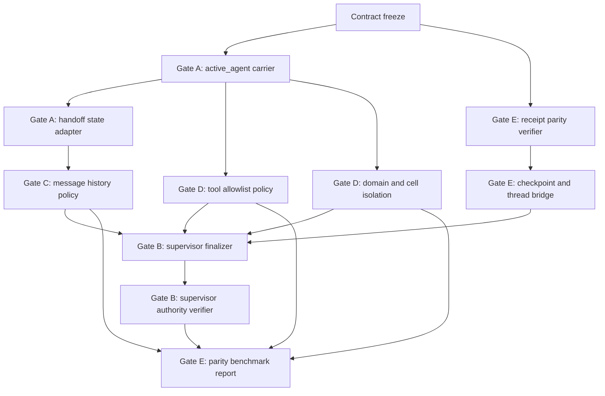

# LangGraph Parity Task Graph

Status: planning graph only
Owner: Agent 1, Planner/Architect
Date: 2026-06-29
Write scope for this pass: this file and `docs/langgraph_parity/LANGGRAPH_PARITY_CONTRACT.md`

## Purpose

This task graph sequences future implementation work for the LangGraph swarm/supervisor parity contract. It does not authorize runtime edits by itself. Future agents must preserve the custody rules in `LANGGRAPH_PARITY_CONTRACT.md` and must not introduce a new task authority, receipt system, or truth store.

## Gate Dependency Graph

## Work Items

| ID | Gate | Task | Depends on | Current owners | Proposed write target | Acceptance evidence |
| --- | --- | --- | --- | --- | --- | --- |
| T0 | A-E | Freeze this contract and graph | None | `docs/langgraph_parity/*` | No runtime target | These two docs exist and name local owners |
| A1 | A | Define `active_agent` carrier and validator | T0 | `Task`, `TaskDispatch`, `TaskBoard`, `Orchestrator`, A2A lifecycle, `ExecutionIdentity` | `dharma_swarm/langgraph_parity/state_contract.py` | Validator proves one live active owner per dispatch |
| A2 | A, C, D | Build local handoff command adapter | A1, E1 | `HandoffProtocol`, `MessageBus`, `TaskBoard`, `Orchestrator._assign_dispatch`, A2A `claim_task` | `dharma_swarm/langgraph_parity/handoff_adapter.py` | Handoff preserves history, appends event, updates active owner, rejects unknown target |
| A3 | A | Define default active agent selection | A1 | `SwarmRouter.plan`, `ProviderPolicyRouter.plan_swarm`, orchestrator dispatch plan metadata | `state_contract.py` | Default is explicit in plan metadata and never inferred from last message |
| B1 | B | Implement supervisor finalization contract | A1, C1, D1, D2, E2 | `Orchestrator`, `TaskBoard`, A2A lifecycle, `RuntimeLifecycle` | `dharma_swarm/langgraph_parity/supervisor_contract.py` | Final answer cites worker evidence and records supervisor as final authority |
| B2 | B | Verify supervisor block and overwrite guards | B1, E1 | A2A `close_task`, `TaskBoard.complete/fail`, route-truth helpers | `supervisor_contract.py` tests or verifier hooks | Worker output cannot overwrite supervisor final; block requires authority and evidence |
| C1 | C | Implement `full_history` and `last_message` policy | A2 | `MessageBus`, `HandoffProtocol`, `ContextCompiler`, memory context parity rules | `dharma_swarm/langgraph_parity/message_history_policy.py` | Both modes are deterministic, redacted, and budget-aware |
| C2 | C | Bind projection and secret filtering into history policy | C1 | memory context parity tests, context compiler, redaction policy | `message_history_policy.py` | Projection atoms omitted by default; raw paths and secrets redacted |
| D1 | D | Enforce role/agent tool allowlists | A1, E1 | `ToolRegistry`, `SwarmRouter`, `ProviderPolicyRouter`, route requests | `dharma_swarm/langgraph_parity/domain_policy.py` | Agent sees and dispatches only allowed tool names |
| D2 | D | Enforce domain, room, and cell isolation | A1 | orchestrator dispatch cell resolution, `DecisionRouter`, `ProviderPolicyRouter` | `domain_policy.py` | Ambiguous domain ownership denies action with failure evidence |
| E1 | E | Build receipt parity verifier | T0 | `EvidenceReceipt`, `RuntimeReceipt`, `IdempotencyRecord`, spine persistence, runtime lifecycle | `dharma_swarm/langgraph_parity/parity_verifier.py` | One logical dispatch has the expected receipt cardinality |
| E2 | E | Map LangGraph thread/checkpoint semantics to local identity | E1, A1 | `ExecutionIdentity`, `DurableWorkflow`, `CheckpointStore`, `RuntimeStateStore` | `dharma_swarm/langgraph_parity/checkpoint_bridge.py` | `run_id`, `trace_id`, `correlation_id`, `claim_id`, and checkpoint ids are stable across handoff |
| E3 | E | Produce parity benchmark report | B2, C1, D1, D2, E2 | `BenchmarkRegistry`, eval harnesses, Forge benchmark docs | `dharma_swarm/langgraph_parity/benchmark.py` | Report includes gates A-E, receipts, latency, throughput, tools, route truth, and canonical runtime receipt evidence |

## Gate Order

1. Gate A comes first because all later semantics depend on a single active execution owner.
2. Gate E receipt verification starts in parallel with Gate A because every later denial, handoff, finalization, and side effect must be auditable.
3. Gate C and Gate D depend on Gate A because message visibility and tool/domain rights must be evaluated for a known active agent and role.
4. Gate B depends on Gates A, C, D, and E because final authority must know ownership, visible evidence, permitted domains, and receipt truth.
5. Gate E benchmark reporting is last because it summarizes the implemented gates rather than declaring parity from partial evidence.

## Implementation Guardrails

- Future modules under `dharma_swarm/langgraph_parity/` are adapters and verifiers only.
- Adapters must call existing owners for state changes. They must not write their own task state or receipt truth.
- Denials must be auditable and side-effect-free.
- Provider execution claims must stay separated from simulated, pending, unproven, projection-only, or candidate-only claims.
- Benchmark output must never update archive or evolutionary fitness without the existing external acted receipt quorum.

## Planned Verification Ladder

Future implementation work should add checks in this order:

1. Static contract tests for `active_agent` derivation and clearing.
2. Handoff adapter tests for valid target, unknown target, previous agent, message preservation, and receipt identity.
3. Message policy tests for `full_history`, `last_message`, projection omission, redaction, and budget truncation.
4. Tool/domain tests for allowlist enforcement, environment-gated tools, ambiguous cell denial, and provider route context.
5. Supervisor tests for final authority, worker non-overwrite, block evidence, and final receipt citations.
6. Receipt parity tests for dispatch cardinality, idempotency, retry, failure, and checkpoint continuity.
7. Benchmark tests for gate pass rate, receipt completeness, latency percentiles, throughput, token/cost where available, tool-call count, provider-route truth, handoff success rate, supervisor override/block count, and `swarm_lift`.

## Stop Conditions

Stop and revise the contract before implementation if any future change requires:

- A new receipt authority or task truth store.
- A hidden second writer of assignment, claim, or terminal task state.
- Supervisor finalization by a worker.
- Tool execution outside an explicit role or agent allowlist.
- Domain action based on guessed or ambiguous cell ownership.
- Benchmark promotion from candidate-only metrics.
- Weakening telos, consent, lifecycle, route-truth, or governance gates.
