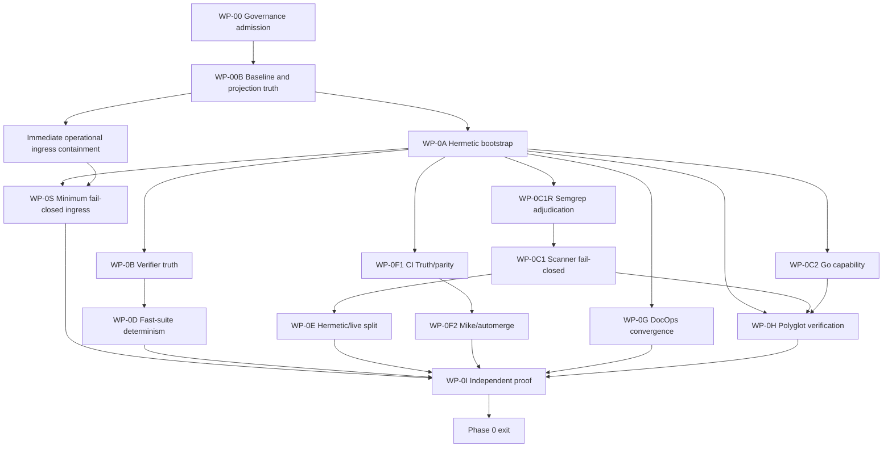

# Titanium-Grade Repository Hardening — Integrated Execution Specification vNext

**Doc role (per `docs/AGENTS.md`):** `working_plan` — a bounded internal-hardening campaign, not repo-level authority. It creates no new runtime substrate or governance owner and remains subordinate to `CLAUDE.md`, `docs/governance/ACTIVE_TRACK.yaml`, and the canonical document stack.

**Status:** operator-approved; WP-00 admission merged in PR #1000. WP-00B is the required post-admission baseline/executor/projection reconciliation packet. Phase 0 implementation begins only after WP-00B is independently reviewed and human-merged.

## Agent entrypoint

New agents start here:

1. Run `make onboard`.
2. Read this document's claim boundary, ownership rules, dependency graph, and Phase 0 exit gate.
3. Confirm PR #1000 and WP-00B are merged on current `origin/main`; if the immutable WP-00B baseline is absent or admission truth has drifted, reconcile it before opening a Phase 0 implementation packet.
4. Work one finding, one owner, and one bounded PR at a time.
5. Do not begin feature work, broad refactors, or live self-evolution before the independent Phase 0 clean-room proof passes on merged `main`.

## Main purpose

1. Make every repository verification signal truthful, reproducible, and failure-sensitive on a clean clone.
2. Raise security, runtime correctness, state integrity, typing, testing, and wiring to an independently credible enterprise standard.
3. Establish a trusted internal substrate before permitting new product features, venture cells, or live self-evolution.

## Objective

The repository itself is the product until an independent engineer can clone, understand, test, deploy, and trust it without access to the author's machine.

GitHub stars are not an engineering acceptance criterion. Public reproducibility, secure defaults, explicit ownership, recoverable state, and trustworthy verification are.

## Specification contract

This is the execution specification for a sustained internal-hardening campaign. It is written for autonomous coding agents, reviewers, and the operator.

It does not authorize a single unbounded rewrite. Every implementation change must ship as a reviewable work packet with:

- one declared surface owner;
- an explicit list of files allowed to change;
- an explicit list of adjacent surfaces that must not change;
- a failing behavioral or structural contract test before production/configuration changes;
- a rollback that restores the prior behavior without state surgery;
- a reproduction command and expected exit status;
- a finding ID from the registry below; and
- a PR body that states which claim becomes more truthful.

The campaign composes existing owners and gates. It must not create a new truth store, receipt format, policy engine, test framework, or catch-all god module.

### Claim boundary

- `PASS` means the exact stated command completed with exit code zero on the stated commit and environment.
- `FAIL` means the command executed and found a defect, stale evidence, malformed configuration, or unmet required condition.
- `NEEDS_HOST` means a live-only verifier could not run on the current host; it is neither pass nor failure.
- `BLOCKED_OPERATOR` means a required operator decision, credential, platform, or external setting prevents closure; it is not a pass.
- `HARNESS_PROVEN` means a bounded fixture or replay passed.
- `CLOSED_NOT_PROD` means repository behavior is verified without claiming production operation.
- `CLOSED_LIVE` requires a declared live owner surface and fresh production evidence.
- Missing tools, missing dependencies, missing receipts, skipped required tests, and malformed configuration never mean `PASS`.

## Audit baseline and immutable campaign baseline

Historical audit baseline before this plan branch:
`212df1a8c22bd2bbf731dd2308472fb9e2a2f549`. Its measurements remain
historical evidence only.

PR #1000 was admission-only. It merged the Titanium track and portfolio
reconciliation without claiming that it had captured the campaign baseline,
installed the executor prompt, reconciled this specification, or repaired the
dashboard projection.

WP-00B captures the immutable post-admission baseline from clean merged
`origin/main` at
`82f7f1e318f663c59c4fccf5ed62d70a8dcc0f89`. The evidence record is
`reports/governance/titanium/wp00_baseline.json`. It is a one-time snapshot,
not a mutable truth store. Later packets must rerun operational commands and
bind their evidence to their own exact commit and environment.

### Admission and WP-00B reconciliation record

Mutable GitHub observations in this table were captured through
`2026-07-17T12:00:37Z`. They are historical baseline evidence and must be
refreshed before any collision, review, CI, or merge decision.

| Decision or observation | Disposition |
|---|---|
| WP-00 PR | PR #1000, admission-only, human-merged |
| PR base | `09b1a400a8fec8a6e2824bd3ff75a4e77eceb457` |
| PR head | `7fe7a517c414f7780dcc2c404c1d78da7a0b4738` |
| Squash merge / campaign baseline | `82f7f1e318f663c59c4fccf5ed62d70a8dcc0f89` |
| Generated status | `origin/generated/status` at `f6721aa27b4a608cbb9fb3eb5565fba596a45113`, derived from the campaign baseline |
| Portfolio after admission | 10 active / 10 maximum; no spare slot |
| Mechanically shippable active tracks | zero in the generated post-admission projection |
| Mike disposition | Remains `ACTIVE`; WP-0F2 still owns Mike/automerge surfaces |
| TAM disposition | Retired honestly at sealed `AMBER` / 45%; never represented as shipped or parity-complete |
| Titanium lifecycle | `repository-titanium-hardening-2026-07` is `ACTIVE`, uses `governance_gate`, and targets `CLOSED_NOT_PROD` |
| WP-00B prompt index | As observed through the GitHub audit timestamp, `docs/prompts/README.md` is omitted because it is unowned by Titanium and overlaps draft PR #972 |
| Strict DocOps projection | Existing merged-main count drift is recorded as `FAIL`; generated projection repair is outside WP-00B |

### Immutable clean-main measurements

| Measure | WP-00B baseline | Reproduction |
|---|---:|---|
| Python modules under `dharma_swarm/` | 1,018 | `python3 scripts/docops/check_docops_integrity.py` |
| Python test files | 905 | same DocOps command |
| `def test_` occurrences | 13,540 | same DocOps command |
| Python LOC | 363,935 | same DocOps command |
| Collected pytest tests | unavailable before dependency bootstrap; 13,818 in the external AgentOps preflight environment | `python -m pytest tests/ --collect-only -q` |
| Markdown files | 1,434 | clean-base DocOps measurement |
| Markdown lines | 300,159 | clean-base DocOps measurement |
| Modules above 500 lines | 207 | `python3 scripts/governance/hygiene/ratchet.py --explain modules_over_500_lines` |
| Silent exception swallows | 241 | `python3 scripts/governance/hygiene/ratchet.py --explain silent_exception_swallows` |
| Active tracks | 10 / 10 maximum | `make onboard` |
| Shippable active tracks | 0 | generated active-track evidence for the exact base |

### Clean-main command-result baseline

| Command | Exit | Typed result |
|---|---:|---|
| `make onboard` | 0 | `PASS` for onboarding; optional external receipt-write warning preserved |
| `python3 scripts/docops/check_docops_integrity.py` | 1 | `FAIL`: count assertions and generated inventory are stale |
| `make docops-integrity` | 2 | `FAIL`: same strict DocOps drift |
| `.venv/bin/python -m pytest --collect-only -q` | 127 | `FAIL`: repository virtualenv absent |
| `make test-fast` | 2 | `FAIL`: pytest absent on the clean host |
| `make test` | 2 | `FAIL`: pytest absent on the clean host |
| `make go-ci` | 2 | `FAIL`: Go absent |
| `make governance-all` | 2 | `FAIL`: Semgrep advisory-skip followed by missing gitleaks |
| `make nats-substrate-contract` | 2 | `FAIL`: dependency/live-evidence prerequisites unavailable or stale |
| `make uplift-guards` | 2 | `FAIL`: Python dependency absent on the clean host |
| `python3 scripts/governance/render_active_track_includes.py --check` | 0 | `PASS` for rendered active-track includes only |
Missing tools and dependencies in this table are baseline facts, not accepted
skips and not Phase 0 closure.

### Post-bootstrap packet admission

WP-00B AgentOps preflight passed after an external dependency bootstrap:
13,818 tests collected and the exact clean filesystem snapshot was bound.
This later branch admission is not a clean-host baseline command.

The immutable packet's references to PR #972 are remote observations from the
GitHub audit window ending `2026-07-17T12:00:37Z`; its
`collision.checked_at_sha` binds repository state only, not continuing remote
PR state. Refresh the collision before review, rebase, or merge decisions.

## Finding registry

Every Phase 0+ implementation packet must close, narrow, or explicitly defer
at least one finding. Governance admission and reconciliation packets such as
WP-00 and WP-00B instead declare an exact control boundary and explicit
non-claims; they do not fabricate a finding closure.

The registry below is current-state truth, not a frozen copy of the original
audit. When an intervening PR narrows a finding without closing its complete
exit condition, the row records both the landed improvement and the residual
obligation.

Severity rubric:

- **5 — Critical:** remotely exploitable, corrupts canonical state, or can duplicate irreversible external effects.
- **4 — High:** defeats a required verification/control or makes production truth materially unreliable.
- **3 — Medium:** blocks clean-clone reproducibility, maintainability, or a declared operational lane.
- **2 — Low:** bounded defect with a working fallback and limited blast radius.
- **1 — Cosmetic:** presentation or local ergonomics only; never sufficient to justify a hardening packet alone.

| ID | Severity | Finding | Evidence owner | Reproduction / proof |
|---|---:|---|---|---|
| TIT-001 | 4 | `verifier-selfcheck` claims all gates are functional without executing behavioral gates | `Makefile:verifier-selfcheck` | compare target body with `make test-fast` result |
| TIT-002 | 4 | fast suite deterministically times out only in suite context | `Makefile:test-fast`, `tests/test_build_engine.py` | `make test-fast`; then run the failing test alone |
| TIT-003 | 3 | Go capability is inferred from executable presence, not required version | `tools/*/go.mod`, `tests/test_go_evidence_ingestor_bridge.py`, `tests/test_github_ingestor_runner.py`, sibling Go bridges | Go 1.22 host with modules declaring 1.26 |
| TIT-004 | 4 | missing Semgrep can exit zero in a required-looking local target (bootstrap-pinning component split to TIT-016 on 2026-07-18; PR #1019 cited TIT-004 pre-split) | `scripts/governance/run_semgrep_with_ca.sh` | remove Semgrep from `PATH` and run strict target |
| TIT-005 | 4 | uplift subprocess can block indefinitely on inherited stdin | `scripts/uplift_guards/shakti_warrant_guard.py` | run `make uplift-guards` with open non-TTY stdin |
| TIT-006 | 4 | PR #993 removed the observed duplicate `advisory` key, but the generic CI Truth JSON loader still accepts a future duplicate top-level key; recurrence prevention remains open | `scripts/runtime/ci_truth.py`, `docs/governance/CI_TRUTH_CONTRACT.json` | inject a duplicate top-level key and require configuration rejection |
| TIT-007 | 4 | PR #993 aligned CI Truth, parity, Mike/automerge, and live protection on the transitional legacy six; final-set ratification, the onboarding-name/packet-scope decision, continuously authenticated live parity, and final consumer proof remain open | CI Truth/parity owners plus Merge Master Mike | exact-set comparison, `check_ci_parity.py --live`, and final-set consumer tests |
| TIT-008 | 4 | strict DocOps is red while PR count drift is advisory and the rolling repair PR can lose checks | DocOps scripts/workflows | `make docops-integrity`; inspect latest reconcile PR head checks |
| TIT-009 | 3 | hermetic governance depends on live NATS freshness | `Makefile:nats-substrate-contract` | run on a clean clone without daemon state |
| TIT-010 | 5 | production-shaped API opens mutations when no key is configured; GraphQL/WS bypass bearer scope | `api/main.py`, `Dockerfile` | protected/unprotected TestClient matrix |
| TIT-011 | 5 | durable invoker is effective-once in bounded cases, not strict exactly-once for external effects | `dharma_swarm/graph/durable_invoker.py` | crash after provider success before DB completion |
| TIT-012 | 4 | task, runtime, ontology, memory, and JSONL state have split authority | `dharma_swarm/swarm.py`, `dharma_swarm/runtime_state.py`, mismatch map | crash/consistency matrix |
| TIT-013 | 4 | critical behavior remains concentrated in god modules and silent catches | hygiene ratchet | module/silent-swallow counters |
| TIT-014 | 4 | untrusted proof/scorer paths still execute shell/native code without a complete jail | `sealed_packet_apply.py`, chamber sandbox | adversarial escape suite |
| TIT-015 | 3 | terminal behavior is not continuously verified in current CI and Bun is absent on clean agents | `terminal/`, active-track criterion | Bun clean-clone test |
| TIT-016 | 4 | unpinned local dependency bootstrap: `make install` was unpinned editable pip and the Dockerfile swallowed dependency-install failure (split from TIT-004 on 2026-07-18 so Semgrep absence and bootstrap pinning carry distinct IDs; WP-0A and PR #1019 cited TIT-004 pre-split) | `Makefile`, `Dockerfile` | narrowed by WP-0A (PR #1019, merged `6b1c5438`), NOT closed: the Docker dependency-failure negative control is `NEEDS_HOST` and the clean-container claim is CI/host evidence (`reports/agentops/work_packets/titanium-WP-0A-hermetic-bootstrap.json` honest blockers); the residual obligation closes only with that host evidence, inside the WP-0I clean-room proof |

## Governance and ownership

WP-00 admits a bounded campaign owner for previously unowned Phase 0 surfaces. Existing ownership remains narrower than the first revision of this specification implied:

| Active track | Surfaces relevant here that it actually owns |
|---|---|
| `merge-master-mike-d4-2026-06` | `pr_merge_control.py`, Mike daemon, automerge/router/backlog workflows, GitHub-review bridge test |
| `sovereign-safety-tcb-2026-07` | evolution safety, claim/evidence and pramana scripts, hygiene package/pattern, telos/titanium packages, named TCB workflows/tests |
| `dharmagraph-engine-2026-07` | graph package, workflow/topology/checkpoint, narrow swarm/orchestrator seams, `pyproject.toml` test-oracle extra only, named graph tests/workflow |
| `organism-rewire-2026-07` | Go tools, world radar, organism surfaces, `docker-compose.yml`, `Dockerfile.swarm` |
| `helm-worldclass-terminal-2026-06` | `terminal/**` |
| `loop-closure-2026-06` | `reports/loop_closure/**` and `CYBERNETIC_LOOP_MAP.md` only |
| `repository-titanium-hardening-2026-07` | only the WP-00-admitted, previously unowned Phase 0 surfaces enumerated below |

Before WP-00, the following Phase 0 surfaces had no declared owner broad enough
for this campaign: `Makefile`, `Dockerfile`, hermetic/parity workflows, CI
Truth/parity files, DocOps scripts/workflows/generated blocks, and uplift/scan
wrappers. Current exact ownership lives only in
`docs/governance/ACTIVE_TRACK.yaml`; the list below is a non-authoritative
admission summary and must not be used for collision decisions.

### WP-00 — Governance admission (merged)

**Merged:** PR #1000 at
`82f7f1e318f663c59c4fccf5ed62d70a8dcc0f89`.

WP-00 performed admission only:

1. Retired `company-builder-parity-2026-07` honestly at its sealed AMBER 45% outcome.
2. Admitted `repository-titanium-hardening-2026-07` at legal 10/10 capacity.
3. Kept existing owner surfaces with their existing tracks.
4. Kept `merge-master-mike-d4-2026-06` active through WP-0F2.
5. Regenerated the canonical portfolio projections.

WP-00 explicitly deferred the immutable baseline, executor prompt,
specification reconciliation, and dashboard projection repair to WP-00B. It
did not authorize Phase 0 implementation.

WP-00 admission ownership summary:

- `Makefile`
- `Dockerfile`
- `.github/workflows/hermetic.yml`
- `.github/workflows/tests.yml`
- `.github/workflows/ci-parity.yml`
- `.github/workflows/docops.yml`
- `.github/workflows/docops-reconcile-main.yml`
- `.github/workflows/pr-dedupe.yml`
- `.github/workflows/bot-pr-limit.yml`
- `docs/governance/CI_TRUTH_CONTRACT.json`
- `scripts/governance/ci_parity_manifest.json`
- `scripts/governance/check_ci_parity.py`
- `scripts/runtime/ci_truth.py`
- `scripts/governance/run_semgrep_with_ca.sh`
- `scripts/uplift_guards/shakti_warrant_guard.py`
- `scripts/uplift_guards/run_pre_commit.py`
- `scripts/governance/check_shakti_warrant.py`
- `scripts/governance/check_nats_substrate_contract.py`
- `scripts/governance/check_nats_live_production_evidence.py`
- `scripts/governance/run_nats_live_production_matrix.py`
- `.github/workflows/a2a-agni-live-contact.yml`
- `scripts/docops/**`
- `dharma_swarm/build_engine.py` (TIT-002 only)
- `dharma_swarm/autonomous_agent.py` (TIT-002 leaked-process investigation only)
- `dharma_swarm/diff_applier.py` and `tests/test_diff_applier.py` (TIT-002 process-tree cleanup investigation only)
- `dharma_swarm/sandbox.py` and `tests/test_sandbox.py` (TIT-002 process-tree cleanup investigation only)
- `docs/docops/AUTO_INVENTORY.md`
- `api/main.py` and existing API-auth tests for the narrow WP-0S fail-closed containment packet only
- `tests/test_hermetic_supply_chain.py`
- Phase 0 contract tests introduced by this specification

WP-00 also admits these exact campaign-control and dashboard projection
surfaces. The dashboard API remains the truth source; this scope removes only
stale client-side authority constants and does not create a new status owner:

- `docs/plans/TITANIUM_GRADE_REPOSITORY_HARDENING_2026-07-10.md`
- `docs/prompts/TITANIUM_HARDENING_CAMPAIGN_EXECUTOR_2026-07-17.md`
- `reports/governance/titanium/**`
- `dashboard/src/lib/operatorCoherence.ts`
- `dashboard/src/components/operator-coherence/v2/cockpitV2Model.ts`
- `dashboard/src/components/operator-coherence/v2/CockpitV2Board.tsx`
- `dashboard/src/components/operator-coherence/v2/cockpitV2Model.test.ts`

WP-00 preserved the already-ratified `organism-rewire-2026-07` ownership of
the following Go-trigger seam; this is historical context, not a future action:

- `scripts/runtime/github_ingestor_runner.py`
- `tests/test_github_ingestor_runner.py`
- `tests/test_go_evidence_ingestor_bridge.py`
- `tests/test_go_github_ingestor_bridge.py`
- `tests/test_go_world_signal_bridge.py`
- `tests/test_go_receipt_identity_verify.py`
- `tests/test_go_adapter_contracts.py`
- `tests/test_world_radar_go_bridge.py`

### WP-00B — Admission reconciliation, baseline, executor, and dashboard truth

**Depends on:** WP-00 merged in PR #1000
**Owner:** `repository-titanium-hardening-2026-07`
**Control boundary:** governance reconciliation exception; admission/projection
truth only, with no claimed TIT finding closure and no WP-0S, WP-0A, WP-0B, or
other Phase 0 implementation

**Allowed files**

- `reports/agentops/work_packets/repository-titanium-hardening-2026-07-WP-00B.json`
- `docs/plans/TITANIUM_GRADE_REPOSITORY_HARDENING_2026-07-10.md`
- `docs/prompts/TITANIUM_HARDENING_CAMPAIGN_EXECUTOR_2026-07-17.md`
- `reports/governance/titanium/wp00_baseline.json`
- `dashboard/src/lib/operatorCoherence.ts`
- `dashboard/src/components/operator-coherence/v2/cockpitV2Model.ts`
- `dashboard/src/components/operator-coherence/v2/CockpitV2Board.tsx`
- `dashboard/src/components/operator-coherence/v2/cockpitV2Model.test.ts`

`docs/prompts/README.md` is deliberately excluded: as observed through
`2026-07-17T12:00:37Z`, the path is unowned by Titanium and overlaps draft PR
#972. Generated DocOps projections are also excluded; their existing
merged-main drift remains a typed blocker.

**Required outcomes**

1. Bind the exact PR #1000 admission provenance and clean merged-main baseline.
2. Install a non-authoritative resumable executor prompt for Phases 0–7.
3. Make this specification place WP-00B between admission and all implementation.
4. Remove stale June SHA, branch, active-count, dirty-candidate, and historical
   production-readiness constants from the live dashboard path.
5. Derive checkout authority and active-track lifecycle review from the current
   operator-coherence report, treating local truth as local and `SHIPPABLE` as
   closure eligibility rather than production proof.
6. Preserve required-check, Administration-read, deployment, credential,
   live-host, DocOps, and independent-review blockers.
7. Preserve human merge authority.

**Exit**

The focused dashboard contracts run as mandatory external verification because
the current AgentOps positive-gate allowlist does not admit Node/npm commands.
Those contracts and the admitted AgentOps packet evaluator closeout must pass.
The canonical `make agent-build-closeout` command must still be invoked, but
its full-repository `governance-all` tail is known from the immutable baseline
to fail on absent gitleaks before this packet can repair that prerequisite.
For WP-00B only, the truthful closeout boundary is therefore:

- the AgentOps closeout report says `status: passed` and proves the exact
  eight-file scope, packet gates, and formal harness negative control;
- the external dashboard verification is green on the same candidate blobs;
- the parent Make result and its out-of-scope tail failure are preserved as
  nonzero evidence and are never called a successful full closeout; and
- any failure before packet-evaluator success, any scope violation, or any new
  or different tail failure blocks review.

This narrow governance-bootstrap exception does not waive the red repository
bundle, does not apply to Phase 0 implementation packets, and does not satisfy
the Phase 0 exit gate. It permits only a draft WP-00B PR for independent review
and human merge. Only merged-main reverification closes WP-00B and permits the
first dependency-ready Phase 0 implementation packet.

Implementation PR rules:

- Run collision preflight for every BR-id cited.
- One PR may touch only one active owner's surfaces.
- A cross-owner dependency is represented by stacked PR ordering, not mixed ownership in one diff.
- Expanding an allowed-file list requires an approved specification amendment before editing.
- Within this campaign only: every Titanium work packet's allowed-file list
  implicitly includes that packet's own runner-required canonical AgentOps
  path `reports/agentops/work_packets/<packet-id>.json`, added byte-identically
  to the external preflight copy during the work (never before preflight).
  Ratified 2026-07-18 from PR #1019's recorded deviation:
  `scripts/governance/run_agent_work_packet.py` admits an edit only when the
  tracked canonical packet path appears in `allowed_files`, so WP-0A
  necessarily shipped
  `reports/agentops/work_packets/titanium-WP-0A-hermetic-bootstrap.json`
  alongside its four spec-listed files. This clause admits only the packet's
  own canonical path and no other unlisted file. It restates observed runner
  behavior for Titanium packet authoring; it claims no authority over the
  canonical Session Entry/AgentOps boundary for non-Titanium packets (per
  `docs/AGENTS.md`, this document is a `working_plan`, not repo-level
  governance).

## Campaign dependency graph



## Autonomous execution protocol

For every work packet:

1. Run `make onboard`, record branch/SHA/dirty state, then run
   `make agent-build-preflight PACKET=<path>` for the exact packet.
2. Read the touched module, its tests, and the relevant mismatch-map entry.
3. Write one failing behavioral or structural contract test that kills the observed failure mode.
4. Run only that test and capture the expected failure.
5. Implement the smallest change that makes the test pass.
6. Run the work-packet verification commands.
7. Run `make agent-build-closeout PACKET=<path>`.
8. Review `git diff --check`, changed-file scope, generated files, and secrets.
9. Commit one logical change, push, and open/update a draft PR.
10. Do not start a dependent packet until its prerequisite PR is green or the operator explicitly authorizes stacked work.

For WP-00B, step 7 uses the explicit bootstrap closeout boundary above. Every
implementation packet remains blocked by a nonzero canonical closeout target;
the WP-00B exception must not be generalized.

## Titanium-grade standard

The repository must be:

- secure by default;
- hermetic and reproducible;
- fully testable from a clean clone;
- failure-sensitive, with no false-green checks;
- crash-recoverable;
- explicit about state ownership;
- typed at public boundaries;
- observable without reading raw logs;
- free of hidden author-machine dependencies;
- behaviorally tested rather than existence-tested;
- modular enough for independent contributors; and
- honest about `LIVE`, `PARTIAL`, and experimental surfaces.

## Exact toolchain contract

WP-00B records current host/tool observations and WP-0A validates the following proposed clean-room versions:

- Python 3.12.13 primary;
- Python 3.11.15 compatibility;
- uv 0.11.2;
- Go 1.26.3;
- Node 22.23.1;
- Bun 1.1.38;
- Semgrep 1.168.0; and
- gitleaks 8.30.1.

Primary clean-room environment: Linux x86_64.

Each version must exist, support the target platform, and be compatible with repository manifests before it becomes the packet's ratified pin. If a proposed version is invalid or conflicts with an owned manifest, the owner amends this table through a reviewed packet with evidence; agents do not silently substitute `latest`, an unbounded range, or an author-machine version.

## Best next long-running goal

### Make `main` truthfully green from a clean clone

This precedes runtime hardening because the adversarial audit found that the measuring instruments themselves are not yet consistently trustworthy:

- `verifier-selfcheck` reported `ALL GATES FUNCTIONAL` while `make test-fast` was broken;
- missing Semgrep was treated as a successful skip;
- CI required-check definitions disagreed before #993; final-set ratification and authenticated live parity remain open;
- a duplicate JSON key silently removed pytest and gitleaks classifications before #993; duplicate-key rejection remains open;
- strict DocOps was red while the PR check was green;
- Go presence was mistaken for Go compatibility;
- `uplift-guards` could wait indefinitely on stdin; and
- repository verification and live-host readiness were mixed together.

Until the remaining items are corrected and the landed repairs are continuously proved, later green results remain provisional.

## Phase 0 — Verification truth

Phase 0 should land as several reviewable PRs under existing surface owners. It must not become one giant hardening PR or a new catch-all framework.

Phase 0 also owns minimum fail-closed ingress because a repository cannot be called truthfully green while a production-shaped service opens mutation paths when authentication is absent. Full boundary hardening remains Phase 1; Phase 0 establishes the non-negotiable safety floor.

Before code changes, the operator records one deployment status for the FastAPI service:

- `CONTAINED` — public exposure removed or service stopped;
- `PRIVATE_ONLY` — bounded to loopback/private authenticated ingress;
- `NOT_DEPLOYED` — no reachable deployment exists; or
- `BLOCKED_OPERATOR` — exposure cannot yet be established.

If public or ambiguous exposure exists, containment happens immediately rather than waiting for the packet stack.

### 0.1 Hermetic bootstrap

- Pin and install Python, Go 1.26, Bun, Node, Semgrep, and gitleaks.
- Use the existing lockfiles in every test and deployment lane.
- Remove dependency-installation paths that suppress failure with `|| true`.
- Ensure one bootstrap command works on a fresh Linux clone.
- Remove reliance on user-site packages, shell profiles, and author-local paths.

### 0.2 Repair the verifier

- Make `verifier-selfcheck` execute meaningful behavioral tests or narrow its success claim.
- Diagnose and fix the suite-order or resource leak causing the deterministic ten-second timeout.
- Probe Go version and module compatibility, not merely `which go`.
- Close stdin and add bounded timeouts to governance subprocesses.
- Make missing required tools fail rather than skip green.

### 0.3 Separate hermetic and live verification

Repository CI must not depend on a live daemon receipt.

- The hermetic lane owns code, tests, contracts, static analysis, and fixtures.
- The live-host lane owns NATS freshness, daemon receipts, provider keys, and VPS state.
- Live requirements report explicit `NEEDS_HOST`, never `PASS` and never an ambiguous failure.
- Existing state and receipt owners remain authoritative; this phase creates no new truth store.

### 0.4 Unify CI authority

- Reject duplicate JSON keys before decoding; preserve #993's one-manifest binding across CI Truth, automerge, Merge Master Mike, and parity checks.
- Ratify and migrate the final required-check set.
- Make authenticated comparison between the manifest and actual branch protection continuous.
- Reject reviews bound to stale heads.
- Ensure manual Mike dispatch cannot proceed when required checks are absent.
- Decide and enforce the human-review policy explicitly.

### 0.5 Restore strict DocOps

- Make strict DocOps pass on `main`.
- Fix the rolling reconciliation PR so force-updates trigger checks.
- Stop snapshot PR accumulation.
- Require generated counts to be reproducible, current, and independently checked.

### 0.6 Prove the result independently

- A second agent or engineer starts from a fresh clone and receives only this specification.
- The reviewer captures the current `main` SHA and toolchain versions, runs the complete Phase 0 exit gate, and verifies the final worktree is clean.
- The author does not repair the reviewer's environment interactively or reinterpret failures as passes.
- Any unavailable live prerequisite is reported with the exact `NEEDS_HOST` or `BLOCKED_OPERATOR` reason.
- Phase 0 does not close until the independent result is green.

## Phase 0 work packets

### WP-0S — Minimum fail-closed ingress

**Findings:** TIT-010
**Owner:** WP-00-admitted `repository-titanium-hardening-2026-07` for the narrow API containment seam; operator owns deployment containment
**Depends on:** WP-00B, WP-0A

**Allowed files**

- `api/main.py`
- existing API authentication/configuration module used directly by `api/main.py`, if one exists
- `tests/test_api_auth.py`
- `tests/test_verify_api.py`
- one new focused API ingress contract test if the existing tests cannot express the matrix

Deployment files already owned by another track are read-only in this packet. Any required deployment-manifest change is a separate stacked PR under that owner.

**Required implementation**

1. Define explicit local-development and production-shaped modes; ambiguous mode selects the safer behavior.
2. Refuse production-shaped startup when required authentication material is absent.
3. Classify REST, GraphQL, WebSocket, webhook, A2A, and health/readiness ingress as public, authenticated-read, authenticated-mutate, or disabled.
4. Apply one fail-closed authorization decision across every enabled mutation transport.
5. Keep any local-only unauthenticated escape hatch explicit, loopback-bound, logged, tested, and excluded from production-shaped startup.
6. Do not claim full security-boundary closure; this packet establishes only the minimum default-deny floor.

**Behavioral tests**

- Production-shaped mode with no key or equivalent credential fails startup.
- Invalid credentials fail across every enabled protected ingress class.
- Valid credentials reach only their declared scope.
- GraphQL and WebSocket mutation paths cannot bypass the REST bearer decision.
- Webhook signatures fail closed when verification material is absent or malformed.
- Public health/readiness endpoints expose no mutation or secret-bearing payload.
- Local-development bypass, if retained, is rejected on non-loopback binding.

**Verification**

```bash
.venv/bin/python -m pytest -q tests/test_api_auth.py tests/test_verify_api.py
```

The packet adds any new focused contract test to this command.

**Negative controls**

- Remove the credential requirement in production-shaped mode → the startup-negative test fails.
- Remove authorization from GraphQL or WebSocket mutation ingress → the route matrix fails.
- Treat missing webhook verification material as success → the webhook negative test fails.

**Rollback**

Revert the complete code-and-test packet. If rollback would re-open a reachable deployment, keep the service contained until a corrected packet lands.

**Exit**

- Default production-shaped startup and all enabled mutation ingress fail closed.
- Deployment status is recorded as `CONTAINED`, `PRIVATE_ONLY`, or `NOT_DEPLOYED`; `BLOCKED_OPERATOR` prevents Phase 0 closure.
- The result is `CLOSED_NOT_PROD` unless fresh deployment evidence proves `CLOSED_LIVE`.

### WP-0A — Hermetic Python bootstrap

**Findings:** TIT-016 (split from TIT-004 on 2026-07-18; the merged PR #1019 cited TIT-004 pre-split)
**Owner:** WP-00-admitted `repository-titanium-hardening-2026-07`
**Depends on:** WP-00B

**Allowed files**

- `Makefile`
- `.github/workflows/hermetic.yml`
- `Dockerfile`
- `tests/test_bootstrap_contract.py` (new)

`pyproject.toml` and `uv.lock` are read-only inputs in this packet. Any discovered dependency-manifest defect requires a separate DharmaGraph-owned packet because that track owns the shared `pyproject.toml` test-oracle seam.

**Required implementation**

1. Add `UV_VERSION ?= 0.11.2` and a `bootstrap` target that installs that exact version through the current Python, resolves its user-base executable path, then runs `uv lock --check` and `uv sync --frozen --extra dev`.
2. Make `uv lock --check` and `uv sync --frozen --extra dev` the Python dependency path used by verification.
3. Make `install` delegate to the same frozen path rather than unpinned `pip install -e ".[dev]"`.
4. Make repository commands resolve `.venv/bin/python` and `.venv/bin/ruff` explicitly after bootstrap.
5. Align `Dockerfile` with the locked Python closure or label it as a separate non-hermetic legacy lane; it may not claim hermeticity while using live resolution.
6. Do not download unpinned executable scripts during a required verification lane.

The Make target must implement the equivalent of:

```bash
python3 -m pip install --user "uv==0.11.2"
UV_BIN="$(python3 -m site --user-base)/bin/uv"
"$UV_BIN" lock --check
"$UV_BIN" sync --frozen --extra dev
```

If the repository later supplies uv in the base environment, the same target may reuse it only after confirming the exact version.

**Tests**

- Add a bootstrap contract test that reads the real Makefile/workflow and proves:
  - the exact pinned uv version is installed or found;
  - `uv.lock` is checked before sync;
  - the frozen lock is used;
  - verification resolves tools inside `.venv`; and
  - Docker dependency failure is not swallowed.
- The test must fail if bootstrap returns to unpinned editable installation or bypasses lock drift.

**Verification**

```bash
make bootstrap
.venv/bin/python -m pytest --collect-only -q
make install
make lint-blockers
```

The clean-container test starts with Python and pip but no uv, user-site packages, repository venv, or author state.

**Expected negative controls**

- Modified `pyproject.toml` without lock refresh → bootstrap fails at `uv lock --check`.
- Pinned uv installation/invocation failure → bootstrap exits nonzero with an actionable message.
- Dependency resolution failure during Docker build → image build fails.

**Rollback**

Revert only `Makefile`, `hermetic.yml`, `Dockerfile`, and the bootstrap contract test. No state migration is permitted in this packet.

**Exit**

- A fresh Linux clone reaches a working `.venv` through one documented command.
- Repeating the command is idempotent.
- No user-site package or shell profile is required.

### WP-0B — Verifier truth

**Findings:** TIT-001
**Owner:** WP-00-admitted `repository-titanium-hardening-2026-07`
**Depends on:** WP-0A

**Allowed files**

- `Makefile`
- `tests/test_verifier_selfcheck_contract.py` (new)

**Required implementation**

Choose and encode one honest contract:

- Preferred: `verifier-selfcheck` runs a bounded behavioral sentinel in addition to syntax, F821, collection, and onboarding.
- Acceptable: narrow the target and banner to state exactly what it verifies, while `agent-build-preflight` separately runs the behavioral sentinel.

It must never print `ALL GATES FUNCTIONAL` unless all gates named by that phrase were executed.

**Tests**

- Add a meta-test that substitutes a failing behavioral sentinel and asserts `verifier-selfcheck` exits nonzero.
- Add a positive control proving a passing sentinel produces the narrowed success banner.
- Assert the target uses repository `.venv` Python after bootstrap.

**Verification**

```bash
make verifier-selfcheck
make agent-build-preflight PACKET=<path>
```

**Mutation check**

Removing the behavioral command or replacing its failure with `|| true` must fail the meta-test.

**Rollback**

Revert the complete packet, which reopens TIT-001 and blocks Phase 0. Never restore the overbroad banner without the behavioral command it names.

**Exit**

Success output and executed evidence are equivalent.

### WP-0C1R — Semgrep finding adjudication

**Findings:** TIT-004
**Owner:** WP-00-admitted `repository-titanium-hardening-2026-07`
**Depends on:** WP-0A

**Allowed files**

- source files containing findings confirmed on the dynamic baseline, grouped into owner-safe PRs
- the narrow tests that prove each confirmed behavior
- existing Semgrep rule/config files only when a false positive is demonstrated with a focused rule test

The scanner wrapper, required/advisory target behavior, and governance orchestration are read-only in this packet; WP-0C1 owns them.

**Required implementation**

1. Run the pinned Semgrep version against the exact dynamic baseline and record the complete finding set.
2. Adjudicate every finding as:
   - fixed with a regression test;
   - false positive with a narrow rule/config proof; or
   - `BLOCKED_OPERATOR`/owner-deferred with a finding ID, owner, and reason that prevents Phase 0 closure.
3. Split fixes by active owner and blast radius; do not mix unrelated findings into a scanner-cleanup omnibus.
4. Do not add broad ignores, global exclusions, or a new baseline merely to make the result green.

**Verification**

```bash
make semgrep-strict
```

Each owner-safe PR also runs its focused regression tests.

**Negative controls**

- Restore any fixed pattern → strict Semgrep or its focused regression test fails.
- Broaden an ignore beyond the demonstrated false positive → the rule/config test fails.
- Leave an unadjudicated finding → the packet remains incomplete.

**Rollback**

Revert only the affected owner-safe fix and its focused tests. Reopening a finding blocks WP-0C1 and Phase 0.

**Exit**

The dynamic-baseline finding set is fully adjudicated and strict Semgrep is clean before scanner absence/failure semantics become required.

### WP-0C1 — Required scanners and governance subprocesses fail closed

**Findings:** TIT-004, TIT-005
**Owner:** WP-00-admitted `repository-titanium-hardening-2026-07`
**Depends on:** WP-0A, WP-0C1R

**Allowed files**

- `Makefile`
- `scripts/governance/run_semgrep_with_ca.sh`
- `scripts/uplift_guards/shakti_warrant_guard.py`
- `scripts/uplift_guards/run_pre_commit.py`
- `scripts/governance/check_shakti_warrant.py`
- `tests/test_semgrep_wrapper.py` (new)
- `tests/test_uplift_guard_subprocess.py` (new)

**Required implementation**

1. Make `make semgrep` a strict required scan. Move the current warn-only behavior to an explicitly named advisory/baseline target.
2. Preserve WP-0C1R's clean result rather than baselining real findings into the required scan.
3. Required Semgrep mode exits nonzero when Semgrep is absent.
4. Gitleaks absence fails with an actionable message before command execution.
5. Every governance subprocess receives closed stdin unless input is explicitly part of its contract.
6. Every governance subprocess has a wall-clock timeout and converts timeout into a nonzero, named failure.

**Tests**

- Strict Semgrep with a stripped `PATH` exits nonzero.
- A deliberately violating fixture makes the strict scan fail.
- Advisory baseline mode emits `SKIPPED`/findings and never appears in `governance-all`.
- A child process that waits on stdin is terminated within its test timeout.
- A passing child still returns its real output and exit code.

**Verification**

```bash
make semgrep
make gitleaks
make uplift-guards
python3 -m pytest -q tests/test_semgrep_wrapper.py tests/test_uplift_guard_subprocess.py
```

**Negative controls**

- `PATH` without Semgrep/gitleaks → named nonzero failure.
- Injected Semgrep violation → nonzero failure.
- Open stdin with no bytes → bounded completion, not hang.

**Rollback**

Revert scanner and subprocess changes together with their tests. Reverting reopens TIT-004/TIT-005 and blocks Phase 0; an indefinite timeout or green missing-tool result may not be restored selectively.

**Exit**

Required scanners are strict and present; uplift guards finish within their declared budget in TTY and non-TTY environments.

### WP-0C2 — Version-aware Go capability

**Findings:** TIT-003
**Owner:** `organism-rewire-2026-07` after WP-00 ownership extension
**Depends on:** WP-0A

**Allowed files**

- `dharma_swarm/world_radar/go_invoke.py`
- `Dockerfile.swarm`
- `scripts/runtime/github_ingestor_runner.py`
- `tests/test_github_ingestor_runner.py`
- `tests/test_go_evidence_ingestor_bridge.py`
- `tests/test_go_github_ingestor_bridge.py`
- `tests/test_go_world_signal_bridge.py`
- `tests/test_go_receipt_identity_verify.py`
- `tests/test_go_adapter_contracts.py`
- `tests/test_world_radar_go_bridge.py`
- `tests/test_hermetic_supply_chain.py`

**Required implementation**

1. Promote the existing version-aware check in `tests/test_go_adapter_contracts.py` into the single production helper owned by `world_radar/go_invoke.py`.
2. Compare installed Go with the exact module `go` directive before selecting `go run`.
3. Route every listed test and `github_ingestor_runner.py` through that helper.
4. When no compatible binary/toolchain exists, return or skip with explicit `NEEDS_HOST`; do not attempt execution and do not move queued payloads to `failed/`.
5. Remove `Dockerfile.swarm` dependency-install suppression so an invalid Python environment cannot boot the Go-integrated daemon.

**Tests**

- Fake Go 1.22 against `go 1.26` → incapable.
- Fake Go 1.26.x → capable.
- Prebuilt executable binary works without Go.
- Malformed `go version` and unreadable `go.mod` fail closed.
- Every affected bridge test uses the shared helper; direct `shutil.which("go")` capability gates are absent.

**Verification**

```bash
make go-ci
python3 -m pytest -q \
  tests/test_github_ingestor_runner.py \
  tests/test_go_evidence_ingestor_bridge.py \
  tests/test_go_github_ingestor_bridge.py \
  tests/test_go_world_signal_bridge.py \
  tests/test_go_receipt_identity_verify.py \
  tests/test_go_adapter_contracts.py \
  tests/test_world_radar_go_bridge.py
```

**Rollback**

Revert the shared helper and all consumers atomically. Partial rollback would recreate split capability answers.

**Exit**

One version-aware helper determines Go capability for all Go bridges and tests.

### WP-0D — Fast-suite determinism

**Findings:** TIT-002
**Owner:** WP-00-admitted `repository-titanium-hardening-2026-07`
**Depends on:** WP-0A, WP-0B

**Observed symptom**

`make test-fast` repeatedly stopped after 1,666 passes while setting up `TestDryRun.test_dry_run_no_files_changed`. The same test passed alone in under one second. This proves suite-order, leaked-resource, or global-state coupling; it does not prove `build_engine.py` itself is defective.

**Allowed files**

- `tests/test_build_engine.py`
- `tests/test_autonomous_agent.py`
- `tests/test_fast_suite_isolation.py` (new)
- `tests/test_diff_applier.py`
- `tests/test_sandbox.py`
- `dharma_swarm/build_engine.py`
- `dharma_swarm/autonomous_agent.py`
- `dharma_swarm/diff_applier.py`
- `dharma_swarm/sandbox.py`
- `Makefile`

Production files may change only after the minimized reproducer proves their causality. If another file owns the leak, stop and amend this specification before editing it.

**Bounded design amendment (2026-07-20)**

Human merge of [PR #1068](https://github.com/AmitabhainArunachala/dharma_swarm/pull/1068)
as commit
[`96f057cea8b3255c9f435b026ff544755f6e8d2d`](https://github.com/AmitabhainArunachala/dharma_swarm/commit/96f057cea8b3255c9f435b026ff544755f6e8d2d)
ratified live ACTIVE_TRACK ownership for exactly the four source/test additions
listed above. A review submitted after that merge identified that this
canonical allowed-file block and the campaign ownership summary remained
stale. This amendment aligns those two design declarations with the
human-ratified ownership change; it grants no other file or implementation
authority. The merged #1068 packet remains immutable historical evidence and
is not rewritten by this follow-up.

Reproduce the authority and the committed-range whitespace proof with:

```bash
git show --stat 96f057cea8b3255c9f435b026ff544755f6e8d2d
gh pr view 1068 --repo AmitabhainArunachala/dharma_swarm \
  --json state,mergedAt,mergedBy,mergeCommit,files
git diff --check \
  94accf91069466caa787dfa4546a97d49b9cfa34...96f057cea8b3255c9f435b026ff544755f6e8d2d
```

**Investigation protocol**

1. Reproduce the failure twice from a clean `.pytest_cache`.
2. Run the failing test alone.
3. Bisect the preceding collected test modules until the smallest order-dependent prefix is known.
4. Measure child processes, open file descriptors, event loops, temporary git hooks, and environment mutations before and after the minimal prefix.
5. Write a regression test that reproduces the leaked state without relying on wall-clock luck.
6. Fix the owner of the leak.

**Forbidden fixes**

- Raising the global fast timeout without root-cause evidence.
- Marking the failing test slow merely because it appears late in the suite.
- Adding retries.
- Reordering tests to hide shared state.

**Verification**

```bash
make test-fast
make test-fast
make test
```

Two consecutive fast runs are required to reject one-off luck.

**Rollback**

Revert the isolated leak fix. If production behavior changed, restore it and keep the regression test failing until a safer fix is designed.

**Exit**

- Two clean consecutive fast-suite passes.
- No new unraisable subprocess/event-loop warning.
- The isolated test remains fast.

### WP-0E — Hermetic/live verification split

**Findings:** TIT-009
**Owner:** WP-00-admitted `repository-titanium-hardening-2026-07`
**Depends on:** WP-0C1

**Allowed files**

- `Makefile`
- `scripts/governance/check_nats_substrate_contract.py`
- `scripts/governance/check_nats_live_production_evidence.py`
- `scripts/governance/run_nats_live_production_matrix.py`
- `.github/workflows/a2a-agni-live-contact.yml`
- `tests/test_nats_substrate_contract.py`
- `tests/test_nats_live_contact.py`
- `tests/test_nats_transport.py`
- `tests/test_nats_verification_split.py` (new)
- `tests/test_nats_live_production_evidence.py` (new)

**Required implementation**

| Lane | May read host state? | Missing host result | Merge authority |
|---|---:|---|---|
| Hermetic substrate contract | No | Test failure only for repo defect | Required-capable |
| Live NATS evidence | Yes | `NEEDS_HOST` on non-daemon host | Never a PR merge requirement |
| Daemon-host scheduled closure | Yes | Failure/stale is red on that host | Operational signal |

- `governance-all` composes only the hermetic NATS contract.
- Existing live matrix/evidence paths retain their current state owner.
- Stale evidence is still failure on a declared live host.
- `NEEDS_HOST` cannot be converted into `PASS` in a report.

**Tests**

- Inspect the real Make dependency graph and assert no live-evidence script is reachable from hermetic `governance-all`.
- Missing live artifact on a non-live fixture host yields `NEEDS_HOST`.
- Stale artifact under declared live mode yields failure.
- Fresh structurally valid artifact yields the current live verdict.

**Verification**

```bash
make governance-all
make nats-substrate-contract
make nats-live-production-matrix
```

The third command is expected to report `NEEDS_HOST` away from the daemon host; that is an honest non-closure.

**Rollback**

Restore target wiring only. Do not copy a live receipt into the repository to make a clean clone green.

**Exit**

`make governance-all` and `make nats-substrate-contract` are hermetic; the live command distinguishes `NEEDS_HOST`, stale failure, and fresh live evidence without feeding a PR merge decision.

### WP-0F1 — CI Truth and parity authority

**Findings:** TIT-006, TIT-007
**Owner:** WP-00-admitted `repository-titanium-hardening-2026-07`
**Depends on:** WP-0A

**Allowed files**

- `docs/governance/CI_TRUTH_CONTRACT.json`
- `scripts/governance/ci_parity_manifest.json`
- `scripts/runtime/ci_truth.py`
- `scripts/governance/check_ci_parity.py`
- `.github/workflows/ci-parity.yml`
- `Makefile`
- `tests/test_ci_truth.py`
- `tests/governance/test_ci_parity_guard.py`

**Required policy**

The committed parity manifest is the sole expected-context list. Live branch protection remains the enforcement owner and is compared against that manifest with Administration-read access.

PR #993 established exact current-state coherence for this transitional set:

- `pytest (3.11)`
- `pytest (3.12)`
- `gitleaks`
- `DocOps integrity gate`
- `Coherence Delta PR body`
- `Onboarding admission parity`

That is a truthful partial result, not WP-0F1 closure. The workflow also emits
the accurately named `Onboarding session status` and the risk-sensitive
`AgentOps packet scope`, but neither currently has live merge authority.

Two unratified final-set candidates are now explicit:

1. The original Titanium proposal: the five common contexts above plus
   `Quality ratchet - repo-wide fitness function`.
2. PR #993's phase-two migration intent: the five common contexts above plus
   `Onboarding session status` and `AgentOps packet scope`, retiring the legacy
   onboarding compatibility context only after both new producers are observed
   green, in the ordered migration below.

The operator approves one candidate, combines them, or provides a replacement
with rationale before WP-0F1 implementation. WP-00B makes no required-check
policy choice. No currently protected context is removed merely because a
different proposal exists. The approved change updates branch protection and
all consumers in one ordered rollout.

**Required implementation**

1. **Landed in PR #993:** merge the duplicate `advisory` arrays. **Open:** reject future duplicate JSON keys before decoding can erase evidence.
2. **Landed in PR #993:** require CI Truth to bind to and validate against the parity manifest for the current six.
3. Replace phantom local commands with real Make targets or correct commands.
4. Make live parity mandatory for WP-0F1 closure; structural-only parity remains visibly incomplete.
5. Ratify the final required set, ensure every chosen context is produced on PR and merge-group heads, then migrate protection and all consumers without a false-green interval.

**Tests**

- Committed contract contains pytest and gitleaks after JSON parsing.
- A duplicate top-level key raises configuration error.
- Manifest and CI Truth required names are identical for both the transitional state and the ratified final state.
- Every ratified final context is produced on pull-request and merge-group heads before protection changes.
- Every CI Truth local command resolves to a real command surface.
- Missing live protection data cannot produce a full-parity verdict.

**Verification**

```bash
python3 -m pytest -q tests/test_ci_truth.py tests/governance/test_ci_parity_guard.py
python3 scripts/governance/check_ci_parity.py --live
```

**Operator prerequisite**

Approve the final required set and provision bounded Administration-read access
to the hosted live-parity lane. Operator credentials already prove
point-in-time equality for the current legacy six; that does not establish
continuous hosted proof or ratify the final set. Without both, WP-0F1 remains
open.

**Rollout and rollback order**

Rollout:

1. Ensure every desired context is produced on PRs and merge groups.
2. Merge contract/manifest validation.
3. Update branch protection last.

Rollback:

1. Restore the prior branch-protection context set first to avoid deadlock.
2. Revert contract/manifest code second.
3. Re-run live parity before accepting another merge.

**Exit**

Committed expected contexts, CI Truth, producing workflows, and live branch protection agree exactly.

### WP-0F2 — Mike and automerge consume CI authority

**Findings:** TIT-007
**Owner:** `merge-master-mike-d4-2026-06`
**Depends on:** WP-0F1

PR #993 already made automerge load the parity manifest and made Mike consume
CI Truth for the transitional six. Preserve that landed foundation. It is
partial evidence, not WP-0F2 closure, until the ratified final set is exercised
through every automerge, manual Mike, and workflow-dispatch entry path.

**Allowed files**

- `scripts/runtime/pr_merge_control.py`
- `.github/workflows/automerge.yml`
- `.github/workflows/codex-mention-router.yml`
- `tests/test_pr_merge_control.py`
- `tests/test_pr_merge_control_github_reviews.py`

**Required implementation**

1. Preserve PR #993's manifest-derived automerge set; never reintroduce a private list.
2. Make absent required checks blockers in manual Mike and workflow-dispatch paths for the ratified final set.
3. Keep stale-head trusted reviews invalid.
4. Preserve the narrow `bot-pr` reviewer waiver; it cannot waive CI, conflicts, changes-requested, or blocking threads.
5. Encode the operator-approved human-review policy without giving Mike approval authority.

**Tests**

- Missing required check blocks Mike.
- Failed, pending, cancelled, and action-required checks block.
- Stale reviewer commit does not satisfy quorum.
- Bot PR waiver does not waive any required context.
- Manual workflow dispatch and automerge event paths produce the same gate verdict.

**Verification**

```bash
python3 -m pytest -q tests/test_pr_merge_control.py tests/test_pr_merge_control_github_reviews.py
```

**Rollback**

Revert Mike consumers only after WP-0F1's required set remains valid. Do not reintroduce a private context list.

**Exit**

Every Mike/automerge entry path consumes the same required-check truth and fails closed on absence.

### WP-0G — Strict DocOps convergence

**Findings:** TIT-008
**Owner:** WP-00-admitted `repository-titanium-hardening-2026-07`
**Depends on:** WP-0A; may proceed in parallel with WP-0D through WP-0F1

**Allowed files**

- `scripts/docops/check_docops_integrity.py`
- `.github/workflows/docops.yml`
- `.github/workflows/docops-reconcile-main.yml`
- `.github/workflows/pr-dedupe.yml`
- `.github/workflows/bot-pr-limit.yml`
- `docs/docops/AUTO_INVENTORY.md`
- `docs/governance/SOVEREIGN_MANIFEST.md` (managed count blocks only)
- `tests/test_docops_integrity.py`
- `tests/test_docops_reconcile_workflow.py` (new)
- `tests/test_pr_dedupe_workflow.py` (new)

**Required implementation**

1. Regenerate current count-managed surfaces deterministically.
2. Make strict mode green on the exact merged tree.
3. Preserve advisory count behavior on ordinary feature PRs only if post-merge reconciliation is guaranteed.
4. Ensure a force-update of the rolling reconcile branch triggers fresh checks on the new head.
5. Ensure success means the update reached main or an actionable PR with checks—not merely that a branch was pushed.
6. Close or update stale snapshot PRs using existing dedupe/limit owners.
7. Keep hand-authored doctrine outside generated count blocks.

**Tests**

- Writer is idempotent: two writes produce byte-identical managed blocks.
- Strict check fails after a tracked count changes.
- Strict check passes after regeneration.
- Reconcile workflow tests assert the updated head receives a check-triggering event.
- Dedupe tests cover timestamped spine snapshots lacking an automation marker.

**Verification**

```bash
make docops-integrity
make docops-report
python3 scripts/docops/check_docops_integrity.py
git diff --check
```

**Operator prerequisite**

Confirm the existing `DOCOPS_RECONCILE_TOKEN`/GitHub App path or authorize the normal reviewed-PR fallback. No credential is committed.

**Rollback**

Revert workflow mechanics and regenerated managed blocks together. Never hand-edit generated counts.

**Exit**

Strict DocOps passes on merged `main`; a reconcile update reaches main or a checked PR head, and snapshot dedupe is bounded by behavior tests.

### WP-0H — Polyglot CI orchestration

**Findings:** TIT-003, TIT-015
**Owner:** WP-00-admitted `repository-titanium-hardening-2026-07`
**Depends on:** WP-0A, WP-0C1, WP-0C2

**Allowed files**

- `.github/workflows/tests.yml`
- `Makefile`
- `tests/test_polyglot_ci_contract.py` (new)

Go module manifests, dashboard manifests/lockfile, and terminal manifests/lockfile are read-only version authorities in this packet. A defect in one requires a separate PR under that language surface owner.

**Required implementation**

- Align all Go CI jobs to one patch-level policy compatible with the read-only module directives.
- Add a real `frontend-check` target matching dashboard CI.
- Add a real `terminal-check` target using the pinned Bun lockfile.
- Run terminal typechecking and behavioral tests in CI; file existence is not sufficient.
- Make local commands and workflow commands byte-for-byte comparable where practical.
- Add contract tests that compare Make commands, workflow commands, and manifest-declared tool versions.

**Verification**

```bash
make go-ci
make frontend-check
make terminal-check
```

Expanded commands:

```bash
npm --prefix dashboard ci --legacy-peer-deps
npm --prefix dashboard run lint -- --quiet
npm --prefix dashboard run build
bun --cwd terminal install --frozen-lockfile
bun --cwd terminal run typecheck
bun --cwd terminal test
```

**Negative controls**

- Wrong Go version fails before compilation.
- Modified dashboard lockfile fails `npm ci`.
- Modified Bun lockfile fails frozen install.
- Removed terminal behavior causes CI failure.

**Rollback**

Revert the CI orchestration and Make targets together. Language manifests remain unchanged.

**Exit**

Go, dashboard, and terminal run on their declared toolchains in the required CI workflow, and the same commands are available locally.

### WP-0I — Independent clean-room proof

**Findings:** TIT-001 through TIT-010, TIT-015, TIT-016
**Owner:** independent reviewer or agent; the implementation author may not serve as the sole reviewer
**Depends on:** WP-00B, WP-0S, and every WP-0A through WP-0H packet merged to `main`

**Allowed changes**

None by default. This packet evaluates merged `main` from a fresh clone. Any defect found returns to a bounded finding-owned implementation packet; the clean-room reviewer does not hot-patch the proof environment.

**Required procedure**

1. Create a fresh non-shallow clone with no reused repository virtualenv, dependency tree, generated report, tool cache, or author-local runtime receipt.
2. Record the exact `origin/main` SHA, UTC timestamp, operating system, architecture, and toolchain versions.
3. Follow only the repository instructions and this specification.
4. Run the complete Phase 0 exit command exactly as written.
5. Verify local commands and required CI contexts represent the same contract.
6. Confirm the final worktree is clean.
7. Report every unavailable live prerequisite as `NEEDS_HOST` or `BLOCKED_OPERATOR`; do not import copied live artifacts.

**Failure rule**

Any required command failure, unexplained skip, missing tool, dirty worktree, author intervention, stale artifact, or mismatch between local and CI authority reopens the owning packet. A retry is allowed only after a corrective PR merges to `main` and the proof restarts from a new clean clone.

**Exit**

- An independent reviewer completes the entire procedure without implementation-author intervention.
- The reviewed SHA is merged `origin/main`, not a local candidate branch.
- The proof record distinguishes `PASS`, `NEEDS_HOST`, `BLOCKED_OPERATOR`, `CLOSED_NOT_PROD`, and `CLOSED_LIVE` without promotion by interpretation.

## Phase 0 exit gate

All commands below must complete from a fresh clone:

```bash
make bootstrap
make verifier-selfcheck
make test-fast
make test-fast
make test
make lint-blockers
make governance-all
make go-ci
make docops-integrity
make frontend-check
make terminal-check
python3 scripts/governance/check_track_status.py
npm --prefix dashboard ci --legacy-peer-deps
npm --prefix dashboard run lint
npm --prefix dashboard run build
bun --cwd terminal install --frozen-lockfile
bun --cwd terminal run typecheck
bun --cwd terminal test
git status --short
```

The exit gate permits no unexplained skips, stale evidence, missing tools, dirty files, or success claims broader than the commands actually prove.

`git status --short` must be empty after removing only documented disposable build caches. Runtime receipts, generated status reports, dependency trees, and tool caches must already be ignored or written outside the repository.

Phase 0 closes only when:

1. WP-00, WP-00B, WP-0S, and every WP-0A through WP-0I subpacket acceptance criterion pass on merged `main`;
2. `make agent-build-closeout PACKET=<path>` is green;
3. live-only checks report either a fresh live verdict on their owner host or explicit `NEEDS_HOST` elsewhere;
4. live branch protection matches the committed required-context manifest;
5. strict DocOps is green on `main`;
6. two consecutive `make test-fast` runs pass;
7. the standard Python suite, Go modules, dashboard, and terminal all pass on their pinned toolchains; and
8. `make onboard` makes no shippability claim from missing or unexecuted evidence;
9. production-shaped startup and every enabled mutation ingress fail closed; and
10. an independent fresh-clone reviewer completes the full exit command without author intervention.

### Phase 0 PR stack

| Order | Packet | May run in parallel with | Merge blocker |
|---:|---|---|---|
| 1 | WP-00 admission | none | merged in PR #1000 |
| 2 | WP-00B reconciliation | none | independent review and human merge |
| 3 | Immediate ingress containment | WP-0A after WP-00B | deployment status is not ambiguous/public |
| 4 | WP-0A bootstrap | containment | clean-clone bootstrap |
| 5 | WP-0S minimum ingress | WP-0B, WP-0C1, WP-0C2 | production-shaped ingress fails closed |
| 6 | WP-0B verifier truth | WP-0S, WP-0C1, WP-0C2 | honest success claim |
| 7 | WP-0C1R Semgrep adjudication | WP-0S, WP-0B, WP-0C2 | all findings owner-adjudicated |
| 8 | WP-0C1 scanner/subprocess | WP-0S, WP-0B, WP-0C2 | no required false-green/hang |
| 9 | WP-0C2 Go capability | WP-0S, WP-0B, WP-0C1R | one version-aware answer |
| 10 | WP-0D fast suite | WP-0E, WP-0F1, WP-0G | two deterministic passes |
| 11 | WP-0E live/hermetic split | WP-0D, WP-0F1, WP-0G | governance-all hermetic |
| 12 | WP-0F1 CI authority | WP-0D, WP-0E, WP-0G | operator live-parity decision |
| 13 | WP-0F2 Mike consumers | WP-0G | all merge paths consume SSOT |
| 14 | WP-0G DocOps | WP-0D through WP-0F1 | strict main green |
| 15 | WP-0H polyglot | after WP-0A/WP-0C1/WP-0C2 | all language lanes green |
| 16 | WP-0I clean-room proof | none | independent full exit on merged `main` |

## Deferred phase specifications

No deferred phase may begin before the Phase 0 exit gate passes on merged `main`. Each phase must be decomposed into work packets using the Phase 0 template before implementation.

### Phase 1 — Security boundaries

**Findings:** TIT-010, TIT-014
**Entry:** Phase 0 closed; minimum fail-closed ingress is merged; API and deployment tests are reproducible
**Primary surfaces:** `api/main.py`, API routers, dashboard transport, webhook verifier, sandbox/proof execution, `Dockerfile`, `docker-compose.yml`

**Required outcomes**

- Preserve and deepen the Phase 0 production-start fail-closed invariant.
- REST, GraphQL, WebSockets, A2A, webhooks, and health surfaces have an explicit auth classification.
- The shipped dashboard can authenticate without exposing long-lived secrets to browser storage.
- Public bindings require a documented TLS/reverse-proxy boundary.
- Mutating endpoints have bounded Pydantic inputs and rate/resource limits.
- Untrusted proof, diff, test, and scorer execution uses argv allowlists and process/network/filesystem isolation.
- Every source mutation reaches `verify_promotion` and the protected-root backstop.

**Behavioral tests**

- Full route matrix: no key, invalid key, valid key, public route, WebSocket, GraphQL, webhook.
- Production-start negative test with missing key.
- Path traversal, oversized payload, repeated request, invalid amount, and malformed signature tests.
- Sandbox escape, credential exfiltration, shell metacharacter, symlink, and network tests.
- Mutation-path census test asserting no direct writable live-root path.

**Exit**

```bash
python3 -m pytest -q tests/test_api_auth.py tests/test_verify_api.py tests/test_evolution_safety.py
make semgrep-strict
```

No externally reachable mutation is fail-open.

### Phase 2 — Runtime correctness

**Findings:** TIT-011
**Entry:** Phase 1 closed
**Primary surfaces:** `dharma_swarm/graph/durable_invoker.py`, `dharma_swarm/graph/reconciler.py`, `dharma_swarm/runtime_lifecycle.py`, provider invocation seams, `dharma_swarm/orchestrator.py` seam only

**Required outcomes**

- Replace universal `exactly-once` language with a table of side-effect classes:
  - memoized local computation;
  - provider generation;
  - idempotent external action;
  - non-idempotent external action;
  - human-confirmed action.
- Propagate provider idempotency keys where supported.
- Use intent/outcome records to quarantine unknown completion rather than blindly repeat non-idempotent actions.
- Add a durable daemon ownership lease and reject a second writer.
- Define bounded queue size, admission, backpressure, retry budget, and terminal quarantine.
- Receipt persistence failure becomes observable state, not a debug-only warning.

**Chaos matrix**

Kill the process:

1. before claim;
2. after claim and before provider call;
3. during provider call;
4. after provider success and before receipt;
5. after receipt and before task completion;
6. during idempotency completion; and
7. during task-board settlement.

For each window, specify whether the result is retry, memo, quarantine, or manual decision.

**Exit**

```bash
python3 -m pytest -q \
  tests/test_graph_durable_invoker.py \
  tests/test_graph_reconciler.py \
  tests/test_graph_chaos_receipt.py
```

A second daemon cannot own the same runtime DB, and no test claims more than its fault model proves.

### Phase 3 — State integrity

**Findings:** TIT-012
**Entry:** Phase 2 ownership lease and crash semantics merged
**Primary surfaces:** `dharma_swarm/runtime_state.py`, `dharma_swarm/task_board.py`, ontology owner, `dharma_swarm/graph/checkpoint.py`, migrations, Litestream config

**Required outcomes**

- Publish a state-authority table identifying canonical, derived, cache, mirror, and host-local stores.
- Define transaction boundaries between task status, claim, delegation run, receipt, artifact, and topology state.
- Replace inline catch-all `ALTER TABLE` logic with ordered, idempotent, versioned migrations.
- Detect schema version mismatches before accepting work.
- Reconcile `tasks.db` and `runtime.db` through an explicit invariant with no silent impossible transitions.
- Decide the canonical ontology path and migrate or merge divergent copies safely.
- Back up every canonical store or explicitly reconstruct it from an owned source.
- Restore onto an empty host and compare semantic state, not merely file hashes.

**Tests**

- Upgrade from every supported schema version.
- Interrupted migration and retry.
- Corrupt/partial DB refusal.
- Task/runtime invariant mutation tests.
- Litestream restore into empty volume.
- Restore followed by daemon boot/reconcile with no duplicate external effect.

**Exit**

One documented restore command recreates a bootable, semantically consistent organism from owned backups.

### Phase 4 — Wiring truth

**Findings:** TIT-012 plus every `PARTIAL`, `DORMANT`, and unresolved mismatch found by the audit
**Entry:** canonical state ownership published
**Primary surfaces:** `INTERFACE_MISMATCH_MAP.md`, active surface manifest, entrypoints, `spine_bypass_report.py`, xray inventory

**Required outcomes**

- Build an executable entrypoint-to-side-effect inventory for CLI, API, daemon, cron, workflow, dashboard, terminal, and Go tools.
- Every named component is classified `LIVE`, `PARTIAL`, `DORMANT`, or removed.
- Every `LIVE` classification has an entrypoint-reachable behavioral test.
- Every `DORMANT` component has an explicit owner and activation condition or is deleted.
- Delete duplicate adapters, routers, executors, receipt types, and state owners after proving callers migrated.
- Resolve mismatch-map entries; a permanent guard is not resolution when two owners still diverge.
- Hold runtime spine bypass at zero and reject new unclassified dispatch paths.

**Exit**

```bash
python3 scripts/repo_xray.py --format json
python3 scripts/governance/spine_bypass_report.py
make assurance-boundary
```

No production claim depends only on documentation, file existence, or a test-only import.

### Phase 5 — Maintainability

**Findings:** TIT-013
**Entry:** wiring inventory stable enough to preserve behavior during decomposition
**Primary surfaces:** highest-centrality modules from xray, module-budget and hygiene ratchets

**Priority order**

1. `dharma_swarm/runtime_state.py`
2. `dharma_swarm/orchestrator.py`
3. `dharma_swarm/swarm.py`
4. `dharma_swarm/agent_runner.py`
5. `dharma_swarm/providers.py`
6. `dharma_swarm/evolution.py`
7. `dharma_swarm/telos_substrate.py`
8. `dharma_swarm/thinkodynamic_director.py`

Ordering may change only with a fresh centrality/blast-radius measurement.

**Required outcomes**

- Each extraction has one responsibility and typed interface.
- No behavior change and no new compatibility layer without a removal date.
- Critical-path `except Exception: pass` reaches zero.
- Every swallowed noncritical failure increments an observable counter or writes to its existing owner.
- Public APIs receive complete annotations and boundary validation.
- Circular imports and private cross-module method calls are ratcheted downward.
- Existing oversized files may not grow; each touched giant must shrink.

**Verification**

```bash
python3 scripts/governance/hygiene/ratchet.py --explain modules_over_500_lines
python3 scripts/governance/hygiene/ratchet.py --explain silent_exception_swallows
make module-budget
make lint-blockers
```

**Exit**

- No critical production module exceeds 1,000 lines.
- No critical path silently swallows an exception.
- The over-500 and largest-module ratchets have strictly improved from baseline.

### Phase 6 — Test quality

**Entry:** critical interfaces decomposed and stable
**Primary surfaces:** mutation runner, assurance boundary, test hygiene, integration/chaos suites

**Required outcomes**

- Grade tests by mutation sensitivity, not count.
- Expand mutation testing from receipt core to auth, idempotency, migration, gate, and state invariants.
- Replace import-only, truthiness-only, file-existence-only, and no-throw closure criteria.
- Maintain separate unit, integration, chaos, deployment, and live-host suites.
- Eliminate order dependence and shared global/environment leakage.
- Generate backend API contracts and verify dashboard/terminal consumers against them.
- Record duration and flake rate; quarantine requires an owner and expiry.

**Exit**

```bash
make mutation-test
make test-hygiene
make assurance-boundary
make test
```

The trusted computing base meets its declared mutation threshold, and no required test is quarantined without an owner and expiry.

### Phase 7 — Open-source engineering readiness

**Entry:** Phases 0 through 6 green
**Scope:** engineering usability only; no marketing or capability inflation

**Required outcomes**

- A new contributor succeeds from clone to verified change without private state.
- Stable public APIs and package boundaries are documented from code.
- Security reporting, dependency updates, release signing, SBOM, provenance, and supported-version policies exist.
- Docker images are reproducible, scanned, minimally privileged, and tagged by immutable digest.
- Examples are executable tests.
- The quickstart reaches a safe local demo without API keys.
- Contributor documentation translates project vocabulary into standard engineering terms.

**Exit**

An independent clean-room contributor follows the published path, submits a bounded change, and reproduces the same verification results as CI.

## Metrics and ratchets

| Metric | Baseline | Phase 0 / campaign target | Executable oracle |
|---|---:|---|---|
| Required false-green behaviors | at least 3 | zero | verifier, scanner, CI Truth, and live/hermetic negative-control tests |
| `make test-fast` consecutive passes | 0/2 | 2/2, then stable | two literal sequential `make test-fast` invocations |
| Required-check expected lists | 3+ | one manifest | `tests/governance/test_ci_parity_guard.py` + live parity |
| Strict DocOps findings | nonzero | zero | `make docops-integrity` |
| Critical unauthenticated mutation routes | nonzero | zero for production-shaped ingress in Phase 0; full boundary hardening in Phase 1 | full API auth route matrix |
| Independent clean-room result | none | one complete pass on merged `main` | WP-0I fresh-clone record |
| Modules >500 lines | 207 at audit commit | no increase, then strict decrease | hygiene ratchet counter |
| Largest module | 5,255 lines at audit commit | no increase; <1,000 for critical modules | largest-module ratchet |
| Silent exception swallows | 243 at audit commit | no increase; zero on critical paths | silent-swallow ratchet + critical-path allowlist |
| Spine bypass sites | 0 | hold at zero | `spine_bypass_report.py` |

Ratchet baselines may tighten after an improvement. They may not be raised in the same PR that introduces a regression.

## Failure and rollback rules

- A red gate is investigated; it is not made advisory in the same change.
- A timeout is a failure with a captured process tree and last progress point.
- A flaky test is a product defect until a deterministic environmental cause is proven.
- A migration PR includes forward, retry, and restore tests; destructive rollback is forbidden.
- Generated files are changed only by their existing generator.
- Security fixes default closed; compatibility escape hatches require explicit local-only naming, logging, and removal criteria.
- A missing tool, skipped required test, stale receipt, or malformed configuration cannot be represented as a pass.
- A failed live check cannot be replaced with copied repository evidence.
- An unavailable operator prerequisite is `BLOCKED_OPERATOR`, not permission to weaken proof.
- If a work packet expands beyond its allowed files, stop and amend the design before editing.
- If a sibling track changes the same surface, rebase and re-run the packet's negative controls before continuing.

## Operator decision queue

These are external prerequisites, not tasks an implementation agent may silently decide:

Resolved by WP-00 operator direction:

- Capacity: retire `company-builder-parity-2026-07` with its unresolved AMBER 45% outcome, then admit `repository-titanium-hardening-2026-07`; the portfolio remains 10/10.
- Sequencing: ratify this specification as the campaign sequencing layer over existing owners.
- Mike ownership: keep `merge-master-mike-d4-2026-06` active through WP-0F2 and add that packet as an explicit blocker.
- WP-00B scope: as observed through `2026-07-17T12:00:37Z`, omit the
  unowned, PR #972-collided `docs/prompts/README.md`; preserve that indexing
  gap as a blocker rather than broadening the packet, and refresh the mutable
  collision before acting.

Open external prerequisites:

1. Approve the WP-0F1 final required-check set with rationale. Current main is coherent on the transitional legacy six; the original Titanium six and PR #993 phase-two seven remain candidates, not authority.
2. Provision bounded Administration-read access to the hosted live-parity lane; operator CLI access already proves point-in-time parity.
3. Confirm the DocOps reconcile credential or approve normal reviewed-PR delivery only; no credential is committed.
4. Define the minimum human-approval rule for human-authored and bot-authored PRs.
5. Verify the actual deployment exposure of the FastAPI web service before WP-0S. If it is reachable beyond loopback/private authenticated ingress, set the required authentication material and unpublish, firewall, or stop the service until WP-0S closes.
6. Nominate the independent WP-0I reviewer or agent after every implementation packet is merged.

An unavailable operator prerequisite blocks only its dependent packet. It does not justify weakening or fabricating the evidence.

## Proposed portfolio freeze

This freeze becomes binding only when the operator records it in the canonical portfolio/track owner. Until Phase 0 closes, the proposed freeze is:

- no new product features;
- no new governance frameworks;
- no new venture cells;
- no live self-evolution;
- no additional dashboards;
- no capability marketing; and
- no broad aesthetic refactors.

The immediate objective is narrow and foundational: make the repository capable of telling the truth about itself.

## Campaign completion condition

The internal-hardening campaign is complete only when an independent engineer can:

1. clone and bootstrap the repository without private state;
2. run every required verification lane successfully;
3. identify one canonical owner for every durable state transition;
4. reproduce crash, recovery, migration, and restore behavior;
5. verify all externally reachable boundaries are secure by default;
6. trace every production claim to a reachable path and failure-sensitive test; and
7. make a bounded contribution without reading or modifying a god module unrelated to the change.
