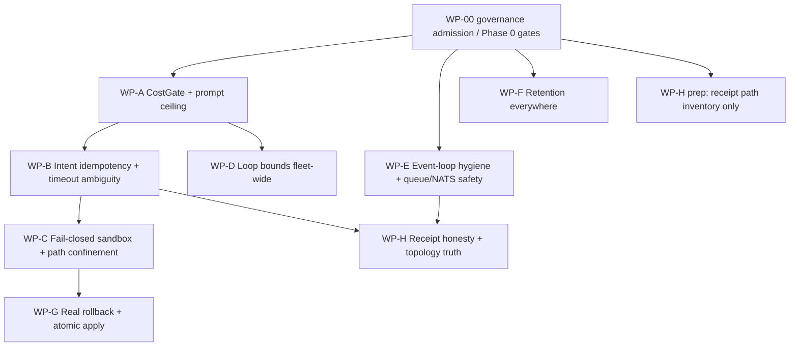

# Titanium Runtime Hardening Work Packets — Five-Pillar Spine Companion

**Doc role (per `docs/AGENTS.md`):** `working_plan` — runtime-hardening companion plan subordinate to `docs/plans/TITANIUM_GRADE_REPOSITORY_HARDENING_2026-07-10.md`. It is not repo-level authority, does not create new TIT IDs outside the authority registry, and does not authorize implementation before WP-00 governance admission and normal owner gates.

**Status:** prep-only synthesis for `hardening/five-pillar-synthesis`. **Date:** 2026-07-17/18. **Source artifact:** `/Users/dhyana/dharma_swarm/docs/CENTRALIZATION_MASTER_PROMPT_2026-07-18.md` (untracked floating prompt, restructured here into campaign-governed form).

## Campaign boundary

This document converts the five-pillar runtime audit into Titanium-governed planning. It keeps the better spine model (CostGate, IdentitySpine, EffectGate, ConcurrencySpine, FitnessCI) while preserving the Titanium campaign contract:

- one implementation PR still closes or narrows one finding ID unless the authority doc is amended;
- each PR declares one owner, allowed files, adjacent surfaces not touched, test-before-code, rollback, and reproduction command;
- this companion can group related findings for sequencing, but a multi-finding WP must be split into sub-packets (for example `WP-A.1`, `WP-A.2`) before implementation if it would violate the authority contract;
- no evolution daemon, thinkodynamic director, or live self-evolution loop may run until WP-A and WP-D have merged and their fitness tests are green.

## Runtime finding registry extension

The authority rows are in `docs/plans/TITANIUM_GRADE_REPOSITORY_HARDENING_2026-07-10.md` as TIT-016 through TIT-028. This companion uses those IDs but does not own them.

| ID | Severity | Runtime theme | Primary spine | Planning packet |
|---|---:|---|---|---|
| TIT-016 | 5 | global LLM cost gate absent | Spine A — CostGate | WP-A |
| TIT-017 | 4 | total prompt-token ceiling absent | Spine A — CostGate | WP-A |
| TIT-018 | 5 | unbounded/accelerating autonomous loops | Spine A — CostGate | WP-D |
| TIT-019 | 4 | timeout/fallback/repair/requeue call multiplication | Spine B + A | WP-B / WP-A |
| TIT-020 | 5 | retry-stable intent idempotency absent | Spine B — IdentitySpine | WP-B |
| TIT-021 | 4 | message/NATS retries wedge or duplicate work | Spine B + D | WP-B / WP-E |
| TIT-022 | 4 | mutable/fail-open receipts and identity gates | Spine B + E | WP-H |
| TIT-023 | 5 | host shell execution via LocalSandbox/blocklist | Spine C — EffectGate | WP-C |
| TIT-024 | 4 | arbitrary file/diff path writes | Spine C — EffectGate | WP-C |
| TIT-025 | 4 | non-atomic mutation apply and status-only rollback | Spine C — EffectGate | WP-G |
| TIT-026 | 4 | event-loop blocking and queue write races | Spine D — ConcurrencySpine | WP-E |
| TIT-027 | 4 | JetStream topology/DLQ receipts can lie | Spine D + E | WP-E / WP-H |
| TIT-028 | 4 | retention/state-boundedness absent | Spine E — FitnessCI + Retention | WP-F |

## Packet sequence and dependencies



**Immediate planning lanes:** WP-A, WP-E, WP-F, and WP-H inventory can be prepared after WP-00. Implementation must still respect one finding / owner / PR and may require sub-packeting.

**Hard stop:** do not run evolution daemons, `thinkodynamic_director`, or unattended self-modification loops until WP-A and WP-D are merged with green fitness tests.

## Spine-to-packet mapping

| Spine | Runtime packets | Existing primitives to wire | Primary TIT IDs |
|---|---|---|---|
| Spine A — CostGate | WP-A + WP-D | `providers.py` `_estimate_cost`, `holon_budget_guard.check_cost_cap`, `cost_tracker.log_cost`, `router_v1._estimate_tokens`, `codex_overnight.py` wall-clock pattern | TIT-016, TIT-017, TIT-018, TIT-019 |
| Spine B — IdentitySpine | WP-B + WP-H | `spine/identity.py`, `_ATTEMPT_IDENTITY_METADATA_KEYS`, `message_bus`, receipts, provider headers | TIT-019, TIT-020, TIT-021, TIT-022 |
| Spine C — EffectGate | WP-C + WP-G | `SandboxManager.create_async(prefer_docker=True)`, `TelosGatekeeper`, `diff_applier.rollback`, `checkpoint.py` atomic write | TIT-023, TIT-024, TIT-025 |
| Spine D — ConcurrencySpine | WP-E | `file_lock.AsyncFileLock`, `asyncio.to_thread`, JetStream topology checks | TIT-021, TIT-026, TIT-027 |
| Spine E — FitnessCI + Retention | every packet + WP-F/WP-H | fast static/AST fitness tests, retention sweep, append-only receipt checks | TIT-016 through TIT-028 |

## Work packets

### WP-A — CostGate and prompt ceiling

**Findings:** TIT-016, TIT-017; preparatory coupling to TIT-019.

**Purpose:** Add one enforced cost/spend chokepoint before external provider calls and one total token ceiling at prompt assembly.

**Required behavior:**

- `check_global_cost_cap()` is called at the `providers.py` chain chokepoint before external completion.
- `cap <= 0` is not silent-unbounded; unbounded requires explicit override.
- unknown models price conservatively, not `$0.0`.
- `_build_prompt` has a total prompt-token ceiling after assembly, reusing `router_v1._estimate_tokens` or an equivalent central estimator.
- oversized dispatch prompt either head/tail truncates within budget or hard-fails with an honest receipt.
- fitness tests go red if the provider gate or `_build_prompt` ceiling is removed.

**Candidate implementation PR split:** WP-A.1 (TIT-016 provider gate) then WP-A.2 (TIT-017 prompt ceiling).

### WP-B — Intent-derived idempotency and ambiguous timeout handling

**Findings:** TIT-019, TIT-020, TIT-021.

**Purpose:** Convert existing idempotency substrate from per-attempt decoration into retry-stable intent semantics.

**Required behavior:**

- intent key is derived at origin from task id + canonical content + origin event.
- `idempotency_key` is not wiped by `_clear_attempt_identity_metadata()`.
- per-attempt uniqueness moves to a distinct side-effect attempt key.
- provider timeout is classified as ambiguous, not blind-retryable.
- outbound provider call carries an idempotency key or equivalent intent token where supported.
- `message_bus.send` has finite stale windows and verifies the message row exists before returning success on dedupe.
- NATS retry keys are deterministic by delivery count, not random UUID.

### WP-C — Fail-closed sandbox and path confinement

**Findings:** TIT-023, TIT-024.

**Purpose:** Close host-compromise paths before any unattended agentic runtime resumes.

**Required behavior:**

- agent tool loop uses `SandboxManager.create_async(prefer_docker=True)` or equivalent central selector instead of hardcoded `LocalSandbox`.
- no LLM-authored tool command reaches host `create_subprocess_shell` through the production path.
- missing strong backend denies or explicitly degrades; it never silently permits host execution.
- `write_file`, `edit_file`, and diff targets must resolve inside their workdir/workspace; absolute, `~`, and `..` paths fail closed.
- shell commands pass `TelosGatekeeper` in strict effect mode.

### WP-D — Loop bounds fleet-wide

**Findings:** TIT-018 plus cost-side coupling to TIT-016.

**Purpose:** Make autonomous loops bounded by construction rather than by model self-restraint.

**Required behavior:**

- `hours <= 0`, `max_cycles=None`, `max_cycle_tokens=0`, or equivalent defaults do not mean forever/disabled.
- consecutive no-sleep / rapid-ascent re-entry is capped.
- delegation depth and per-cycle task attempts are bounded.
- stagnation backs off rather than speeds up.
- generation budgets are checked before generation, not after.
- daily counters reset by date rather than permanently disabling after first cap hit.
- deterministic pulse is default; agentic pulse is opt-in.

### WP-E — Event-loop hygiene and queue/NATS safety

**Findings:** TIT-021, TIT-026, TIT-027.

**Purpose:** Remove event-loop freezes and make the event matrix honest under crash/redelivery conditions.

**Required behavior:**

- no `subprocess.run` or `thread.join()` blocks an active event loop in named runtime paths.
- one `file_lock.AsyncFileLock` contract governs `queue.jsonl` read/modify/write.
- NATS reconnect is enabled with bounded backoff and cached handles are invalidated on close.
- stream topology is provisioned/verified before success receipts.
- `DeliverPolicy.ALL` or equivalent replay-safe delivery is used where idempotency dedups.
- broker max-delivery advisories produce durable receipts/operator signals.

### WP-F — Retention everywhere

**Findings:** TIT-028 and state-boundedness portions of TIT-017/TIT-022.

**Purpose:** Stop `.dharma` growth, context drift, and write-side vector/log inflation.

**Required behavior:**

- conversation logs rotate by size and delete/compact by TTL.
- `conversation_turns` and `idea_shards` have write-side caps and TTL/salience eviction.
- raw LLM output re-entering prompts is scanned and provenance-tagged.
- vector-store `upsert` enforces the same size bound as reads, evicting oldest where needed.
- receipts are archive-then-delete after retention, not in-place mutated.
- stigmergy access-count bumps are batched rather than rewriting the whole marks file per read.
- the dead distiller is wired into the sleep cycle or explicitly demoted.

### WP-G — Real rollback and atomic mutation apply

**Findings:** TIT-025.

**Purpose:** Ensure self-modification either applies completely and verifiably or leaves no partial code state.

**Required behavior:**

- diffs validate all target paths and hunk context before any write.
- multi-file apply stages writes and commits them via atomic replace only after all validation passes.
- failure path invokes rollback or leaves no partial writes.
- canary rollback restores code (for example verified `git revert`) rather than only changing archive status.
- archive rewrites use temp+fsync+replace under lock.
- checkpoint/mutation ledgers use the existing atomic-write pattern.

### WP-H — Receipt honesty and path constants

**Findings:** TIT-022, TIT-027, and receipt-path portions of TIT-028.

**Purpose:** Make receipts append-only, non-lying, and out of the git worktree.

**Required behavior:**

- no receipt path in runtime A2A scripts defaults into the repository.
- receipt replacements are rejected or versioned append-only.
- missing execution identity fails closed on spine-owned surfaces or emits a countable `identity_missing` receipt.
- `ensure_stream_topology` never returns/receipts `ok` after swallowing broker errors.
- topology and DLQ evidence has fresh, durable receipts.

## Edge-case matrix from the source synthesis

The following matrix is imported from the source synthesis and remains subordinate to the TIT registry above.

## The centralization model — four spines

Every audit finding collapses into **"a dangerous action was taken without passing through a chokepoint."** So we build four chokepoints and force all paths through them. This is the whole strategy.

```
          +---------------------------------------------------------+
          |  ANY path that spends money  -->  SPINE A: CostGate      |
          |  ANY path that mutates state -->  SPINE B: IdentitySpine |
          |  ANY LLM-authored effect     -->  SPINE C: EffectGate    |
          |  ANY shared-file / loop I/O  -->  SPINE D: ConcurrencySpine|
          +---------------------------------------------------------+
                                   |
                    SPINE E (meta): Fitness functions in CI
                    assert every path above is actually wired.
```

| Spine | Chokepoint location | Existing primitive to wire | Kills findings |
|---|---|---|---|
| **A — CostGate** | `providers.py` chain-executor, where `_estimate_cost` already runs (`:2528`) **+** `agent_runner.py:1227` `_build_prompt` (token ceiling) | `holon_budget_guard.check_cost_cap` + `cost_tracker.log_cost` + `router_v1._estimate_tokens` | 3.1–3.8, 2.4, doctrine's phantom $3/day cap |
| **B — IdentitySpine** | task creation + `providers.py` HTTP send | `spine/identity.py`, `message_bus`, receipts | 1.1–1.8 |
| **C — EffectGate** | `agent_runner` tool loop + `diff_applier.apply` | `SandboxManager.create_async`, `TelosGatekeeper`, `diff_applier.rollback`, `checkpoint.py:225` atomic write | 5.1–5.6, 2.2/2.5 (unscanned re-injection) |
| **D — ConcurrencySpine** | `a2a_task_lifecycle` queue ops + every `async def` doing I/O | `file_lock.AsyncFileLock`, `asyncio.to_thread`, `create_subprocess_exec` | 4.1–4.6 |
| **E — FitnessCI** | `tests/fitness/` run in `make onboard` / CI | existing constitutional_size_check, evidence checkers | systemic drift, receipt honesty |

**Retention** (1.7/1.8/2.1/2.2/2.3/2.6/2.7) is a cross-cutting nightly job, not a spine — but it is wired *once* and swept centrally.

---

## Full edge-case enumeration (the behaviors any fix MUST cover)

This is the "enumerate every behavior and edge case before planning" deliverable. Grouped by spine. Each row is a behavior the centralized fix must handle — **not** just the literal example in the audit, but the general class.

### Spine A — CostGate (compute metabolism)
- E-A1 Cost gate must sit on the **synchronous send path** and be able to **refuse** (raise/deny), not just log.
- E-A2 Unknown/unpriced model -> **conservative non-zero default price**, never `$0.0` (`cost_tracker.py:23-55`). Blind-to-zero is the same as no gate.
- E-A3 `cap <= 0` must **NOT** silently mean unbounded. It must mean *error/deny absent an explicit `DHARMA_ALLOW_UNBOUNDED=1` env override*. (Current `holon_budget_guard` and `merge_master_mike` both treat `cap<=0` as opt-out — the exact silent-disable footgun.)
- E-A4 Rolling-window accounting: 24h sum must survive process restart (persisted, not in-memory) and must not double-count retries as separate spend when they are the same intent.
- E-A5 Loop re-entry with **zero sleep** must be capped (<=3 consecutive) regardless of model output (`thinkodynamic_director.py:5080`).
- E-A6 `hours <= 0` / `max_cycles = None` / `max_cycle_tokens = 0` must **not** mean "forever/disabled." Adopt `codex_overnight.py:611` wall-clock pattern fleet-wide; `-1` = explicit unbounded, `0` = error.
- E-A7 Delegation recursion: depth cap (>=3 refuse) + per-cycle attempted-task ceiling; **success must not prolong spend** (`thinkodynamic_director.py:4536`).
- E-A8 Inverse-backoff bug: stagnation must **slow** the loop (true backoff), never speed it up (`orchestrate_live.py:1410`). Budget check **before** generation, not after (`evolution.py:2026`).
- E-A9 Daily counters must **reset at midnight** (`orchestrate_live.py:572` bug: never resets -> cap disables loop permanently after day 1).
- E-A10 Provider fallback multiplication: total upstream attempts across the whole chain must be capped (not `retries x providers x repair x requeue`); add a token-bucket per provider for 429 storms.
- E-A11 Heartbeat/pulse must default to the **non-LLM deterministic** path; agentic pulse opt-in only (`pulse.py`).
- E-A12 A2A inbound packets must **not** convert 1:1 into LLM calls with no daily quota (`fugu_ultra_semantic_responder.py:896`).
- E-A13 **Total prompt-token ceiling at the single build chokepoint** (`agent_runner.py:1227` `_build_prompt`, called at `:2405`). Every current cap is *per-fragment*; `task.description` is fully unbounded and fan-out pipelines feed one agent's output into the next task's description (finding 2.4). One enforcement point at the end of `_build_prompt`: estimate total tokens (reuse `router_v1.py:81 _estimate_tokens`), truncate head+tail to a budget, and **hard-fail with a receipt above a ceiling** — so a megabyte description cannot pay full input-token cost per dispatch × retries silently. This is a CostGate concern because it is unbounded spend at a prompt chokepoint, not a fragment-formatting concern.

### Spine B — IdentitySpine (idempotency & state boundedness)
- E-B1 Idempotency key derived **at origin of intent**: `sha256(task_id + canonical(content) + origin_event_id)`; created at task creation.
- E-B2 Key must be **excluded** from `_ATTEMPT_IDENTITY_METADATA_KEYS` so retries can't wipe it (`orchestrator.py:56`).
- E-B3 Per-attempt uniqueness moves to a **separate** `side_effect_key = f"{intent_key}:attempt:{n}"` — never the dedupe key.
- E-B4 **Timeout/ambiguous outcome** must be classified as *ambiguous*, not auto-retryable-blind (`resilience.py:314`). On ambiguous: consult a `side_effect_intent` receipt written **before** the HTTP call.
- E-B5 Outbound provider calls send an `Idempotency-Key` header derived from E-B1.
- E-B6 Deterministic **retry keys** using delivery-count, not `uuid4()` (`nats_transport.py:686`, `a2a_server.py:357`).
- E-B7 Handler must **ack before/atomically-with** execution boundary, or be safe to re-execute (`nats_transport.py:499-547` crash window).
- E-B8 `message_bus.send` wedge: finite `stale_after_seconds`; on `not should_execute`, verify the row actually exists (`SELECT 1`) before returning success (`message_bus.py:245`).
- E-B9 Receipts **append-only**, keyed `(task_id, receipt_id, attempt)`; reject `INSERT OR REPLACE` overwrite of evidence incl. `created_at` (`runtime_state.py:3417`, `spine/persistence.py:64`).
- E-B10 Tollbooth **fail-closed** on spine-owned surfaces; at minimum emit a countable `identity_missing` receipt instead of writing the claim anyway (`spine/tollbooth.py:15`, `runtime_state.py:1723`).
- E-B11 Vector store size bound must apply to **`upsert`** (write side) with evict-oldest, not only reads (`vector_store.py:630`; DELETE machinery at `:848` already exists).
- E-B12 Dedupe bookkeeping must not itself be unbounded: counter column instead of per-duplicate receipt; TTL sweep past redelivery window (`runtime_state.py:3622`).
- E-B13 **Empty/malformed inputs:** missing `task_id` (already raises — keep), empty content, missing `origin_event_id` -> deterministic fallback that is still stable across retries (not random).

### Spine C — EffectGate (sandbox paranoia & atomic rollback)
- E-C1 Sandbox selection: `SandboxManager.create_async(prefer_docker=True)` failing **closed** when no container backend -> deny execution, don't silently fall back to host (`agent_runner.py:1922`).
- E-C2 Command policy: **allowlist + `create_subprocess_exec` + `shlex.split`**, replacing 7-pattern blocklist + `create_subprocess_shell` (`sandbox.py:22,90`).
- E-C3 Every shell command routes through `TelosGatekeeper` in `external_strict` (currently `shell_exec` bypasses gates entirely).
- E-C4 `write_file`/`edit_file` path confinement: `resolved.relative_to(workdir)`, reject absolute/`~`/`../` (`agent_runner.py:1567`).
- E-C5 Diff apply path confinement: resolve-and-`is_relative_to(workspace)` at `apply()`; reject absolute/`..` at **parse time** (`diff_applier.py:267`; pathlib absolute-wins).
- E-C6 Self-mod gate must be **effect-based** (write-outside-workspace = BLOCK), not substring keyword matching in permissive `internal_yolo` (`telos_gates.py:408`). Default self-mod -> `external_strict`.
- E-C7 Atomic apply = **all-or-nothing staging** (temp + `os.replace` after ALL patches validate); rollback on the failure branch (`diff_applier.py:297` currently returns without rollback).
- E-C8 **Per-hunk context verification** — reject if context lines don't match (`diff_applier.py:466` currently splices by line-number blind), or shell to `git apply --check`.
- E-C9 Canary `ROLLBACK` must perform a **real `git revert`** verified against baseline, not flip an archive status field while bad code stays on disk (`canary.py:148`).
- E-C10 Archive rewrite must be **temp+fsync+`os.replace` under lock** (`archive.py:356` truncate-in-place can destroy the entire fitness lineage on crash).
- E-C11 Checkpoint interrupt: **fail-closed** (REJECT) on missing callback in headless mode, not auto-APPROVE (`checkpoint.py:115`); reuse `checkpoint.py:225` atomic pattern for all ledgers (`strange_loop.py:369`, `checkpoint.py:310,335`).
- E-C12 LLM output re-entering prompts (Latent Gold `agent_runner.py:1285`; shared memory `agent_memory_manager.py:576`; `remember`/`share` tools) must pass `scan_and_sanitize`/`injection_scanner` at the injection boundary + carry provenance/confidence tags.

### Spine D — ConcurrencySpine (async decoupling & event matrix)
- E-D1 One flock contract via `file_lock.AsyncFileLock` made the **module-level requirement** of `a2a_task_lifecycle.py`; eliminate the 3 uncoordinated protocols (lock-free rewrite `:184`, flock `hermes_heartbeat_poll.py:77`, append-no-lock `codex_composer_wake_loop.py:357`).
- E-D2 No sync call inside `async def`: convert all 4 blocking sites to `create_subprocess_exec`/`asyncio.to_thread` (`thinkodynamic_director.py:1686`, `review_cycle.py:102`, `roaming_dispatch_daemon.py:142`, `autoresearch_loop.py:507`). Pattern already exists at `zeitgeist.py:166`.
- E-D3 No `thread.join()` from the loop thread (`a2a_bridge.py:215`).
- E-D4 NATS reconnect: bounded-backoff reconnect enabled, drop cached handles on close (`nats_transport.py:140` currently `allow_reconnect=False`).
- E-D5 `DeliverPolicy.ALL` (idempotency layer dedups) so pre-consumer messages aren't lost; provision `DHARMA_FLEET` stream in `ensure_stream_topology`; JetStream (not core-NATS at-most-once) acks (`nats_transport.py:243`, `a2a_inbox_bridge.py:79,256`).
- E-D6 DLQ: subscribe to `$JS.EVENT.ADVISORY.CONSUMER.MAX_DELIVERIES.>`; emit receipt + operator signal instead of silent 30-day age-out (`nats_transport.py:568`).
- E-D7 `ensure_stream_topology` returns "ok" **only after `stream_info` round-trips** — never receipt "ok" on swallowed broker error (`nats_transport.py:203`).
- E-D8 SignalBus: bounded `maxlen` + dropped-counter (not silent unbounded deque that dies during the loop-stall crises of E-D2) (`signal_bus.py:63`).
- E-D9 SQLite transport: `busy_timeout=30000`, one long-lived connection, single-transaction batching (currently 4 serialized WAL commits per message, connection-per-op) (`runtime_state.py:403`).
- E-D10 Dispatch path: `gather` + `Semaphore(k)` instead of serial-assign-per-tick (`orchestrator.py:402`).
- E-D11 File-queue claims need a **lease/timeout** so a SIGKILL'd claim doesn't wedge at `claimed` forever (`a2a_task_lifecycle.py` has none; board tasks already recover via `swarm.py:2414`).
- E-D12 Delete dead zero-sleep loop awaiting a wiring mistake (`orchestrate_live.py:1215` `_run_recognition_loop_UNUSED`).

### Spine E — FitnessCI + Retention (systemic drift)
- E-E1 Executable fitness test: **"the cost gate exists and is called"** (grep/AST-assert `check_global_cost_cap` wired at the providers chokepoint). If absent -> CI red.
- E-E2 Fitness test: idempotency key **not** in the attempt-wipe list.
- E-E3 Fitness test: no `create_subprocess_shell` reachable from agent tool loop; no `LocalSandbox` hardcode.
- E-E4 Fitness test: doctrine<->code reconciliation — if `CLAUDE.md` claims a "$3/day cap," a test must assert the code path exists (else the doctrine line fails CI). No lying receipts.
- E-E5 Retention nightly sweep (single wired job): receipt TTL archive-then-delete (90d); conversation-log daily size-cap + rotation + TTL-delete segments; `idea_shards` salience-floor eviction; `conversation_turns` 30d TTL; vectors.db write-side bound; runtime.db retention (currently zero DELETE paths outside FTS).
- E-E6 Redirect the 4 in-repo receipt writers out of the git worktree into `~/.dharma/a2a/...` (`a2a_inbox_bridge.py:40`, `a2a_send.py:65`, `a2a_reply_capture.py:31`, `holon_l4_supervisor.py:201`).
- E-E7 Worktree/branch cap fitness function (governance cap ~14; currently 66/385) — detect + refuse-to-grow, with a metabolizer, not just a detector.
- E-E8 Boundary: FitnessCI must run in **< a few minutes** (the 55–130 min full suite is why drift accumulated). Fitness tests are static/grep/AST assertions, not integration runs.
- E-E9 Fitness test: `_build_prompt` has a **total** token ceiling (AST-assert an enforcement call after fragment assembly, not just per-fragment caps) — closes finding 2.4 and prevents regression to per-fragment-only bounding.

---

## Idempotency / interaction edge cases across spines (the tricky ones)

- X-1 **CostGate x IdentitySpine:** a retry that is the *same intent* must not be counted as new spend (E-A4 depends on E-B1). Wire CostGate to read the intent key.
- X-2 **IdentitySpine x timeout (X-billing):** the double-billing chain (1.2) is A x B: without B4/B5 the CostGate still sees N distinct sends. Both spines required to close it.
- X-3 **EffectGate x ConcurrencySpine:** the sandbox deny path must not block the loop (fail-closed must be async).
- X-4 **FitnessCI x everything:** each spine ships **with** its fitness test in the same PR, or the wiring silently rots again (the whole reason this audit exists).
- X-5 **Retention x append-only receipts:** TTL delete must respect the append-only invariant (archive-then-delete, never in-place mutate) — the two rules must not fight.
- X-6 **Empty/boundary:** first-boot with empty DB, zero rolling-cost history, no NATS stream yet, no Docker backend — every spine must have a defined *safe* first-boot behavior (deny-or-degrade, never silent-permit).

---

## Verification notes inherited from the source synthesis

## Verification log (what I confirmed before trusting the audit)

All checks run on branch `fix/tool-call-xml-dialect-parser`, canonical tree `/Users/dhyana/dharma_swarm`.

| Audit claim | Verification | Result |
|---|---|---|
| `spend_tokens` is tracking-only | `economic_spine.py:274` docstring: "ALWAYS succeeds — tracking only, no enforcement" | OK exact |
| No global cost cap exists | `grep check_global_cost_cap / DHARMA_DAILY_USD_CAP` -> 0 hits | OK absent |
| `log_cost` has no production callers | only self-ref at `cost_tracker.py:71,159` | OK dead |
| Idempotency key minted per-attempt | `spine/identity.py:82` `clean_idem = ... or f"idem_{clean_run}"`; run is random | OK exact |
| Key wiped on retry | `orchestrator.py:56` `_ATTEMPT_IDENTITY_METADATA_KEYS` includes `idempotency_key`; popped at `:2187` | OK exact |
| Sandbox hardcodes Local | `agent_runner.py:1922` `from dharma_swarm.sandbox import LocalSandbox` | OK exact |
| 7-pattern blocklist | `sandbox.py:22-30` — 7 regexes, misses `rm -rf ~/`, `curl|sh` | OK exact |
| `orchestrate_live.py` has 0 NATS refs | `grep -c nats/NATS/jetstream` -> 0 | OK exact |
| Midnight counter never resets | `orchestrate_live.py:572` `daily_count` only increments, sleeps+continues at cap | OK exact |
| `~/.dharma` = 182 GB | `du -sh ~/.dharma` -> **182G** | OK exact |
| 63 worktrees / 380 branches | `git worktree list` -> **66**, `git branch` -> **385** | OK (drifted higher) |
| **Primitives already exist** | `file_lock.py:87` AsyncFileLock; `checkpoint.py:225` atomic tmp+rename; `diff_applier.py:331` rollback(); `zeitgeist.py:166` to_thread; `codex_overnight.py:611` wall-clock deadline; `sandbox.py:190` SandboxManager.create_async(prefer_docker=True); `holon_budget_guard.py` check_cost_cap | OK **all present, unwired** |

**Conclusion:** the audit is accurate to file:line. The "immune system in a jar" is literal. Every fix below wires an *existing* primitive into a chokepoint; almost none require new architecture.

---

## External research grounding (what SOTA says the fix shape is)

Five independent principles from current distributed-systems / LLM-agent-ops practice, each mapping onto a pillar:

1. **Enforcement != observability.** A limit you only *record* is not a limit. Cost/rate governance must sit on the synchronous request path and be able to *refuse*, not on a telemetry sink. -> Pillar 3.
2. **Idempotency is keyed to the *logical operation*, not the *attempt*.** The canonical pattern (Stripe-style Idempotency-Key, AWS client request tokens) derives the key from caller intent at origin, persists the *result* against it, and returns the stored result on replay. Per-attempt keys are an anti-pattern that guarantees double-execution. -> Pillar 1.
3. **Deny-by-default sandboxing with allowlists.** Blocklists of dangerous strings are known-broken (infinite bypasses); the working pattern is an allowlist of permitted commands + exec-not-shell + fail-closed when the strong backend is unavailable. -> Pillar 5.
4. **Never block the event loop; the queue needs one writer protocol.** Sync calls inside `async def` are a canonical asyncio footgun; shared mutable files need exactly one locking discipline. -> Pillar 4.
5. **Architecture fitness functions.** Drift (line-count caps, worktree caps, evidence staleness, "does the cost gate exist") should be *executable tests in CI*, not doctrine in a markdown file. The reconciliation cost of doctrine<->code decoupling otherwise lands entirely on one human. -> Systemic drift axis.

External corollary worth noting for the standing language question: the recurring failure across LLM-agent incident writeups is **budget/authority tracked as runtime receipts instead of pre-execution semantics**. That is exactly this repo's gap, and exactly the thing the house language question wants promoted into typechecker/evaluator semantics. The four spines below are the runtime prototype of those semantics.

---

## Open uncertainties

- Several packets span multiple current owners. Before implementation, split into one-finding/one-owner sub-packets or amend the authority doc.
- The active-track manifest currently names `docs/prompts/TITANIUM_HARDENING_CAMPAIGN_EXECUTOR_2026-07-17.md`, which is absent in this worktree. This document adds the requested spine executor prompt, but does not silently modify governance manifests.
- The source prompt was created from a different checkout and branch. File:line anchors must be re-verified on the implementation branch at the start of each PR.
