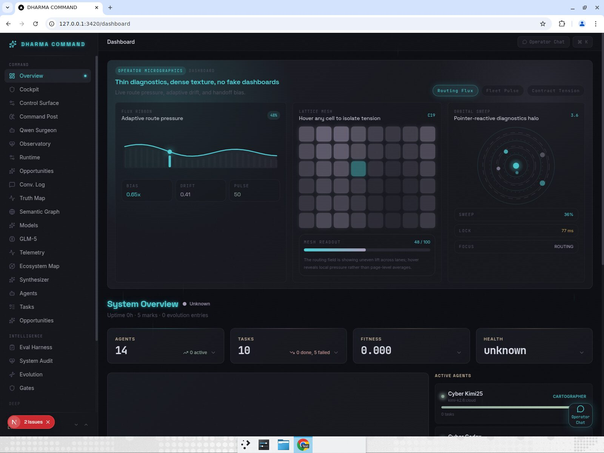
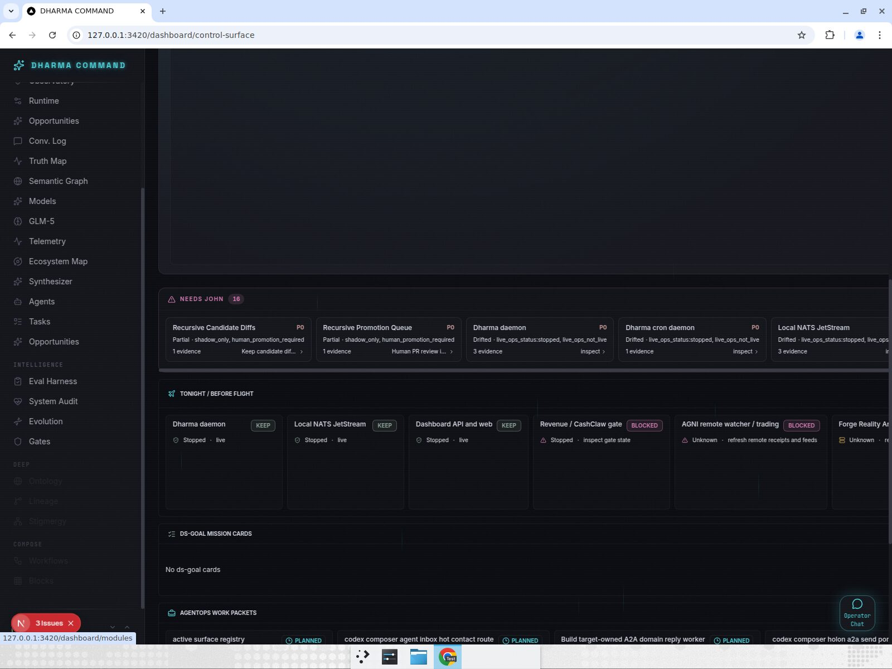
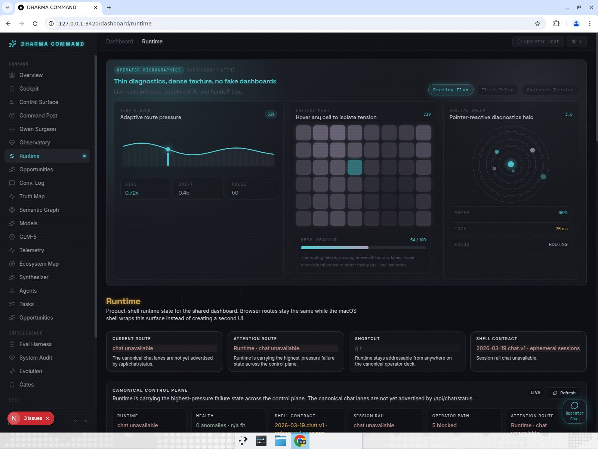
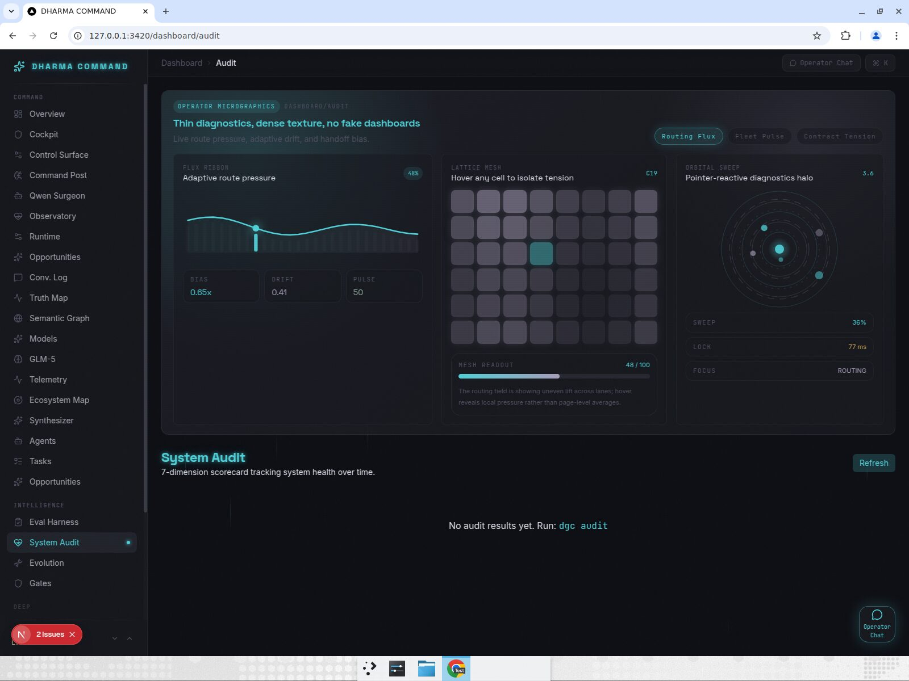
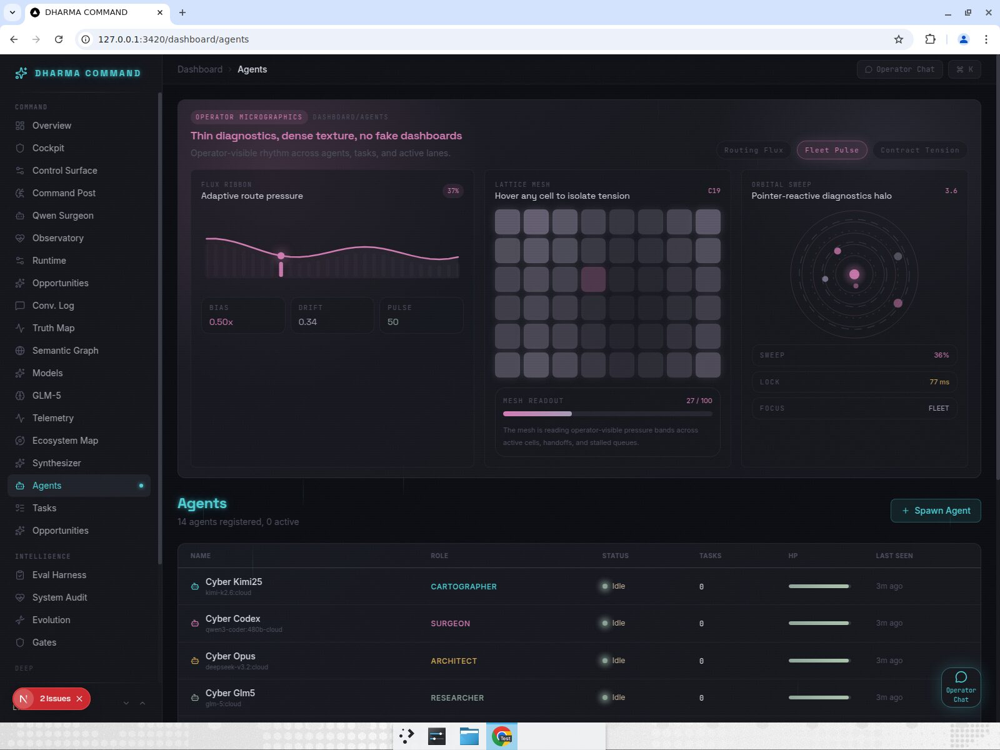
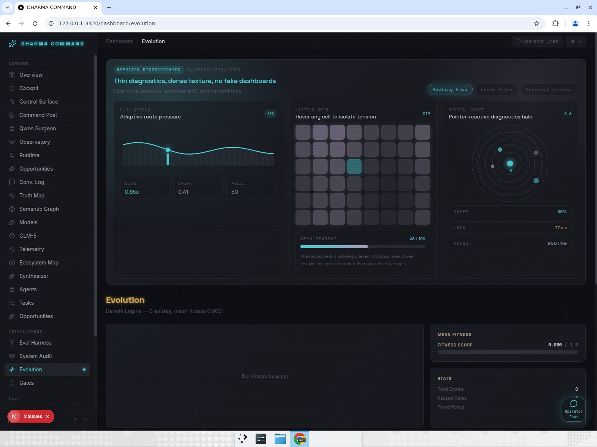
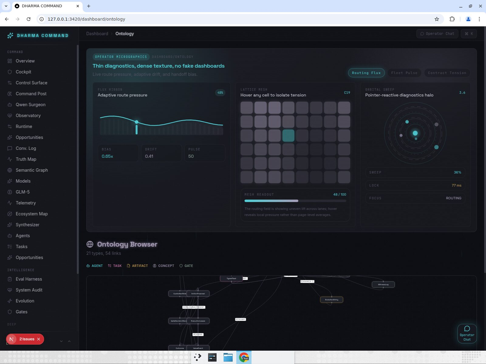

# Dashboard Test Report — Phase 3

## Result

- Degraded/pass: dashboard lint and production build passed; OpenAPI type drift check failed; all requested browser routes rendered without a Next/browser crash.
- Recording: `dashboard_gauntlet_recording.mp4`.

## Script checks

- `npm --prefix dashboard run lint`: exit `0`; warnings only, mostly unused variables.
- `npm --prefix dashboard run build`: exit `0`; Next production build completed.
- `OPENAPI_URL=http://127.0.0.1:8420/openapi.json npm --prefix dashboard run gen:types:check`: exit `1`; generated `/tmp/api-generated.check.ts` differs from committed `dashboard/src/lib/api-generated.ts`.

## Browser route assertions

- Passed: `/dashboard` rendered overview and matched live API shape: 14 agents, 10 tasks after restart, health `unknown`.
- Passed/degraded: `/dashboard/control-surface` rendered live control-plane cards, needs-John items, AgentOps packets, semantic receipts, and a System Truth payload of 133 rows; screenshot evidence shows stopped/drifted live-ops rows.
- Passed: `/dashboard/cockpit` rendered control-plane cards without crash; it appears to share much of the control-surface readout rather than a clearly distinct cockpit workspace.
- Passed/degraded: `/dashboard/runtime` rendered and honestly surfaced `chat unavailable` plus API-key-required lanes.
- Passed/degraded: `/dashboard/audit` rendered but showed no audit results and instructed `dgc audit`.
- Passed: `/dashboard/agents` rendered 14 registered agents, 0 active.
- Passed/degraded: `/dashboard/evolution` rendered but showed 0 entries and no fitness data.
- Passed: `/dashboard/ontology` rendered graph with 21 types and 54 links.

## Screenshots

## Raw evidence

- `npm_lint.txt`, `npm_build.txt`, `npm_gen_types_check.txt`
- `overview.jpg`, `control_surface.jpg`, `runtime.jpg`, `audit.jpg`, `agents.jpg`, `evolution.jpg`, `ontology.jpg`
- `dashboard_gauntlet_recording.mp4`
